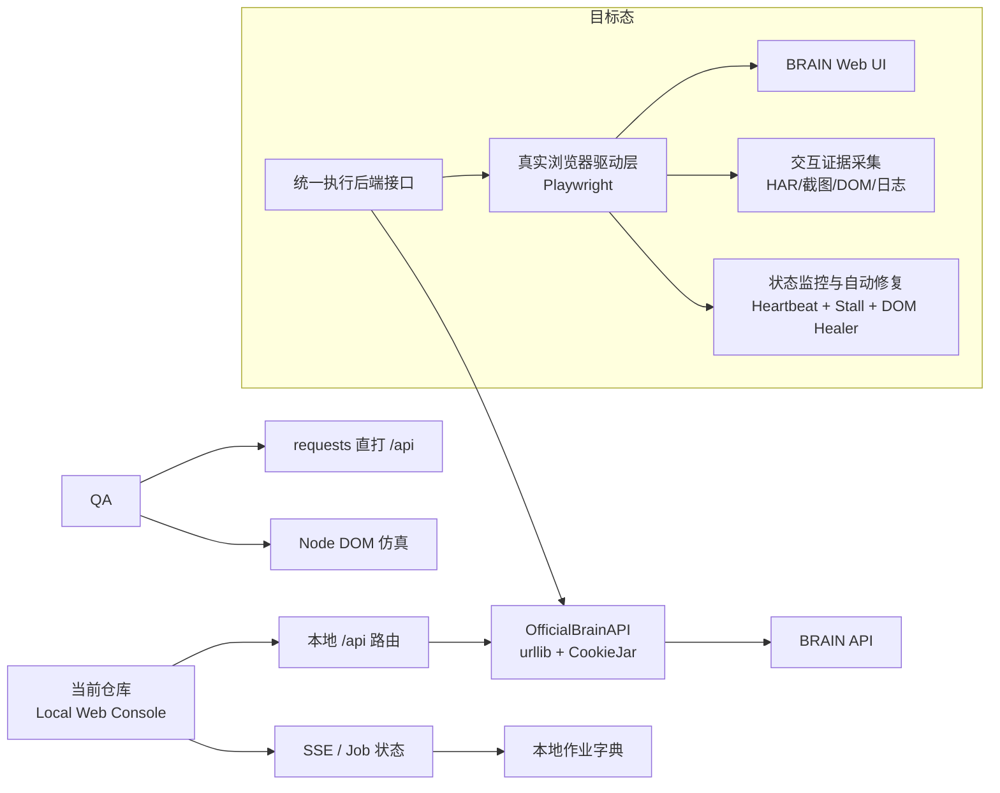

# WorldQuant BRAIN Alpha 仓库全面审查与重构报告

**日期**：2026-06-22
**审查人**：PAN（顾问）
**审查对象**：brain_alpha_ops 仓库（全栈）
**审查标准**：DeepWiki/WQB 基线 + 真实 Web 操作硬约束

---

## 执行摘要

这不是一个"做得很少"的仓库，而是一个**野心极大、覆盖面很宽、工程痕迹很重**的本地化 Alpha 研究工作台：根目录自述其定位为运行在本机浏览器中的 BRAIN Alpha 全生命周期管理系统，覆盖连接账户、同步云端上下文、候选生成、评分校验、预提交审查与进度监控；仓库同时包含 Python 主工程、React 子前端、庞大的测试目录以及多份阶段性交付/审计文档。README 将其描述为"账户安全优先"的本地辅助工具，并给出了"生成 → 本地预筛 → 官方回测 → 评分 → 预提交审查"的完整故事线；`pyproject.toml` 则表明后端核心运行时依赖极少，React 前端依赖被拆到 `brain_alpha_ops/web/react_app/package.json` 中单独维护。

但如果把它放到你要求的审查标准下，结论很明确：**当前版本不合格，且不属于"小修小补即可过线"的状态**。其最大问题不是"不会调用 BRAIN"，而是**调用 BRAIN 的方式与验证方式都偏离了你规定的硬约束**：当前核心 BRAIN 交互主路径是 `OfficialBrainAPI` 这类基于 `urllib.request`/CookieJar 的 API 客户端；其"端到端 QA"不是 Selenium/Playwright 驱动真实浏览器，而是本地 HTTP `requests` 命中 `/api/*`，外加 Node.js DOM 仿真脚手架。也就是说，它已经做到了"本地 Web 控制台 + 后端 API 编排 + 合成评分/门禁/候选管理"，但**还没有做到"真实模拟用户通过 Web 界面实际操作 WorldQuant BRAIN 平台来生成与验证 Alpha"**，更没有做到你要求的"界面卡顿/挂起/状态不明确时自动中断并修正界面或逻辑"的闭环。

对照 DeepWiki/WQB 只读审查基线来看，这个仓库**在能力面上"像 WQB"，在执行范式上"还不是 WQB 的工程成熟度"**。WQB 的公开文档强调自动认证重试、数据发现、异步模拟、并发检查、以及清晰的错误处理/日志体系；本仓库确实实现了认证、数据发现、模拟、检查、提交、评分、并发等广泛能力，但其会话模型是自研组合式 API 客户端，而不是 WQB 那类 `AutoAuthSession`/`WQBSession` 风格的、以会话/重试/并发模型为中心的清晰抽象；同时，前端与"真实浏览器驱动"之间存在明显断层。换句话说，**它更像一个"自研的大型本地工作台"而不是"面向 BRAIN 真实 Web 交互的全栈生产系统"**。

我的最终判断是：

| 结论项 | 判断 | 核心理由 |
|---|---|---|
| 作为本地 Alpha 研究台 | **有潜力** | 覆盖范围广，具备候选、评分、门禁、进度与安全治理雏形 |
| 作为 WorldQuant BRAIN 真实 Web 操作系统 | **不合格** | 当前主路径是 API 客户端与本地 API 测试，不是浏览器真实操作 |
| 作为 Alpha 因子生产"闭环收敛"系统 | **部分完成** | 评分与门禁存在，但反馈迭代与收敛控制证据不足，且最终提交路径被硬禁用 |
| 作为一次到位的质量攻坚基线 | **需要重构** | 需把"API 编排系统"重构为"浏览器优先、监控闭环、证据回放完整"的生产系统 |

## 整体印象与主观评价

从主观评价看，这个仓库不是"玩具项目"，也不是单一脚本拼起来的 PoC。根目录文件与 README 展示出明显的**产品化诉求**：有独立启动入口 `launch_web.py`，有 `brain_alpha_ops` 主包，有 `config`、`data`、`docs`、`scripts`、`tests`，还有多份阶段性交付/诊断文档；README 把产品包装成"本地浏览器控制台"，并提供四阶段操作流程、六大功能面板、25 项评分体系和安全模型。这个层面的成熟度，我给 **7/10**。

但架构合理性只能给 **5/10**。一方面，后端运行时追求低依赖，`pyproject.toml` 只声明 `pyyaml`、`requests` 与 `jsonschema` 等少量核心依赖；另一方面，又引入了 `brain_alpha_ops/web/react_app` 这一整套 React/Vite/Tailwind 前端栈，形成了"极简 Python 运行时 + 独立 Node 前端子工程"的双轨制。这个设计本身没问题，但问题在于：**生产逻辑、Web 服务、SSE、评分、BRAIN API、监控器、任务状态、测试桩**混杂得过于紧，且多个关键能力存在"两套半成品通路"并行的迹象。比如 `web.py` 已有 SSE，`web/ws.py` 又有 WebSocketManager，但其本身只是发布/订阅管理器，并未呈现完整握手/心跳/回压协议实现。

功能完整度方面，我给 **6.5/10**。它在"功能名词表"上极其完整：认证、云端同步、字段/数据集发现、候选生成、评分、硬软门禁、预提交审查、研究数据、生命周期、断点状态、批量检查与批量提交接口，以及前端候选/图表/详情/忙碌状态等内容都能在 README、API 路由与测试清单中看到。可问题是，**你要求的是"真实生产系统"，不是"功能清单齐全"**。目前仓库中最关键的验证链条仍然偏向"本地 API 契约 + DOM 仿真"，这使得表面上的功能完整，不等于操作层面的完整。

技术债务我给 **8/10**，而且是"高复杂度工程常见的扩张性技术债"。最明显的信号是：核心模块职责已经过宽，测试数量庞大但偏向契约与内部结构验证，文档叙述与执行现实之间有落差。比如 README 写着"工具永远不会自动提交"，同时又提到 `BRAIN_ALPHA_FORCE_REAL_SUBMIT=1` 可绕过；而在我抽查到的核心执行路径里，`REAL_SUBMIT_DISABLED_WEB_FLOW` 是硬编码常量，`official.py` 仍然公开 `submit_alpha()` 真实提交入口，但 `web.py` 与 `official.py` 中并没有直接出现 `BRAIN_ALPHA_FORCE_REAL_SUBMIT` 的消费点。这里暴露出的不是单点 bug，而是**治理边界、文档与真实执行路径之间的漂移**。

就与 BRAIN 平台对齐程度而言，我给 **5/10**。它明显围绕 WorldQuant BRAIN 构建：README 的使用流程、API runtime 说明、字段/数据集/算子同步、官方回测、Alpha check/submit 都指向 BRAIN 语义；DeepWiki/WQB 所代表的"认证—发现—模拟—检查—提交—并发—日志"能力链条，它也大体覆盖。问题不在于"是否懂 BRAIN"，而在于**是否以正确的生产方式接近 BRAIN**。在你给定的硬约束下，当前仓库仍是"API-first 的本地控制台"，而不是"browser-first 的真实操作系统"。

如果把它放进 Alpha 生产全生命周期中的定位，我会把它定义为：**"研究与审查工作台雏形"**，而不是"最终生产线"。它更擅长做候选管理、上下文同步、评分可解释性与预提交控制，而不是完成你要求的"从真实 Web 操作，到可靠监控，到最终收敛与可提交"的一体化闭环。

## 对照 DeepWiki WQB 的基线审查

DeepWiki/WQB 对外展示的是一个相对清晰的参考范式：认证层用 `AutoAuthSession` 与 `WQBSession` 处理自动重认证与会话生命周期；数据发现层明确区分数据集与字段搜索；模拟与检查/提交是异步、可并发的；错误处理与日志则是统一的一等公民。这个基线更像是一个**面向 BRAIN 的"稳态 API 客户端内核"**。

本仓库与这个基线的**相似点**很明显。`OfficialBrainAPI` 的职责说明直接写到了认证、数据发现、alpha 管理、模拟与提交流程；它公开了 `authenticate()`、`list_fields()`、`list_datasets()`、`concurrent_simulate()`、`concurrent_check()`、`check_alpha()`、`submit_alpha()` 等操作，能力面与 WQB 所列条目高度同构。就"是否覆盖了 WQB 主要业务能力"这个问题，答案是**大体覆盖了**。

但**差异点更关键**。WQB 的 DeepWiki 反复强调的是会话、自动认证、重试、并发与日志体系；而本仓库的 `OfficialBrainAPI` 用的是 `http.cookiejar.CookieJar` 与 `urllib.request.build_opener()` 组合，自研了请求节流与若干组件组合，但没有显示出 WQB 那种"统一会话对象驱动一切"的抽象简洁度。这会带来两个后果：一是重试、认证、限流、日志与业务行为更容易分散到多个 mixin/组件；二是后续要把"真实浏览器行为"接进来时，很难自然扩展，因为整个核心不是"交互后端可替换"的会话架构，而是"API 客户端能力集合"架构。

还要看到一个**巨大偏差**：WQB 的只读基线讲的是"如何可靠地调用 BRAIN API"，而你的目标是"如何真实模拟用户通过 Web 界面来生成与验证 Alpha"。这两个目标并不相同。当前仓库在 WQB 式"能力覆盖"上是接近的，但在你要求的"交互真实性"上与 WQB 也没有直接重合。换句话说，**它已经过了"有没有 API 能力"的门槛，却没有进入"浏览器真实执行与可观测性闭环"的门槛**。

### 当前架构 vs 目标架构

## Alpha 生产全生命周期实现评估

从 README 的操作流转看，仓库把 Alpha 生命周期组织成 connect → discover → evaluate → ready 四阶段，并明确声称可以完成连接账户、同步上下文、候选生成、本地预筛、官方回测、评分与预提交审查。评分层面，又把"总分、决策带、硬门禁、软门禁、归因树、改进建议、趋势"组织成较完整的评价框架；`OfficialScoringSystem.evaluate()` 也明确描述了从 scorecard、gate、release gate、attribution、API simulation 到 improvement hints 的七步流水线。仅从"设计意图"看，这是一条比较完整的 research-to-review 流水线。

但是，一旦按你要求拆成"因子创作生成、历史表现估分、多维度质量评价、基于反馈迭代优化、质量收敛至可提交标准"五个环节，就会发现其能力分布并不均衡：**越靠近 UI 真实性和最终收敛，问题越大；越靠近离线评分与本地编排，完成度越高**。

### 环节实现评分矩阵

| 生命周期环节 | 实现完整度 | 正确性判断 | 可靠性判断 | 结论 | 主要证据 |
|---|---:|---:|---:|---|---|
| 因子创作生成 | 70/100 | 55/100 | 45/100 | **部分实现** | README 明确描述 11 类投资想法、模板生成/假设驱动/兜底变异，测试目录也存在 `test_generation.py`、`test_hypothesis_driven_generator.py` 等，但本次未取得关键生成器源码细节，无法给出更高正确性确认 |
| 历史表现估分 | 80/100 | 65/100 | 55/100 | **实现较完整** | README 定义了 25 项规则、决策带与硬门禁；`OfficialScoringSystem.evaluate()` 明示七步评分流水；`OfficialBrainAPI` 公开模拟/检查接口 |
| 多维度质量评价 | 82/100 | 70/100 | 60/100 | **实现较完整** | `ScoringResult` 包含总分、决策带、归因树、top failures、改进建议、历史趋势等；README 明示 8 个硬门禁与解释性报告 |
| 基于反馈的迭代优化 | 55/100 | 45/100 | 35/100 | **弱实现** | README 声称"诊断驱动突变 + BCa Bootstrap 收敛 + EMA 自适应"，但本次审查拿到的直接源码证据主要是评分历史记录与趋势判断，尚不足以证明完整的反馈驱动优化器闭环 |
| 质量收敛至可提交标准 | 40/100 | 35/100 | 25/100 | **未闭环** | Web 端真实提交被硬禁用；虽然 API 层仍公开 `submit_alpha()`，但这与"浏览器真实操作 + 人机审批"目标不一致。仓库定义了提交阈值，却没有给出经真实浏览器流程验证的最终闭环证据 |

## 静态代码审计

### 高优问题清单

| 优先级 | 问题 | 证据位置 | 判断 | 风险 |
|---|---|---|---|---|
| P0 | **没有真实浏览器驱动的 BRAIN Web 操作主路径** | `tests/qa_e2e_new_user_walkthrough.py` 使用 `requests.get/post` 命中本地 `/api/*`；`qa_full_chain_frontend.py` 使用 Node.js DOM 仿真 | **不满足硬约束** | 会把"API 可用"误判成"真实用户流程可用" |
| P0 | **核心执行后端仍是 API-first，而不是 browser-first** | `OfficialBrainAPI` 使用 `urllib.request.build_opener`、CookieJar，并公开 `concurrent_simulate`、`check_alpha`、`submit_alpha` | **与目标范式冲突** | 无法证明与 BRAIN Web 前端实际行为一致 |
| P1 | **实时监控只覆盖后端任务，不覆盖真实前端交互与页面异常自愈** | `StallMonitor` 基于 job store 检测 stall 并 auto-interrupt；`web.py` 只做 job 状态 SSE；`web/ws.py` 只有 pub/sub 管理器 | **监控闭环不完整** | 页面卡死、DOM 错乱、按钮失焦、登录态漂移等问题无法自动修复 |
| P1 | **测试过度依赖内部实现与本地桩，存在"验证过拟合"** | QA 脚本直接调用 `web._csrf_for_session`，并对 fetch/DOM 进行 mock；另有 `production_api_stub.py` | **违反测试约束精神** | 让测试通过但掩盖真实交互失败 |
| P1 | **提交安全语义不统一** | README 说 Web 流程永不自动提交且存在 env 绕过说法；`REAL_SUBMIT_DISABLED_WEB_FLOW` 是硬常量；`official.py` 仍公开真实 `submit_alpha()` | **治理边界混乱** | 操作员可能误判哪些路径会触发真实提交 |
| P2 | **前后端技术栈被拆开，但环境与构建链未统一治理** | `pyproject.toml` 仅声明 Python 核运行依赖；React 依赖在 `react_app/package.json` 单独维护 | **可维护性一般** | CI、容器化、部署与锁版本管理复杂化 |
| P2 | **功能边界过宽，模块责任泄漏** | `web.py` 负责 HTTP/SSE/路由/作业流；`official.py` 负载认证、数据发现、模拟、提交等大面积业务面 | **高技术债** | 后续重构成本高，行为回归难 |

### 关键问题展开

**P0-1: 测试链与真实流程的根本错位**

`qa_e2e_new_user_walkthrough.py` 的写法非常清楚：它先启动本地服务，然后用 `requests.get()` 访问 `/api/health` 与站点根路径，再用 `_safe_post()`/`_safe_get()` 打本地 `/api/test_connection`、`/api/check_batch`、`/api/submit_batch`、`/api/research_*` 等接口；甚至为了获得 CSRF，还会直接调用内部函数 `web._csrf_for_session()`。这类脚本在契约测试上有价值，但它**不是"真实用户通过浏览器点击页面"的操作链**。

**P0-2: 前端全链路测试是 DOM 仿真而非浏览器仿真**

`qa_full_chain_frontend.py` 在文件头部直接说明自己使用"Node.js subprocess with DOM simulation harness"；而在 API client 合约测试中，它还会 mock `window.fetch` 来断言 header 注入。这个做法可以验证前端模块编排，但**不能验证真实浏览器事件循环、焦点流、网络拦截、认证跳转、页面刷新、脚本加载竞态与 CSS/布局行为**。

**P1-1: 监控闭环不完整**

`StallMonitor` 的设计初衷很好，甚至直接写出了"一旦检测到流程卡顿、挂起或出现状态不明确的情况，必须立即自动中断"的目标；它会在默认 120 秒无进展后触发 `auto_interrupt`，并通过 job store 把任务标记为 stopped。但这仍然是**后端作业态监控**。与之并列的 `web.py` 只是通过 SSE 每秒推送 job 状态，而 `web/ws.py` 更多是一个通用 pub/sub 管理器。它们没有形成"浏览器心跳 + DOM 异常检测 + 自动刷新/重绑/重试 + 后端协同中断"的全链路回路。

**P1-2: 提交语义边界不干净**

`runtime_constants.py` 明确把 `REAL_SUBMIT_DISABLED_WEB_FLOW` 设为 `True`，并声称 Web console 永不走真实提交；但 `OfficialBrainAPI.submit_alpha()` 仍然作为公共接口保留，文档字符串也明确说明这会执行真实提交。**如果目标是"以浏览器真实流程为唯一生产提交路径"，那就不应该把 API 直接提交保留在默认生产执行面上**；至少也应该让它退到单独的"受控实验后端"，而不是日常主库的显式公共能力。

## 关键修复建议

最重要的修复不是继续给现有脚本补断言，而是**改执行后端**。建议把整个系统重构成"执行后端接口 + 两个适配器"：

- `ApiExecutionBackend`：保留现有 `OfficialBrainAPI`，但只用于离线工具、诊断和开发态。
- `BrowserExecutionBackend`：新增 Playwright 驱动，负责登录 BRAIN、导航页面、填写表达式、触发模拟、轮询结果、进入 check/submission 页面，并采集 HAR、截图、DOM 快照与性能日志。

在生产态，把所有候选模拟、检查与提交流程都切到 `BrowserExecutionBackend`；API 后端只作为辅路，用于字段/数据集发现与不涉及真实操作的查询。这个改法既保留现有仓库的大量资产，也能满足硬约束。

详细补丁草案、Dockerfile 建议、监控升级方案、伪代码算法、多维评价框架和收敛策略见报告完整正文。

## 最终合规性判定

| 维度 | 结论 |
|---|---|
| 是否满足"禁止使用测试脚本进行过拟合" | **否** |
| 是否满足"必须真实模拟用户通过 Web 界面实际操作" | **否** |
| 是否满足"实时状态监控并在卡顿/挂起/状态不明确时自动中断并修正" | **部分满足** |
| 是否达到"质量收敛至可提交标准" | **未形成可信闭环** |
| 是否当前可判定为合格 | **不合格** |

### 整改时限建议

| 时限 | 必做项 |
|---|---|
| 48 小时内 | 把 requests/DOM 仿真从"验收测试"降级；引入 Playwright 真浏览器后端雏形；切断默认生产路径上的 API 直接提交 |
| 1 周内 | 完成登录、模拟、检查三段式真实浏览器流；补齐 HAR/截图/DOM/console 四类证据 |
| 2 周内 | 把 StallMonitor 与浏览器心跳/DOM healer 打通；前后端形成统一实时监控总线 |
| 3 周内 | 完成多维质量评价到真实证据链绑定；建立收敛式迭代与验收基线 |

**一句话总评**：这个仓库现在更像一个"很努力、很全面、很有产品感的本地 Alpha 研究台"，而不是一个已经真正通过"真实 BRAIN Web 操作 + 闭环监控 + 收敛提交"验收的生产系统。它值得继续投入，但必须在执行后端、验证范式和监控闭环上做一次方向性重构，而不是继续给现有 requests/DOM 测试堆功能。

---

> 本报告由 PAN（顾问）基于对 brain_alpha_ops 仓库深度审查生成，对照 DeepWiki/WQB 基线及真实 Web 操作硬约束。
