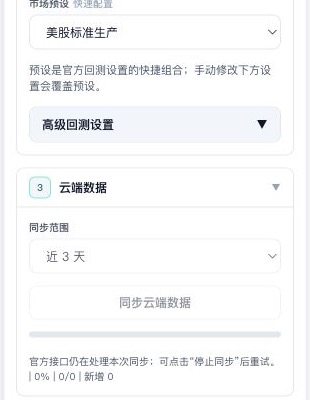
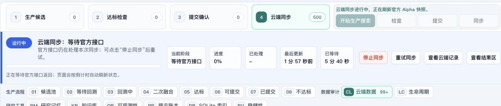
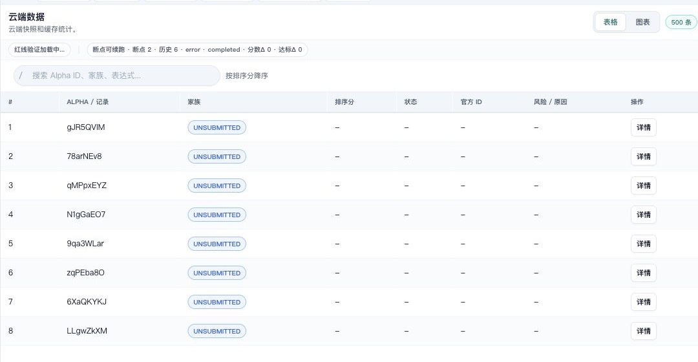
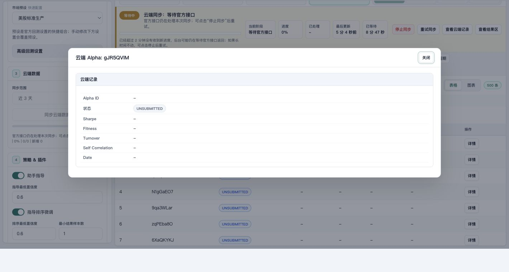
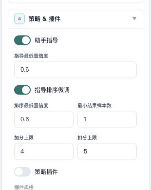

# brain-alpha-ops 用户操作指南

`brain-alpha-ops` 是一个在本机浏览器中使用的 WorldQuant BRAIN Alpha 操作工作台。它把生产环境连接、云端 Alpha 同步、候选查看、达标检查和提交确认放在同一个页面里，帮助你按顺序完成可审计的 Alpha 操作流程。

本文档面向最终用户。你可以把它当作从启动、连接、同步、查看、检查到提交前确认的操作指引。文档截图来自真实生产环境页面，截图区域避开账号、密码、Token 等敏感输入，不使用 Mock 数据、空状态截图或演示数据截图。

## 1. 截图与数据说明

本文截图基于 2026-05-29 连接 BRAIN 生产环境后的页面状态：

| 项目 | 结果 |
|---|---|
| 运行环境 | `production` / 官方 BRAIN API |
| 连接状态 | 已连接，认证模式为 `session_cookie` |
| 云端数据 | 页面显示 500 条云端 Alpha 记录 |
| 示例字段 | Alpha 记录 ID、状态、同步阶段、等待时间、详情弹窗 |
| 提交状态 | 未触发真实提交 |
| 凭据处理 | 凭据仅用于登录，不写入 README、配置文件或截图 |

不同账号看到的数据量、Alpha ID、状态和指标会不同。请以你自己账号下的页面结果为准。

## 2. 你可以完成什么

| 功能模块 | 你能做什么 | 页面入口 |
|---|---|---|
| 连接与身份 | 连接真实 BRAIN 生产环境账号 | 左侧“连接与身份” |
| 市场与回测 | 选择市场预设，确认回测配置 | 左侧“市场 & 回测” |
| 云端数据 | 同步并查看账号下已有 Alpha | 左侧“云端数据”、中部“云端数据”标签 |
| 策略与插件 | 控制助手指导、排序微调和策略插件 | 左侧“策略 & 插件” |
| 生产候选 | 启动候选生成、回测和排序流程 | “开始生产搜索” |
| 达标检查 | 对达标候选执行提交前检查 | “达标检查”或“检查” |
| 提交确认 | 对通过检查的候选做提交前复核 | “可提交”“提交确认”“提交勾选” |
| 审计追踪 | 查看云端同步、生命周期、检查记录和运行状态 | 页面中部视图标签 |

建议顺序是：先连接账号，再同步云端数据，再启动或查看候选，最后才做检查和提交前确认。

## 3. 安装与启动

### 3.1 准备环境

开始前请准备：

1. 可以访问 WorldQuant BRAIN 的电脑。
2. Python 3.10 或更高版本。
3. 可用的 WorldQuant BRAIN 账号。
4. Chrome、Edge、Safari 或 Firefox 等浏览器。
5. 已下载的 `WorldQuant-BRAIN-Alpha` 项目目录。

### 3.2 进入项目目录

macOS / Linux：

```bash
cd WorldQuant-BRAIN-Alpha
```

Windows PowerShell：

```powershell
cd WorldQuant-BRAIN-Alpha
```

### 3.3 创建并启用本地运行环境

macOS / Linux：

```bash
python3 -m venv .venv
source .venv/bin/activate
python3 -m pip install --upgrade pip
python3 -m pip install -e .
```

Windows PowerShell：

```powershell
python -m venv .venv
.\.venv\Scripts\Activate.ps1
python -m pip install --upgrade pip
python -m pip install -e .
```

### 3.4 配置登录信息

推荐使用环境变量，避免把凭据保存到仓库文件中。

| 变量名 | 用途 |
|---|---|
| `BRAIN_USERNAME` | BRAIN 登录邮箱或用户名 |
| `BRAIN_PASSWORD` | BRAIN 登录密码 |
| `BRAIN_TOKEN` | 可选访问令牌 |

macOS / Linux：

```bash
export BRAIN_USERNAME="your_email_here"
export BRAIN_PASSWORD="your_password_here"
```

Windows PowerShell：

```powershell
$env:BRAIN_USERNAME="your_email_here"
$env:BRAIN_PASSWORD="your_password_here"
```

也可以在 Web 页面左侧“连接与身份”区域临时输入账号信息。临时输入只用于当前会话，不建议截图保存该区域。

### 3.5 检查基础配置

默认配置文件是 [config/run_config.json](config/run_config.json)。首次使用时重点确认：

| 配置项 | 建议值 | 说明 |
|---|---|---|
| `environment` | `production` | 使用官方 BRAIN 生产环境 |
| `auto_submit` | `false` | 默认不自动提交 |
| `web.host` | `127.0.0.1` | 仅允许本机访问 |
| `web.port` | `8765` | 本地 Web 控制台端口 |
| `ops.storage_dir` | `data` | 本地运行数据目录 |

### 3.6 启动 Web 控制台

macOS / Linux：

```bash
python3 launch_web.py
```

Windows PowerShell：

```powershell
python launch_web.py
```

启动成功后，终端会显示本地访问地址。默认地址是：

```text
http://127.0.0.1:8765
```

打开该地址即可进入 `brain-alpha-ops` Web 控制台。

## 4. 完整使用流程

### 4.1 连接生产账号

1. 打开本地控制台。
2. 确认顶部显示“生产环境”。
3. 在左侧“连接与身份”中输入账号信息，或使用已设置的环境变量。
4. 展开“高级连接设置”，确认 API 地址是官方 BRAIN 地址。
5. 点击“测试连接”。
6. 等顶部显示“已连接 — production · session_cookie”后再继续。

截图或分享页面前，请确认账号、密码、Token 等输入区域没有出现在画面中。

下面这张图展示左侧真实配置区和右侧等待反馈区，适合先看整体布局。



### 4.2 等待加载、同步和长任务

页面遇到耗时操作时，会显示运行状态面板、进度条、当前阶段、已处理数量和预计剩余时间。等待过程中不要重复点击生产、同步、检查或提交按钮；按钮被禁用时，页面会在按钮提示和左侧任务操作台说明原因。

下面的真实生产截图展示了云端同步等待官方接口返回时的状态：页面显示“当前阶段”“进度”“最后更新”“已等待”，并提供停止同步、重试同步、查看云端记录等操作。



### 4.3 查看真实云端 Alpha 数据

1. 点击“云端数据”标签。
2. 等待表格出现 Alpha 行。
3. 确认表格中有真实 Alpha 记录 ID、状态和操作入口。
4. 如需刷新最新记录，在左侧“云端数据”中选择同步范围并点击“同步云端数据”。

下方截图来自生产环境中的非空云端数据表，页面显示 500 条云端记录，表格行包含 `gJR5QVIM`、`78arNEv8`、`qMPpxEYZ`、`N1gGaEO7` 等真实记录。



### 4.4 查看单条 Alpha 详情

1. 在“云端数据”表格中找到目标 Alpha。
2. 点击该行右侧“详情”。
3. 在弹窗中核对云端 Alpha 记录、状态和指标字段。
4. 查看完毕后点击“关闭”。

下面的示例详情来自生产环境中的 Alpha `9qaOZVno`，状态为 `UNSUBMITTED`，并展示真实的业务字段和检查结论。



### 4.5 设置市场与回测参数

1. 在左侧“市场 & 回测”中选择市场预设。
2. 首次使用建议保持“美股标准生产”等默认预设。
3. 如需手动调整，再展开“高级回测设置”。
4. 修改地区、股票池、Delay、中性化、Decay、Truncation 等参数后再启动生产。

预设会覆盖一组常用官方回测参数。手动修改下方设置后，以手动设置为准。


### 4.6 设置策略与插件

1. 在左侧“策略 & 插件”确认“助手指导”和“指导排序微调”开关。
2. 如果不需要加载本地策略插件，保持“策略插件”关闭。
3. 如果启用策略插件，在“插件规格”中填写插件路径。
4. 调整置信度、加分上限、扣分上限时，建议一次只改一项，便于比较效果。



### 4.7 启动生产搜索

1. 确认账号已经连接。
2. 优先加载或同步云端数据，避免与已有 Alpha 重复。
3. 选择市场预设。
4. 点击“开始生产搜索”。
5. 等候选进入“候选池”“等待回测”“回测中”“二次融合”等阶段。
6. 查看排序分、状态和风险原因。

候选池为空不代表云端数据为空。云端数据表示账号已有线上 Alpha；候选池表示本地生产搜索生成的新候选。

### 4.8 执行达标检查

1. 等候选进入可检查阶段。
2. 点击“达标”或“可提交”相关视图。
3. 选择候选后点击“检查”。
4. 等待检查结束。
5. 查看通过数量、失败数量和失败原因。

如果没有可检查候选，“检查”按钮可能不可用，这是安全设计，不是页面异常。

### 4.9 提交前确认

1. 只在候选通过达标检查后进入“可提交”或“提交确认”视图。
2. 再次核对 Alpha ID、官方 ID、状态和风险原因。
3. 勾选确实要处理的候选。
4. 确认 `auto_submit=false`，除非你明确需要自动提交。
5. 点击“提交勾选”前最后核对数量。

阅读指南或做只读确认时，不需要勾选提交项，也不要触发真实提交。

## 5. 只读验证模式

如果你只想确认项目能读取真实生产数据，不希望触发候选生产或提交，可以按以下只读路径操作：

1. 启动 Web 控制台。
2. 连接生产环境账号。
3. 打开“云端数据”标签。
4. 查看表格中的真实 Alpha 记录 ID 和状态。
5. 打开一条 Alpha 详情。
6. 不点击“开始生产搜索”。
7. 不勾选提交项。
8. 不点击“提交勾选”。

这一路径适合新用户熟悉页面，也适合在提交前确认账号、数据和页面状态是否正常。

## 6. 常见问题排查

### 6.1 Web 页面打不开

可能原因：

1. Web 控制台没有启动。
2. 浏览器地址输入错误。
3. 默认端口被占用。
4. 本机安全软件阻止了本地端口访问。

处理方式：

1. 确认终端中启动命令仍在运行。
2. 打开 `http://127.0.0.1:8765`。
3. 如果端口被占用，修改 [config/run_config.json](config/run_config.json) 中的 `web.port`，例如改为 `8766`。
4. 保存配置后重新启动 Web 控制台。

### 6.2 页面显示未连接

可能原因：

1. 登录环境变量未设置。
2. 页面输入的账号或密码不正确。
3. Token 已过期。
4. 网络暂时无法访问 BRAIN。

处理方式：

1. 重新确认 `BRAIN_USERNAME`。
2. 重新设置 `BRAIN_PASSWORD` 或 `BRAIN_TOKEN`。
3. 确认 API 地址为 `https://api.worldquantbrain.com`。
4. 点击“测试连接”重新验证。

### 6.3 云端数据为空或数量不符合预期

可能原因：

1. 当前账号本身没有对应范围内的 Alpha。
2. 同步范围过窄。
3. 官方接口仍在处理同步任务。
4. 网络或登录会话临时失效。

处理方式：

1. 把同步范围从“近 3 天”改为更长范围。
2. 等页面运行状态面板显示同步完成。
3. 如提示可重试，点击“重试同步”。
4. 仍然异常时，重新测试连接后再同步。

### 6.4 按钮被禁用

按钮禁用通常是为了防止冲突操作。页面会在任务操作台、按钮标题或运行状态面板说明原因，例如：

| 提示 | 含义 |
|---|---|
| 页面数据正在加载 | 等待启动数据加载完成 |
| 云端同步正在进行 | 请等待同步完成后再生产、检查或提交 |
| 达标检查正在进行 | 请等待官方检查返回 |
| 提交正在进行 | 请不要重复提交 |
| 请先选择要提交的 Alpha | 当前没有可提交选择 |

### 6.5 不想触发真实提交

保持以下习惯：

1. 不勾选提交项。
2. 不点击“提交勾选”。
3. 保持 `auto_submit=false`。
4. 只查看云端数据、详情和检查结果。

## 7. 安全提醒

1. 不要把账号、密码、Token 写入 README、截图或聊天记录。
2. 不要提交含有真实凭据的配置文件。
3. 分享截图前，确认输入框、浏览器地址栏和终端输出没有敏感信息。
4. 提交 Alpha 前确认它来自真实生产路径，并已经通过本地与官方检查。
5. 默认把本地控制台绑定到 `127.0.0.1`，不要暴露到公网。
