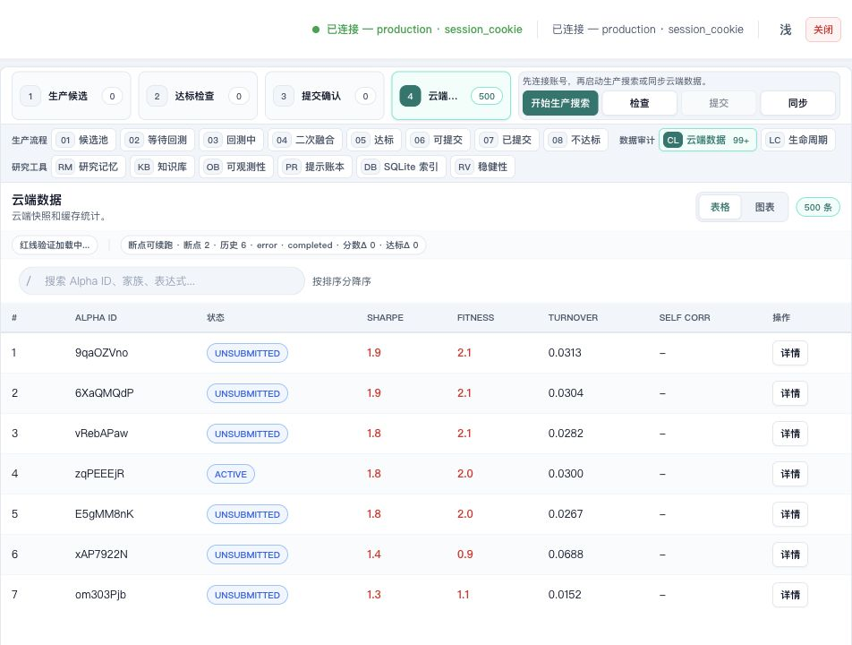
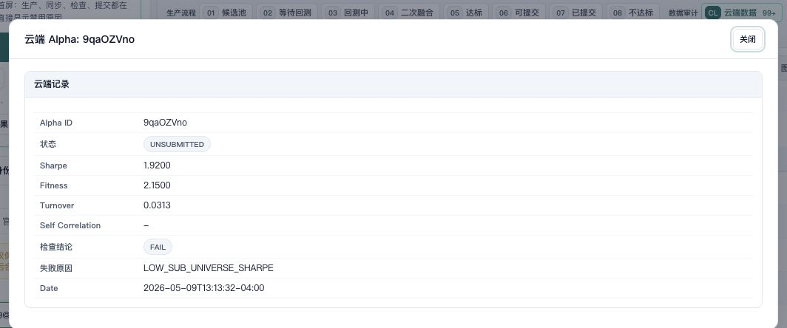

# brain-alpha-ops 用户操作指南

`brain-alpha-ops` 是一个在本机浏览器中使用的 WorldQuant BRAIN Alpha 操作工作台。它把生产环境连接、云端 Alpha 同步、候选查看、达标检查和提交确认放在同一个页面里，帮助用户按顺序完成可审计的 Alpha 操作流程。

本文档面向最终用户，说明如何从零启动、连接真实 BRAIN 生产环境、查看云端 Alpha、执行生产搜索、完成达标检查，并在提交前做安全确认。文档中的项目截图均来自真实生产环境，截图区域已避开账号、密码、Token 等凭据输入位置，不包含 Mock 数据、空状态截图或演示数据截图。

## 1. 截图与数据说明

为了让你看到的界面状态与真实使用体验一致，本文截图使用 2026-05-29 08:51 CST 连接 BRAIN 生产环境后的页面状态生成：

| 项目 | 结果 |
|---|---|
| 运行环境 | `production` / 官方 BRAIN API |
| 连接状态 | 已连接，认证模式为 `session_cookie` |
| 云端数据 | 本地生产快照含 23,243 条真实云端 Alpha 记录 |
| 示例字段 | Alpha ID、状态、Sharpe、Fitness、Turnover、检查结论、失败原因 |
| 提交状态 | 未勾选提交项，未触发真实提交 |
| 凭据处理 | 凭据仅用于登录，不写入 README、配置文件或截图 |

截图只用于帮助你识别真实页面和业务字段。请以你自己账号下的 Alpha ID、指标和检查结果为准；不同账号看到的数据量、状态和失败原因会不同。

## 2. 适用场景

如果你已经拥有 WorldQuant BRAIN 账号，并希望用本地页面管理研究流程，可以使用 `brain-alpha-ops` 完成以下工作：

| 功能 | 你能做什么 | 页面入口 |
|---|---|---|
| 连接与身份 | 连接真实 BRAIN 生产环境账号 | 左侧“连接与身份” |
| 云端数据 | 查看账号下已有 Alpha、状态和指标 | “云端数据”标签 |
| 生产搜索 | 启动本地候选生成与排序流程 | “开始生产搜索” |
| 达标检查 | 对候选执行提交前检查 | “达标检查”或“检查” |
| 提交确认 | 只对通过检查的候选做提交前确认 | “可提交”“提交确认”或“提交勾选” |
| 审计追踪 | 查看任务状态、生命周期、检查结果和本地记录 | 页面中部视图标签 |

使用时请遵守三条原则：

1. 先连接账号，再同步云端数据，再处理候选。
2. 先看状态、指标和风险原因，再决定是否检查或提交。
3. 默认保持 `auto_submit=false`；不确定时不要提交。

## 3. 安装与启动

### 3.1 准备环境

开始前请准备：

1. 可以访问 WorldQuant BRAIN 的电脑。
2. Python 3.10 或更高版本。
3. 可用的 WorldQuant BRAIN 账号。
4. Chrome、Edge、Safari 或 Firefox 等浏览器。
5. 已下载的 `WorldQuant-BRAIN-Alpha` 项目目录。

### 3.2 进入项目目录

macOS / Linux：

```bash
cd WorldQuant-BRAIN-Alpha
```

Windows PowerShell：

```powershell
cd WorldQuant-BRAIN-Alpha
```

### 3.3 创建并启用本地运行环境

macOS / Linux：

```bash
python3 -m venv .venv
source .venv/bin/activate
python3 -m pip install --upgrade pip
python3 -m pip install -e .
```

Windows PowerShell：

```powershell
python -m venv .venv
.\.venv\Scripts\Activate.ps1
python -m pip install --upgrade pip
python -m pip install -e .
```

### 3.4 配置登录信息

推荐使用环境变量，避免把凭据保存到仓库文件中。

| 变量名 | 用途 |
|---|---|
| `BRAIN_USERNAME` | BRAIN 登录邮箱或用户名 |
| `BRAIN_PASSWORD` | BRAIN 登录密码 |
| `BRAIN_TOKEN` | 可选访问令牌 |

macOS / Linux：

```bash
export BRAIN_USERNAME="your_email_here"
export BRAIN_PASSWORD="your_password_here"
```

Windows PowerShell：

```powershell
$env:BRAIN_USERNAME="your_email_here"
$env:BRAIN_PASSWORD="your_password_here"
```

如果使用 Token，可以只设置 `BRAIN_TOKEN`。也可以在 Web 页面左侧“连接与身份”区域临时输入账号信息；临时输入只用于当前会话，不建议截图保存该区域。

### 3.5 检查基础配置

默认配置文件是 [config/run_config.json](config/run_config.json)。首次使用时重点确认：

| 配置项 | 建议值 | 说明 |
|---|---|---|
| `environment` | `production` | 使用官方 BRAIN 生产环境 |
| `auto_submit` | `false` | 默认不自动提交 |
| `web.host` | `127.0.0.1` | 仅允许本机访问 |
| `web.port` | `8765` | 本地 Web 控制台端口 |
| `ops.storage_dir` | `data` | 本地运行数据目录 |

### 3.6 启动 Web 控制台

macOS / Linux：

```bash
python3 launch_web.py
```

Windows PowerShell：

```powershell
python launch_web.py
```

启动成功后，终端会显示本地访问地址。默认地址是：

```text
http://127.0.0.1:8765
```

打开该地址即可进入 `brain-alpha-ops` Web 控制台。

## 4. 完整使用流程

### 4.1 连接生产账号

1. 打开本地控制台。
2. 确认顶部显示“生产环境”。
3. 在左侧“连接与身份”中输入账号信息，或使用已设置的环境变量。
4. 展开“高级连接设置”，确认 API 地址是官方 BRAIN 地址。
5. 点击“测试连接”。
6. 等页面顶部显示“已连接”后再继续。

正常连接后，页面会显示类似 `已连接 — production · session_cookie` 的状态。截图或分享页面前，请确认账号、密码、Token 等输入区域没有出现在画面中。

### 4.2 查看真实云端 Alpha 数据

1. 点击“云端数据”标签。
2. 等待表格出现 Alpha 行。
3. 确认表格中有真实 Alpha ID、状态、Sharpe、Fitness、Turnover 等业务字段。
4. 如果需要刷新最新记录，点击“同步云端数据”。

下面的示例截图来自生产环境中的非空云端数据表，首屏包含 `9qaOZVno`、`6XaQMQdP`、`vRebAPaw`、`zqPEEEjR` 等 Alpha 记录，并展示 Sharpe、Fitness、Turnover 指标。



### 4.3 查看单条 Alpha 详情

1. 在“云端数据”表格中找到目标 Alpha。
2. 点击该行右侧“详情”。
3. 在弹窗中核对 Alpha ID、状态、Sharpe、Fitness、Turnover、检查结论和失败原因。
4. 查看完毕后点击“关闭”。

下面的示例详情来自生产环境中的 Alpha `9qaOZVno`。该记录状态为 `UNSUBMITTED`，Sharpe 为 `1.9200`，Fitness 为 `2.1500`，Turnover 为 `0.0313`，检查结论为 `FAIL`，失败原因为 `LOW_SUB_UNIVERSE_SHARPE`。



### 4.4 刷新云端数据

1. 在左侧“云端数据”区域选择同步范围。
2. 首次使用建议选择“近 3 天”。
3. 点击“同步云端数据”。
4. 同步时不要重复点击生产、检查或提交按钮。
5. 等待页面提示完成或失败。

如果官方接口临时断开，页面会记录失败原因。可等待几分钟后重试，或先使用已加载的云端快照查看数据。

### 4.5 启动生产搜索

1. 确认账号已经连接。
2. 优先完成或加载云端数据，避免生成与云端历史过度相似的候选。
3. 在左侧“市场 & 回测”中选择市场预设。
4. 保持默认参数开始，避免一开始设置过严。
5. 点击“开始生产搜索”。
6. 等待候选进入“候选池”“等待回测”“回测中”等阶段。
7. 查看状态、排序分和风险原因。

注意：候选池为空不代表云端数据为空。云端数据表示账号已有线上 Alpha；候选池表示本地生产搜索生成的新候选。

### 4.6 执行达标检查

1. 等候选进入可检查阶段。
2. 点击“达标”或“可提交”相关视图。
3. 选择候选后点击“检查”。
4. 等待检查结束。
5. 查看通过数量、失败数量和失败原因。

如果没有可检查候选，“检查”按钮可能不可用，这是安全设计，不是页面异常。

### 4.7 提交前确认

1. 只在候选通过达标检查后进入“可提交”或“提交确认”视图。
2. 再次核对 Alpha ID、官方 ID、状态和风险原因。
3. 勾选确实要处理的候选。
4. 确认 `auto_submit=false`，除非你明确需要自动提交。
5. 点击“提交勾选”前最后核对数量。

阅读指南或做只读确认时，不需要勾选提交项，也不要触发真实提交。

## 5. 只读验证模式

如果你只想确认项目能读取真实生产数据，不希望触发候选生产或提交，可以按以下只读路径操作：

1. 启动 Web 控制台。
2. 连接生产环境账号。
3. 打开“云端数据”标签。
4. 查看表格中的真实 Alpha ID、状态和指标。
5. 打开一条 Alpha 详情。
6. 不点击“开始生产搜索”。
7. 不勾选提交项。
8. 不点击“提交勾选”。

这一路径适合新用户熟悉页面，也适合在提交前确认账号、数据和页面状态是否正常。

## 6. 常见问题排查

### 6.1 Web 页面打不开

可能原因：

1. Web 控制台没有启动。
2. 浏览器地址输入错误。
3. 默认端口被占用。
4. 本机安全软件阻止了本地端口访问。

处理方式：

1. 确认终端中启动命令仍在运行。
2. 打开 `http://127.0.0.1:8765`。
3. 如果端口被占用，修改 [config/run_config.json](config/run_config.json) 中的 `web.port`，例如改为 `8766`。
4. 保存配置后重新启动 Web 控制台。

### 6.2 页面显示未连接

可能原因：

1. 账号或密码填写错误。
2. Token 已过期。
3. 环境变量没有在当前终端生效。
4. 网络暂时无法访问 BRAIN。

处理方式：

1. 重新确认 `BRAIN_USERNAME`。
2. 重新设置 `BRAIN_PASSWORD` 或 `BRAIN_TOKEN`。
3. 在同一个终端中重新启动 Web 控制台。
4. 回到页面点击“测试连接”。
5. 看到“已连接”后再继续同步或查看数据。

### 6.3 云端同步很慢或失败

可能原因：

1. 账号下 Alpha 数量较大。
2. 官方接口分页返回较慢。
3. 网络临时中断。
4. 操作过于频繁。

处理方式：

1. 不要连续点击同步按钮。
2. 首次同步优先选择“近 3 天”。
3. 如果提示失败，等待几分钟后重试。
4. 如果本地已有非空云端快照，可以先查看已有数据，再择机刷新。
5. 如果错误反复出现，保留任务错误信息，稍后再同步。

### 6.4 云端数据有记录，但候选池为空

这是正常情况。云端数据是账号已有线上 Alpha；候选池是本地生产搜索产生的新候选。

处理方式：

1. 只查看线上 Alpha 时，使用“云端数据”即可。
2. 需要新候选时，点击“开始生产搜索”。
3. 等候选进入候选池后，再查看排序分和风险原因。

### 6.5 检查或提交按钮不可用

可能原因：

1. 当前没有可检查或可提交候选。
2. 另一个同步、检查、生产或提交任务正在运行。
3. 候选没有通过提交前检查。
4. 页面发现高相似度、缺官方 ID、云端已提交等阻断风险。

处理方式：

1. 等当前任务结束。
2. 查看候选状态和风险原因。
3. 先完成生产搜索、云端同步或达标检查。
4. 只处理通过检查且无阻断风险的候选。

### 6.6 担心误提交

建议做法：

1. 确认 `auto_submit=false`。
2. 不勾选任何提交项。
3. 不点击“提交勾选”。
4. 只使用“云端数据”和“详情”进行只读查看。

## 7. 账号与截图安全

请始终遵守：

1. 不要把真实账号、密码、Token、Cookie 或会话信息写入 README、日志或提交记录。
2. 不要保存包含凭据输入框的截图。
3. 截图必须来自真实生产环境，并且必须包含真实业务数据。
4. 不要用 Mock 数据、空状态或无数据页面替代生产截图。
5. 如果怀疑凭据泄露，请立即更换密码或 Token。

本 README 的截图均只展示生产连接态和业务数据区域，不展示凭据输入内容。
