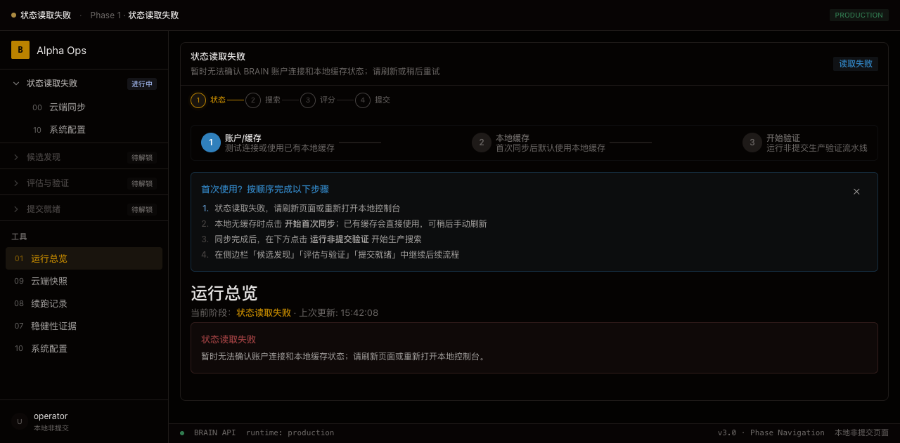
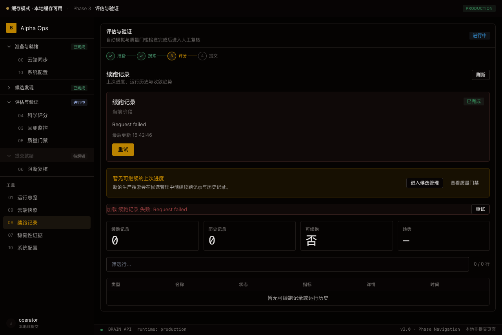
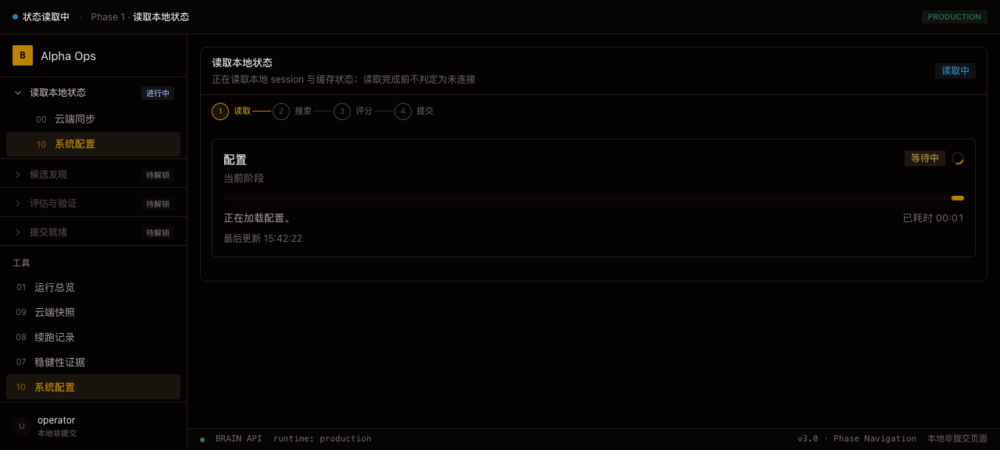
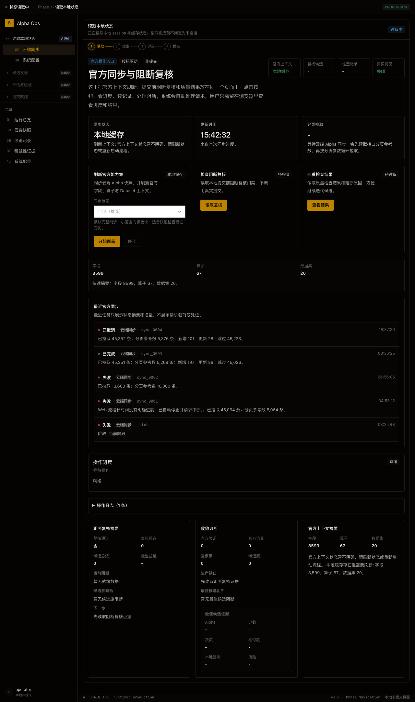
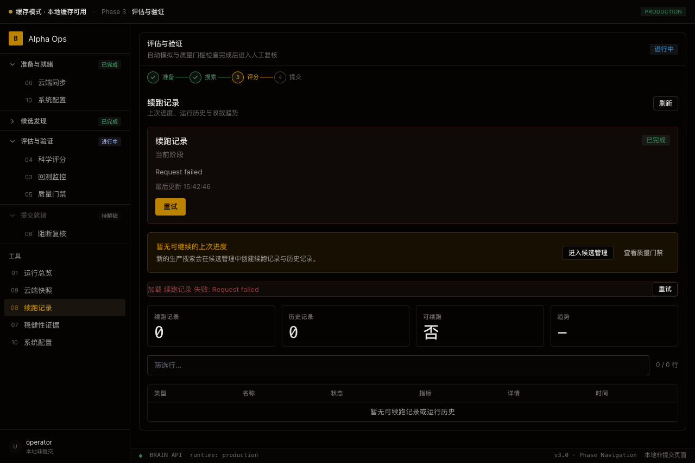
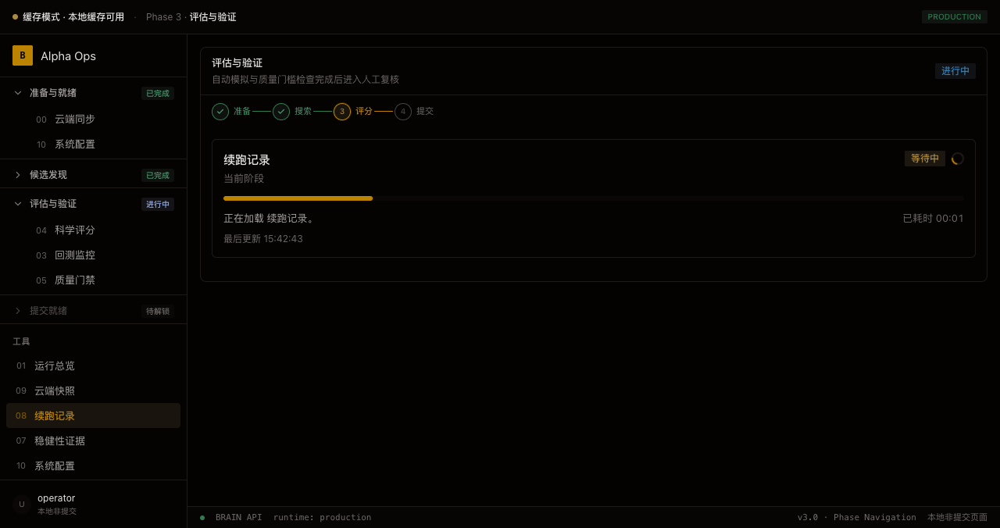

# BRAIN Alpha Ops


> **你的 WorldQuant BRAIN 智能研究助手 — 帮你「找 alpha」，但绝不替你按「提交」按钮。**



---

## 目录

1. [项目简介](#1-项目简介)
2. [项目亮点](#2-项目亮点)
3. [快速上手](#3-快速上手)
4. [操作流程 — 从连接到提交](#4-操作流程--从连接到提交)
5. [界面导览 — 六大功能面板](#5-界面导览--六大功能面板)
6. [评分体系详解 — 三层 25 项](#6-评分体系详解--三层-25-项)
7. [安全模型](#7-安全模型)
8. [架构概览（开发者入口）](#8-架构概览开发者入口)
9. [常见问题 FAQ](#9-常见问题-faq)
10. [故障排查](#10-故障排查)
11. [开发与贡献](#11-开发与贡献)
12. [Docker 部署](#12-docker-部署)
13. [已知限制](#13-已知限制)
14. [相关链接](#14-相关链接)
15. [术语小词典](#15-术语小词典)
16. [核心操作流程](#16-核心操作流程)

---

## 1. 项目简介

BRAIN Alpha Ops 是跑在你**自己电脑**上的 alpha 研究工作台。它会 7×24 小时自动在 WorldQuant BRAIN 平台上**生成 → 测试 → 打分 → 筛选**量化策略，最后把候选清单交到你手上，由你拍板。

**它不是:**
- ❌ 云端 SaaS — 数据在你电脑上，完全由你控制
- ❌ 自动提交工具 — **最后一步永远需要你确认**
- ❌ 黑盒 AI — 每个 alpha 的「为什么高分 / 为什么被拒」都有明细可查

**它是:**
- ✅ 一个浏览器打开的本地控制台（`http://127.0.0.1:8765`）
- ✅ 完整的 alpha 生命周期管理（生成 → 本地预筛 → 官方回测 → 评分 → 预提交审查）
- ✅ 账户安全第一的工具（凭证不落盘 / 提交需敲字确认 / HIL 人机协同闸门）

---

## 2. 项目亮点

### 能力概览

| 工具自动做的事 | 怎么做的 | 你需要做什么 |
|-------------|---------|------------|
| 加载 BRAIN 平台 **8,599** 个数据字段 | 启动一次从官方 API 拉取并缓存到本地 | 启动一次，后面不管 |
| 从 **11 类**投资想法生成候选 alpha | 假设驱动（70%）+ 经验反馈（20%）+ 随机探索（10%） | 选你要研究的主题 |
| 本地快速筛选 | 84×160 合成数据跑一遍，过滤明显不靠谱的 | 不用管 |
| 调官方 API 做真实回测 | 受速率限制保护，不会超额度 | 不用管 |
| 按 **25 项**规则打分 | 8 硬错误 + 10 软警告 + 7 信息项 | 不用管 |
| 自动优化迭代 | 诊断驱动突变 + BCa Bootstrap 收敛 + EMA 自适应 | 不用管 |
| 挑出高分候选 | 综合分排序 + 归因解释 | **你最后过目决定** |
| **帮你点「提交」** | — | **❌ 永远不会做** |

### 关键数字

| 指标 | 数值 |
|------|------|
| 生产 Python 模块 | 645 个 .py 文件 |
| React 前端组件 | 140 个 .tsx |
| 官方数据字段 | 8,599 |
| 官方数据集 | 20 |
| 内置投资想法 | 11 类（YAML 配置） |
| 评分检查项 | 25 项（8 ERROR + 10 WARNING + 7 INFO） |
| Pipeline Mixin 数量 | 6 |
| BRAIN API 适配文件 | 21 |
| 测试用例 | ~2,874 |
| Web API 路由 | 通过 web_handler_dispatch.py 统一分发 |
| 支持 Alpha 类型 | REGULAR / POWER_POOL / ATOM / PYRAMID |

---

## 3. 快速上手

### 环境要求

| 准备项 | 说明 | 必须？ |
|------|------|------|
| 电脑（Mac / Windows / Linux） | Python 3.12+（推荐 3.12，CI 验证版本） | ✅ |
| WorldQuant BRAIN 账号 | [brain.worldquant.com](https://brain.worldquant.com) 注册 | ✅ |
| 浏览器 | Chrome / Edge / Safari / Firefox | ✅ |
| ~10GB 硬盘 | 首次启动下载 8,599 字段到本地 | ⚠️ 建议 |
| Node.js 20+（可选） | 需要 React 前端时才装 | ❌ 可选 |

### 三步装好

```bash
# 1. 下载代码
git clone https://github.com/<your-github-username>/WorldQuant-BRAIN-Alpha.git
cd WorldQuant-BRAIN-Alpha

# 2. 安装依赖（只做一次，约 2-5 分钟）
python3 -m venv .venv
source .venv/bin/activate        # Windows: .venv\Scripts\activate
python3 -m pip install -e .

# 3. 启动！
python3 launch_web.py
```

启动后浏览器**自动打开**控制台首页。



### 连接 BRAIN

1. 在侧边栏点击「系统配置」
2. 在面板中输入 BRAIN **用户名 + 密码**（或 Token）
3. 点击「测试连接」
4. 等待首次同步完成（约 30 秒 - 2 分钟，从 BRAIN API 下载 8,599 字段 + 20 数据集 + 67 算子到本地缓存）

> 💡 密码**只存在内存**（`secure_credentials.py` 管理），不写硬盘 / 日志 / 截图。重启后需重新输入。

### 可选：启用 React 高级前端

默认前端是零依赖的单文件 HTML。如需带独立图表和深色主题的 React 前端：

```bash
cd brain_alpha_ops/web/react_app
npm install && npm run dev

# 另起终端启动后端，指定前端模式：
BRAIN_ALPHA_OPS_WEB_FRONTEND=react python3 launch_web.py
```



*系统配置面板：可设置 BRAIN 市场参数（instrumentType / region / universe / delay / dataset）、回测预算、评分阈值。底部显示「BRAIN API · runtime: production」。*

---

## 4. 操作流程 — 从连接到提交

控制台按 **4 阶段**组织：connect → discover → evaluate → ready，对应一次完整 alpha 生产周期。

### 阶段 1：连接 & 准备

- 输入凭证 → 测试连接
- 自动认证 + 加载用户档案（tier / level / points）
- 同步云端上下文（字段、数据集、算子）



*云端同步面板：本地缓存状态（字段 8,599 / 算子 67 / 数据集 20）、刷新官方能力集、阻断复核检查、同步历史记录。*

### 阶段 2：候选发现

- 点击「开始非提交生产运行」
- 环境自动设为 `auto_submit = False`
- 后台循环：选择数据集 → 按策略模板生成候选 → 本地 84×160 合成数据预筛
- 每个候选落 JSONL 日志，生命周期可追溯

### 阶段 3：评估与验证

- **官方回测**：通过预筛的候选送入 BRAIN API 真实跑回测
- **自动评分**：25 项检查 + 8 硬门禁 → 三层加权 → 综合排序
- **稳健性证据**：反过拟合（IC 稳定性 + 置换检验）+ 滚动验证
- **诊断迭代**：低分候选触发诊断驱动变异，自动尝试优化



*评估与验证阶段：左侧侧边栏四阶段组织，主区域展示当前阶段功能面板。*

### 阶段 4：提交就绪 — 等你拍板

- 所有通过硬门禁、综合分 ≥85 的候选进入「提交队列」
- 查看每个候选的完整指标（Sharpe / 换手 / 自相关 / 归因树）
- **模拟提交**先看 BRAIN 平台会有什么反应，不产生真实提交
- 确认后才走真实提交流程 → 二次确认 → 敲字「我确认」



*续跑记录面板：历史运行记录、可续跑候选、趋势概要。*

> 🛡️ **工具永远不会自动提交。** `REAL_SUBMIT_DISABLED_WEB_FLOW` 是代码级别的硬开关（永远为 `True`），web 端的提交按钮不会激活真实提交流程。环境变量 `BRAIN_ALPHA_FORCE_REAL_SUBMIT=1` 可绕过（仅限受控测试环境）。`OfficialBrainAPI.submit_alpha()` 直连提交入口仅用于开发/受控实验，**不是默认生产能力**——生产提交必须通过浏览器真实操作 + HIL 闸门二次确认。

---

## 5. 界面导览 — 六大功能面板

| 面板 | 入口 | 做什么 |
|------|------|-------|
| **运行总览** | 侧边栏 #01 | 连接状态、本地/云端 alpha 数量、活动时间线 |
| **候选管理** | 候选发现 → 生成 | 生成、查看、筛选候选 alpha |
| **回测监控** | 评估与验证 | 监控官方回测槽位（运行中 / 已完成 / 失败） |
| **科学评分** | 评估与验证 | 25 项检查结果、归因树、改进建议 |
| **质量门禁** | 评估与验证 | 硬/软门禁明细、反过拟合报告 |
| **提交确认** | 提交就绪 | 提交前阻断复核、批量提交、二次确认 |
| **系统配置** | 侧边栏 #10 | 市场参数、预算控制、评分阈值、凭证管理 |
| **续跑记录** | 评估与验证 | 查看历史运行、恢复中断任务 |

### 11 类内置投资想法

工具内置 **11 种**经典投资方法论（YAML 配置），可随时开关、自定义。

| 想法 | 一句话 | 适用场景 |
|------|-------|--------|
| 价值反转（Value Reversal） | 跌多了会反弹 | 中长期 |
| 盈利上修（Earnings Revision） | 分析师上调预期 → 涨 | 中短期 |
| 卖空情绪（Sentiment Short） | 极端看空 → 反向 | 逆向投资 |
| 流动性溢价（Liquidity Premium） | 高流动性股票溢价 | 大容量组合 |
| 低波动（Low Volatility） | 低波动的反直觉收益 | 防御型 |
| 质量盈利（Quality Profitability） | 高盈利能力的超额收益 | 长期持有 |
| 微结构（Microstructure） | 从订单流中找信号 | 高频/日内 |
| 分析师行为（Analyst Behavior） | 分析师预测的惯性 | 事件驱动 |
| 跨资产溢出（Cross-Asset） | 债券/商品对股票的影响 | 宏观对冲 |
| 事件驱动（Event Driven） | 财报/并购后的价格效应 | 事件套利 |
| 宏观敏感（Macro Sensitivity） | 对利率/通胀敏感的品种 | 宏观择时 |

自定义假设：上传 YAML 到 `brain_alpha_ops/research/hypotheses/`，模板参考 `_schema.yaml`。

---

## 6. 评分体系详解 — 三层 25 项

### 三层架构

```
综合分 = 先验(30%) + 实证(45%) + 清单(25%)
```

| 层 | 权重 | 项数 | 评估内容 |
|----|------|------|---------|
| **先验评分** | 30% | 8 维 | 表达式质量 — 经济逻辑、结构复杂度、字段/算子支持度、多样性、可解释性 |
| **实证评分** | 45% | 17 项 | 官方回测结果 — Sharpe、Fitness、换手率、自相关、PROD_CORRELATION 等 |
| **清单评分** | 25% | 7 项 | 提交完备性 — 官方指标完整性、经济逻辑、多样性、本地质量确认 |

### 8 个硬门禁（必须全部通过，否则实证分直接归零）

| 门禁 | 阈值（Delay-1） | 说明 |
|------|----------------|------|
| `sharpe` | ≥ 1.25 | 夏普比率下限 |
| `fitness` | ≥ 1.0 | 适应度下限 |
| `turnover_min` | ≥ 1%（0.01） | 换手率下限 |
| `turnover_platform` | ≤ 70%（0.70） | 平台换手率上限 |
| `turnover_quality` | ≤ 30%（0.30） | 质量目标换手率（可配置降级为 WARNING） |
| `self_correlation` | < 0.70 | PnL 自相关（有 Sharpe 优势例外规则） |
| `prod_correlation` | ≤ 0.70 | 与已上线 alpha 的相关性（调官方 API，不做本地估算） |
| `weight_concentration` | ≤ 0.10 | 单股权重集中度 |
| `sub_universe_sharpe` | ≥ 0.75 × √(sub/alpha) × sharpe | 子宇宙夏普（有小规模例外） |

> **零硬编码原则**：8 个硬门禁名字在 `scoring/gates.py:25` 写入 `OFFICIAL_HARD_GATE_NAMES` 白名单，`add_hard_gate()` 会主动拒绝白名单之外的名字。阈值都从 `QualityThresholds` dataclass 读取，没有内联魔数。

### 决策带

| 综合分 | 决策 | 含义 |
|--------|------|------|
| ≥ 85 | **可提交** | 通过所有硬门禁，可直接进入提交队列 |
| 70-84 | **优化后再提交** | 软指标有改善空间，建议迭代 |
| 50-69 | **仅研究** | 距离提交标准较远，作参考 |
| < 50 | **放弃或重建** | 不满足基本要求 |
| 硬门禁失败 | **阻止** | 无论总分多高，直接被阻拦 |

### 可解释性

每条 alpha 有完整**归因树**：每个维度得分 × 权重 = 贡献值，含中文解释 + 历史趋势（improving / stable / declining）。失败项自动生成具体改进建议（"降低 decay 参数"、"使用不同字段家族"等）。

---

## 7. 安全模型

### 账户安全

| 维度 | 措施 | 实现位置 |
|------|------|---------|
| **凭证保护** | 内存常驻，从不落盘 / 日志 / 截图 | `secure_credentials.py` |
| **网络暴露** | 默认 `127.0.0.1` localhost，`allow_remote: false` | `run_config.json` |
| **日志脱敏** | 覆盖 error / data / text 三类敏感信息 | `redaction.py` |
| **真实提交守门** | `REAL_SUBMIT_DISABLED_WEB_FLOW = True`（永不改变） | `runtime_constants.py:339` |
| **HIL 闸门** | 模拟确认 + 提交双重确认（需要敲字「我确认」） | `HILDefaults` / `web_handler_dispatch.py` |
| **速率限制** | per-session 4xx/5xx 指数退避，静默期保护 | `rate_limit_policy.py` |
| **会话安全** | CSRF token + X-CSRF header + Request-ID/Timestamp 重放防护 | `web_session.py` |
| **CSP 策略** | Content-Security-Policy header 在 HTML 响应中注入 | `web_csp.py` |
| **密钥扫描** | CI 门禁中自动跑密钥泄露扫描 | `.github/workflows/quality-gate.yml` |
| **防循环 import** | 双向 import gate（反向 import 门控） | `web_facade_bindings.py` |

### ConfigPanel 缓存模式（凭据折叠 UX）

当本地缓存可用且未连接官方服务时，ConfigPanel 进入**缓存模式**，凭据输入被折叠隐藏，避免无谓暴露账号密码（`ConfigPanel.tsx:76-80`、`LocalCacheConnectionSection.tsx:22-83`）：

| 状态 | UI 表现 |
|------|---------|
| 缓存可用 & 未连接 | 仅显示「当前使用本地缓存」+「退出本地会话」+「临时连接官方服务」按钮 |
| 点击「临时连接官方服务」 | 展开凭据输入区（仅本次会话有效，不保存到配置/本地存储） |
| 点击「退出本地会话」 | 清空当前页面缓存状态和历史记录 |
| 已连接官方服务 | 凭据输入区常驻显示，可测试连接 |

用户未展开「临时连接官方服务」时，账号/密码/token 输入框不渲染。切换连接状态后 Dashboard、ConfigPanel、全局状态、后端会话状态保持一致。

---

## 8. 架构概览（开发者入口）

### 技术栈

| 层 | 技术 | 规模 |
|----|------|------|
| Python 后端 | Python 3.12+, stdlib `http.server`（无 Flask/FastAPI） | 645 文件 |
| React 前端 | React 18 + TypeScript + Vite + Tailwind CSS | 140 文件 |
| 存储 | JSONL 事件流 + SQLite 表达式索引 + JSON 缓存 | 无外部数据库 |
| CI | GitHub Actions（8 步质量门禁） | 1 workflow |
| 包管理 | pyproject.toml + pip | — |

### 模块地图

```
brain_alpha_ops/                    # 核心源码
├── web/                            # Web 控制台
│   ├── __init__.py (486 行)        # HTTP Server + Handler + POST 路由
│   ├── react_app/ (140 .tsx)       # React 前端（页面 + hooks + utils）
│   └── web_handler_dispatch.py     # 65 个 handler 分发表
├── brain_api/ (20 文件)            # BRAIN 官方 API 适配
│   ├── official.py                 # OfficialBrainAPI（4-Mixin 装配）
│   ├── official_auth.py            # 认证（Basic/Token/Cookie 3 模式）
│   ├── official_context.py         # 分页上下文加载（磁盘缓存 + 过期回退）
│   └── official_simulation.py      # 模拟提交 + check + submit + prod_correlation
├── research/ (111 文件)            # 研究引擎
│   ├── pipeline.py (~720 行)       # AlphaResearchPipeline（10 Mixin 组合）
│   ├── generator.py                # CandidateGenerator（模板/假设/变异 3 模式）
│   ├── scoring.py (~830 行)        # 三层评分引擎
│   ├── alpha_checks.py (~760 行)   # 25 检查项注册中心
│   ├── local_backtest_engine.py    # 84×160 合成数据本地预筛
│   ├── convergence.py              # BCa Bootstrap 收敛追踪
│   ├── iterative_optimizer.py      # 诊断驱动突变优化
│   ├── llm_service.py (610 行)     # LLM 服务（离线 fallback）
│   ├── assistant.py (831 行)       # 助手请求/响应 schema
│   ├── mcp_server.py               # stdio JSON-RPC MCP 服务端
│   └── hypotheses/ (11 YAML)       # 投资想法库
├── scoring/ (10 文件)              # 评分系统
│   ├── gates.py                    # 硬门禁白名单 + zero-deviation 校验
│   ├── official_scoring.py         # OfficialScoringSystem（6 步评估流程）
│   └── attribution.py              # 树状归因引擎
├── compliance/                     # 合规检查（redline 8 类）
├── data/                           # OfficialDataLoader 单例（双重检查锁定）
└── config/                         # 配置加载 + jsonschema 校验
```

### 执行后端

系统支持两种执行后端，通过 `AlphaExecutionBackend` Protocol 统一接口：

| 后端 | 模式 | 说明 | 适用场景 |
|------|------|------|----------|
| **Browser** | `browser` | Playwright 驱动真实 BRAIN 网页操作 | 生产环境，采集截图/DOM/HAR 证据 |
| **API** | `api` | OfficialBrainAPI 直接调用 | 开发调试，无需浏览器 |

通过环境变量切换：
```bash
BRAIN_ALPHA_OPS_EXECUTION_MODE=browser python3 launch_web.py  # 生产模式（默认）
BRAIN_ALPHA_OPS_EXECUTION_MODE=api python3 launch_web.py       # 开发模式
```

或在代码中使用工厂函数：
```python
from brain_alpha_ops.execution_factory import create_execution_backend

backend = create_execution_backend(mode="auto")  # auto: 优先 browser，fallback api
```

Pipeline 同时支持两种传入方式：
```python
# 传统方式：直接传 BrainAPI 实例
pipeline = AlphaResearchPipeline(config=config, api=brain_api)

# 新方式：传 execution backend，自动桥接到 BrainAPI 协议
pipeline = AlphaResearchPipeline(config=config, execution_backend=backend)
```

### 测试与 CI

```bash
# 全量测试（~300s）
python3 -m pytest tests/ -v

# 快速回归（开发循环）
python3 -m pytest tests/ -v -x --tb=short -m "not slow"

# 覆盖率
python3 -m pytest tests/ --cov=brain_alpha_ops --cov-report=html

# 代码质量
ruff check brain_alpha_ops/
mypy brain_alpha_ops/
```

### 测试说明
- **单元测试**: `python3 -m pytest tests/ -q` — 测试内部逻辑
- **契约测试**: `tests/qa_*.py` — 测试本地API契约（已降级，非生产验收）
- **E2E测试**: `tests/e2e/` — Playwright真实浏览器测试（生产验收标准）

### 前端测试

| 类型 | 命令 / 位置 | 说明 |
|------|------------|------|
| Vitest 单测 | `cd brain_alpha_ops/web/react_app && npm run test` | jsdom 行为测试，覆盖关键链路 |
| 静态文本检查 | `tests/test_react_*.py` | Python 静态扫描 React 源码（保留兼容） |
| 行为回归 | `react_app/src/__tests__/` | ConfigPanelCacheMode、ConfigPanelFolding、CandidatePoolState、ScoringAttribution、QualityGateInterception、SimulationQueueState、MobileInteractionBehavior |

### CI 门禁清单

`quality-gate.yml`（PR → main 自动跑）完整门禁：

| # | 门禁 | 脚本 / 命令 | 新增? |
|---|------|------------|-------|
| 1 | Python 编译 | `python -m compileall` | |
| 2 | 配置 schema 校验 | `load_run_config` | |
| 3 | 依赖策略 | `scripts/check_dependency_policy.py` | |
| 3.5 | 前端依赖审计 | `npm audit` + `npm ci` | |
| 4 | 前端内联同步 | `build_inline.py --check` | |
| 5 | 密钥泄露扫描 | `scripts/scan_sensitive_artifacts.py` | |
| 6 | 日志脱敏审计 | `scripts/check_log_redaction.py` | |
| 7 | 模块规模审计 | `scripts/check_module_size.py` | |
| 8 | pytest + 覆盖率 | `pytest --cov` + codecov | |
| 9 | 覆盖率上传 | codecov-action | |
| — | Browser E2E 契约 | `tests/test_browser_execution_adapter.py` | |
| — | 前端审计 | `frontend-audit` job | |
| F3 | TypeScript 类型 | `npm run typecheck`（`tsc -b`） | ✨ 新增 |
| F3 | ESLint | `npm run lint` | ✨ 新增 |
| F3 | Prettier 格式 | `prettier --check` | ✨ 新增 |
| F3 | Vitest 前端单测 | `npm run test`（`vitest run`） | ✨ 新增 |
| F3 | E2E 冒烟 | `tests/e2e/test_real_web_flow.py`（凭据缺失 skip） | ✨ 新增 |
| F3 | 能力集一致性 | `scripts/check_capability_registry.py` | ✨ 新增 |
| F3 | BRAIN 契约 | `scripts/check_brain_contract.py` | ✨ 新增 |
| F3 | 构建产物冒烟 | `build-release.yml` 加入 | ✨ 新增 |

### 核心生产子系统

**BRAIN 能力集注册表** — `brain_alpha_ops/data/capability_registry/` 是字段/算子/Dataset ID/Region/Universe/Delay/Decay/Neutralization/Truncation/Pasteurization/NaNHandling/UnitHandling/TestPeriod/Visualization 的**唯一权威来源**。所有生成、解析、评分、门禁、模拟提交统一从 `get_registry()` 读取，禁止散落硬编码。能力缺失返回 `CapabilityResolutionError`，触发"需要人工确认"。

**候选池生命周期状态机** — `candidate_lifecycle.py:LifecycleState` 定义 11 态：`draft`→`locally_scored`→`gate_rejected`/`queued_for_simulation`→`simulating`→`simulation_failed`/`simulation_passed`→`needs_optimization`/`ready_for_review`→`submitted`/`archived`。Pipeline 通过 `CandidateLifecycle.transition()` 迁移（禁止直接赋值字符串），每次迁移生成 `TransitionRecord` 审计记录。非法迁移抛 `IllegalTransitionError`。

**三槽调度器** — `OFFICIAL_SIMULATION_SLOT_LIMIT=3`（`research/simulation_scheduler/_consistency.py`）是官方模拟并发槽的唯一来源。`BacktestSlotManager.active_limit` 与 `ThreeSlotScheduler.max_slots` 必须等于此值；`assert_scheduler_consistency()` 校验零偏差。429 触发账号级冷却，`CONCURRENT_SIMULATION_LIMIT_EXCEEDED` 仅暂停对应槽，候选池继续生产。

**错误目录** — `error_catalog.py:ErrorKind` 定义 11 类用户错误（login_expired/cache_unavailable/official_rate_limited/simulation_concurrency_exceeded/dataset_missing/field_non_compliant/expression_invalid/network_timeout/task_cancelled/queue_blocked/local_service_unavailable）。每类含原因/影响/建议/恢复入口（`RECOVERY_URLS`），前端转换为可操作提示，严禁展示堆栈或空白。

---

## 9. 常见问题 FAQ

### Q: 工具会自动提交吗？
**A: 绝对不会。** `REAL_SUBMIT_DISABLED_WEB_FLOW` 是代码级别硬开关，永远为 `True`。没有任何 alpha 会在没有人确认的情况下被提交。

### Q: 密码安全吗？
**A:** 凭证只在内存（`secure_credentials.py` 统一管理），不写文件/日志/截图。所有输出自动脱敏（覆盖 error/data/text 三类）。

### Q: 会消耗我的 BRAIN 额度吗？
**A: 会。** 每次官方回测消耗一次 API 调用。工具内置速率限制（`OfficialCallGuard` + `rate_limit_policy.py`），自动控频。会话有 CSRF 校验 + 重放防护。

### Q: 能跑出「稳赚不赔」的 alpha 吗？
**A:** 不能，世上没有这种东西。工具帮你**扩大搜索面 + 量化评分**，从中找到在当前环境下相对靠谱的候选。任何策略都需要你理解它的逻辑。

### Q: 有 LLM / AI 集成吗？
**A:** 有。`llm_service.py`（610 行）提供 LLM 服务，支持离线确定性 fallback。`mcp_server.py` 提供 stdio JSON-RPC MCP 接口，30+ 工具方法。`assistant.py` 提供完整的助手请求/响应 schema，12 个安全短语回归测试已固化。

### Q: 支持 Windows 吗？
**A:** 支持。Python 跨平台。Windows 终端命令写法有标注。

### Q: 工具是免费的吗？
**A:** MIT 开源免费。BRAIN 平台遵从 WorldQuant 服务条款。

### Q: 能多台电脑一起跑吗？
**A:** 不建议。每台独立跑候选池。合并需手工操作。

---

## 10. 故障排查

| 现象 | 怎么排查 |
|-----|---------|
| 启动报「module not found」 | 重跑 `python3 -m pip install -e .` |
| 浏览器空白页 | 检查终端报错；验证 `curl http://127.0.0.1:8765/` 返回 200 |
| 连接 BRAIN 失败 | 先在 brain.worldquant.com 用同一账号登录验证 |
| 跑得很慢 | 网络问题（调 BRAIN API 受网速影响）；尝试减少 `max_candidates_per_cycle` |
| 提交按钮无反应 | **设计如此！** 真提交需敲字「我确认」，不是点按钮 |
| 首次启动卡住 | 等 2-3 分钟（下载 8,599 字段），看终端日志确认进度 |
| 图片/样式加载异常 | 重启服务；清除浏览器缓存 |

如果以上都不管用：
1. 查 `data/` 目录最新日志
2. 截日志前 50 行 + 复现步骤 → 发 [GitHub Issues](https://github.com/<your-github-username>/WorldQuant-BRAIN-Alpha/issues)
3. ⚠️ **绝对不要把密码 / Token 贴到 Issue！**

---

## 11. 开发与贡献

欢迎各种形式的贡献：

| 类型 | 怎么开始 | 难度 |
|------|--------|------|
| 🐛 报 Bug | [开 Issue](https://github.com/<your-github-username>/WorldQuant-BRAIN-Alpha/issues/new) | ⭐ |
| 💡 提想法 | [开 Discussion](https://github.com/<your-github-username>/WorldQuant-BRAIN-Alpha/discussions) | ⭐ |
| 📖 改文档 | 改 .md → PR | ⭐⭐ |
| 🎯 加假设 | 加 `hypotheses/*.yaml` → PR | ⭐⭐ |
| 💻 改代码 | 改 `brain_alpha_ops/` → PR | ⭐⭐⭐⭐ |

```bash
# PR 流程
git clone https://github.com/<你的用户名>/WorldQuant-BRAIN-Alpha.git
cd WorldQuant-BRAIN-Alpha
git checkout -b my-feature
# 改代码...
python3 -m pytest tests/ -v    # 确保测试通过
git add . && git commit -m "Add: 我做了什么"
git push origin my-feature
# 去 GitHub 点 "Compare & pull request"
```

行为准则：友善、耐心、就事论事。**不提交包含真实 BRAIN 凭证的代码。**

---

## 12. Docker 部署

### 构建镜像

```bash
docker build -t brain-alpha-ops .
```

### 运行容器

```bash
docker run -p 8765:8765 brain-alpha-ops
```

启动后访问 `http://127.0.0.1:8765`。

### 使用 docker-compose

```bash
docker compose up -d
```

### 环境变量

| 变量 | 默认值 | 说明 |
|------|--------|------|
| `BRAIN_ALPHA_OPS_EXECUTION_MODE` | `browser` | 执行后端：`browser` 或 `api` |
| `BRAIN_ALPHA_OPS_WEB_FRONTEND` | `react` | 前端模式：`react` 或默认 HTML |
| `PYTHONDONTWRITEBYTECODE` | `1` | 禁止生成 .pyc |
| `PYTHONUNBUFFERED` | `1` | 禁止 Python 输出缓冲 |

---

## 13. 已知限制

| 限制 | 说明 |
|------|------|
| 不自动提交 | 设计选择，不是缺陷。HIL 闸门强制人类确认 |
| 不替代 BRAIN 平台 | 研究阶段工作台，完整平台功能还在 BRAIN 官网 |
| 单机运行 | 不支持多机分布式协作 |
| API 速率受限 | BRAIN 平台有每日/每小时调用上限，工具会自律控频 |
| 首次启动慢 | 需下载 8,599 字段 + 20 数据集到本地（约 30 秒 - 2 分钟） |
| Python 3.12+ | 不支持更老版本（CI 验证 3.12，依赖 `from __future__ import annotations` + PEP 604） |

---

## 14. 相关链接

- [GitHub 仓库](https://github.com/<your-github-username>/WorldQuant-BRAIN-Alpha)
- [CI / Quality Gate](https://github.com/<your-github-username>/WorldQuant-BRAIN-Alpha/actions)
- [WorldQuant BRAIN 平台](https://brain.worldquant.com/)
- [开发者手册](docs/DEVELOPER_HANDBOOK.md)

### `.trae/specs/` 规格索引

| 规格文件夹 | 用途 |
|-----------|------|
| `overhaul-alpha-production-quality` | 生产系统全栈质量攻坚（本规格，工作流 A–F） |
| `complete-brain-alpha-ops` | BRAIN Alpha Ops 完整能力补齐 |
| `upgrade-to-public-product` | 升级为公开产品的错误/空/加载态与可访问性 |
| `deep-optimization-phase2/6/7/10/11` | 深度优化各阶段（子包 `__all__`、模块拆分等） |
| `improve-frontend-ux` | 前端 UX 改进 |
| `deep-optimization-final/fixup` | 深度优化收尾与修复 |

---

## 15. 术语小词典

| 术语 | 通俗解释 |
|------|---------|
| **Alpha（α）** | 一个量化投资策略的数学表达式 |
| **Sharpe Ratio** | 每承担一单位风险能赚多少。>1.5 算优秀 |
| **换手率（Turnover）** | 策略多久换一次股。30% = 月换 30% 持仓 |
| **回测（Backtest）** | 用历史数据模拟「如果当时跑这个策略」 |
| **Universe（股票池）** | 策略在哪些股票里挑，如「全美 TOP3000」 |
| **Dataset（数据集）** | BRAIN 平台的数据原材料（价格、财务、舆情等） |
| **硬门禁（Hard Gate）** | BRAIN 官方规定的必须满足条件，不满足不给提交 |
| **HIL** | Human-in-the-Loop — 最后提交必须有人拍板 |
| **PROD_CORRELATION** | 检查新 alpha 与已上线 alpha 有多像，太像会失败 |
| **MCP** | Model Context Protocol — 让 AI 助手能调用外部工具的标准 |
| **SSE** | Server-Sent Events — 浏览器实时接收后台进度的机制 |
| **速率限制** | 防止对 BRAIN API 调用太频繁被限流的保护机制 |

---

**Happy alpha hunting！ 🚀**

---


### 🔒 预提交审查

在提交任何 Alpha 之前，系统会执行独立的审批路径：
- 独立审批路径执行前，所有阻断项已被识别和处理
- 系统不会直接执行提交 — 最终提交决策始终属于你的独立审批路径
- Web 控制台提供完整的预提交审查界面，确保每一步都有据可查

---
## 16. 核心操作流程

BRAIN Alpha Ops 的核心操作流程围绕生成、测试、打分、筛选四个阶段循环进行：

1. **连接与认证** — 通过 Web 界面输入 BRAIN 凭据，系统验证并缓存官方上下文
2. **配置生成参数** — 在研究配置面板中设置预算和评分阈值
3. **启动研究管线** — 点击启动生产，系统自动进入生成、评分、排序循环
4. **实时监控进度** — 通过生产仪表板查看当前循环状态和候选列表
5. **审查候选 Alpha** — 在评分面板中查看综合评分、归因分析、门禁状态
6. **手动提交决策** — 通过所有门禁的候选由你最终决定是否提交

> 系统永远不会自动提交 Alpha，提交按钮始终掌握在你手中。

---

<sub>MIT License · 本项目不是 WorldQuant 官方产品 · 使用前请阅读 BRAIN 平台服务条款</sub>
