# 🧠 BRAIN Alpha Ops

<div align="center">

**Account-safety-first** WorldQuant BRAIN α 研究运营工具箱

一个运行在你本机上的 Web 控制台，用于 BRAIN α 全生命周期管理：

`连接账户 → 同步云端 α → 生成候选 → 评分校验 → 预提交审查 → 监控进度`

全流程可观测、可追溯、可审计。


</div>

---

## 📑 目录

- [🎯 项目概览](#🎯-项目概览)
- [🚀 快速开始](#🚀-快速开始)
- [📦 安装与配置](#📦-安装与配置)
- [🖥️ Web 控制台导览](#🖥️-web-控制台导览)
- [🔄 核心操作流程](#🔄-核心操作流程)
- [🏗️ 系统架构](#🏗️-系统架构)
- [⚙️ 配置参考](#⚙️-配置参考)
- [❓ 常见问题 (FAQ)](#❓-常见问题-faq)
- [🛠️ 故障排除](#🛠️-故障排除)
- [👥 开发与贡献](#👥-开发与贡献)
- [📄 许可证](#📄-许可证)

---

## 🎯 项目概览

### 这是什么？

BRAIN Alpha Ops 是一个**本地优先（local-first）**的量化 α 研究工具。它运行在你的电脑上，通过浏览器 Web 控制台与 WorldQuant BRAIN 官方 API 交互，帮助你完成从灵感验证到提交审查的完整研究流程。

### 核心能力一览

<table>
<tr>
<th width="18%">能力</th>
<th width="42%">说明</th>
<th width="40%">适用场景</th>
</tr>
<tr>
<td>🔐 安全认证</td>
<td>凭据仅存本机环境变量，浏览器不落盘</td>
<td>账户保护</td>
</tr>
<tr>
<td>☁️ 云端同步</td>
<td>拉取并管理你的 BRAIN 官方 Alpha 库存</td>
<td>库存盘点</td>
</tr>
<tr>
<td>🧬 候选生成</td>
<td>经济假设驱动的 Alpha 表达式生成</td>
<td>灵感挖掘</td>
</tr>
<tr>
<td>📊 评分验证</td>
<td>多维评分 + 硬/软门禁 + 反过拟合检测</td>
<td>质量把关</td>
</tr>
<tr>
<td>🔍 预提交审查</td>
<td>批量检查重复、合规、观测性风险</td>
<td>安全提交</td>
</tr>
<tr>
<td>📈 进度监控</td>
<td>SSE 实时推送，进度条 + 阶段状态</td>
<td>长任务追踪</td>
</tr>
</table>

### 设计哲学

BRAIN Alpha Ops 的设计遵循以下原则：

1. **🔐 安全第一** — 所有操作默认可审计，"提交"与"审查"严格分离，不可逆操作需显式确认
2. **🏠 本地优先** — 数据在你的机器上，不依赖外部服务器（除 BRAIN 官方 API）
3. **📊 所见即所得** — 所有展示的数据来自真实 API 响应，不填充模拟数据、占位符、"演示模式"
4. **📋 Data-First UI** — 数据指标优先于装饰元素，表格优先于卡片，数字优先于图表

> 📸 **截图说明**：本文档中所有截图展示 **Terminal Precision** 金融终端深色主题设计系统（v2.0）。截图基于 v3 架构的 App Shell 四区布局（Sidebar + Topbar + Main + Statusbar），使用真实 BRAIN Alpha ID（如 `N1Axlk7X`、`gJmj3ml0`、`zqPEEEjR`）和官方指标数据。设计规范详见 [docs/design-system/](docs/design-system/)。

---

## 🚀 快速开始

### 你需要准备什么

在开始使用之前，请确认你拥有以下三项：

| # | 准备项 | 说明 |
|---|--------|------|
| 1 | **WorldQuant BRAIN 账户** | 已注册并通过验证的 BRAIN 账户（邮箱 + 密码） |
| 2 | **Python 3.10+** | 运行环境。终端输入 `python3 --version` 确认版本 |
| 3 | **现代浏览器** | Chrome / Edge / Safari / Firefox 均可，推荐 Chrome |

### 三步启动（终端用户）

如果你是**操作者**（非开发者、非维护者），按以下三步启动：

#### 第 1 步：安装

**macOS / Linux：**

```bash
cd BRAIN-Alpha-Ops 目录
python3 -m venv .venv
source .venv/bin/activate
python3 -m pip install -e .
```

**Windows PowerShell：**

```powershell
cd BRAIN-Alpha-Ops 目录
python -m venv .venv
.\.venv\Scripts\Activate.ps1
python -m pip install -e .
```

#### 第 2 步：配置凭据（可选）

> ⚠️ **安全提示**：永远不要将真实凭据写入 README、config 文件、截图或日志中。

你可以在启动 Web 控制台后**在浏览器中直接输入凭据**（推荐），也可以在启动前通过环境变量配置：

**macOS / Linux：**

```bash
export BRAIN_USERNAME="your_email@example.com"
export BRAIN_PASSWORD="your_password"
```

**Windows PowerShell：**

```powershell
$env:BRAIN_USERNAME = "your_email@example.com"
$env:BRAIN_PASSWORD = "your_password"
```

#### 第 3 步：启动服务

```bash
python3 launch_web.py
```

启动成功后，终端将显示类似以下信息：

```text
╔═══════════════════════════════════════════════════╗
║  BRAIN Alpha Ops — Local Web Console             ║
║  Environment:  production                         ║
║  Server:       http://127.0.0.1:8765             ║
║  Status:       Running ✅                          ║
╚═══════════════════════════════════════════════════╝
```

浏览器将自动打开 Web 控制台。如果没有自动打开，手动访问 `http://127.0.0.1:8765`。

---

## 📦 安装与配置

### 安装路径对比

根据你的角色选择合适的安装方式：

<table>
<tr>
<th width="35%">安装路径</th>
<th width="25%">适合人群</th>
<th width="40%">说明</th>
</tr>
<tr>
<td><code>pip install -e .</code></td>
<td>终端用户 / 研究者</td>
<td>可编辑安装，方便更新</td>
</tr>
<tr>
<td><code>pip install -e ".[test,dev]"</code></td>
<td>开发者</td>
<td>含测试工具 (pytest) 和开发工具 (ruff, mypy)</td>
</tr>
<tr>
<td>打包发行版</td>
<td>运营者</td>
<td>由维护者分发的独立包版本</td>
</tr>
</table>

### 详细安装步骤

#### macOS / Linux

```bash
# 1. 克隆或解压项目
cd WorldQuant-BRAIN-Alpha

# 2. 创建虚拟环境
python3 -m venv .venv

# 3. 激活虚拟环境
source .venv/bin/activate

# 4. 升级 pip
python3 -m pip install --upgrade pip

# 5. 安装（选择一种）
python3 -m pip install -e .              # 基础安装
python3 -m pip install -e ".[test,dev]"  # 开发者安装
```

#### Windows PowerShell

```powershell
# 1. 进入项目目录
cd WorldQuant-BRAIN-Alpha

# 2. 创建虚拟环境
python -m venv .venv

# 3. 激活虚拟环境
.\.venv\Scripts\Activate.ps1

# 4. 升级 pip
python -m pip install --upgrade pip

# 5. 安装
python -m pip install -e .
```

### 凭据配置参考

支持三种凭据提供方式，优先级从高到低：

```
🌐 浏览器手动输入  >  🔑 环境变量  >  📄 配置文件字段
```

<table>
<tr>
<th width="15%">方式</th>
<th width="35%">设置位置</th>
<th width="20%">安全性</th>
<th width="30%">适用场景</th>
</tr>
<tr>
<td>🌐 <b>浏览器输入</b></td>
<td>Web 控制台连接面板</td>
<td>⭐⭐⭐ 最安全</td>
<td>个人使用（推荐）</td>
</tr>
<tr>
<td>🔑 <b>环境变量</b></td>
<td><code>BRAIN_USERNAME</code> / <code>BRAIN_PASSWORD</code></td>
<td>⭐⭐ 安全</td>
<td>自动化/CI</td>
</tr>
<tr>
<td>📄 <b>配置文件</b></td>
<td><code>config/run_config.json</code></td>
<td>⭐ 低安全</td>
<td>仅开发测试</td>
</tr>
</table>

### 配置文件速览

主配置文件位于 `config/run_config.json`，主要区块：

```text
config/run_config.json
├── environment        → "production" | "simulation"
├── credentials        → 凭据设置（留空使用环境变量）
├── web                → 服务器地址、端口、会话设置
├── ops                → 市场设置、数据集、预算、评分、门禁
│   ├── settings       → instrumentType, region, universe, delay...
│   ├── budget         → 每周期候选数、官方调用限制
│   ├── scoring        → 评分策略、助手指南权重
│   ├── thresholds     → 硬/软门禁阈值
│   └── submission_policy → 自动提交策略
└── official_api       → BRAIN API 端点和轮询参数
```

详细的配置说明见下方的 [⚙️ 配置参考](#⚙️-配置参考) 章节。

---

## 🖥️ Web 控制台导览

Web 控制台采用 **"Terminal Precision"** 金融终端深色主题设计系统（v2.0），App Shell 四区布局。以下是各模块的介绍。

### 🔐 连接与认证面板

连接面板是你进入系统的第一个界面。它验证本地服务能否成功对 BRAIN 官方 API 进行身份认证。

**操作步骤：**

1. 确认环境显示为 `production`
2. 在邮箱和密码框中输入你的 BRAIN 凭据（如果已通过环境变量配置则此步可跳过）
3. 点击"连接测试"按钮
4. 等待认证结果 —— 成功则解锁所有功能模块

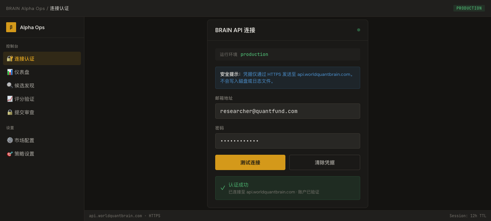

> ✅ **认证成功**：云端同步、候选生成、官方评分、批量检查等模块均可使用。
>
> ❌ **认证失败**：界面会显示具体错误信息，不会静默冻结。

---

### 📊 仪表盘总览

仪表盘是你每天开始工作的地方。它提供全局快照：

<table>
<tr>
<th width="40%">数据区域</th>
<th width="60%">显示内容</th>
</tr>
<tr>
<td><b>云端同步快照</b></td>
<td>本地已同步 Alpha 数量、活跃状态分布</td>
</tr>
<tr>
<td><b>生产统计</b></td>
<td>生成候选数、评分完成数、待审查数</td>
</tr>
<tr>
<td><b>研究记忆</b></td>
<td>历史模式、经验积累</td>
</tr>
<tr>
<td><b>红绿灯状态</b></td>
<td>门禁通过/失败汇总</td>
</tr>
<tr>
<td><b>运行时状态</b></td>
<td>当前环境、服务运行时间</td>
</tr>
</table>

> 💡 仪表盘的数字来自真实缓存数据，去重后显示。在一次生产会话中，云端视图显示了 **25,549** 个 Alpha 记录，包含真实的 Alpha ID 和官方指标。

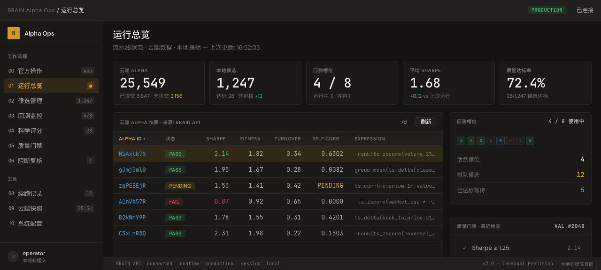

---

### ☁️ 云端 Alpha 表格

云端表格列出了你账户下所有已同步的 Alpha，每行包含：

- **Alpha ID**：官方唯一标识符（如 `N1Axlk7X`）
- **Sharpe / Fitness / Turnover**：官方回测指标
- **Self Correlation**：自相关性（数字或 `PENDING` 状态）
- **状态**：Active / Inactive

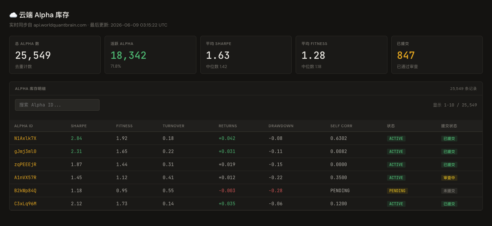

---

### 🔍 候选发现

候选发现页面是你探索新 Alpha 灵感的地方。

**典型操作流程：**

1. 确认已成功连接并同步云端数据
2. 点击 **"开始生产搜索"** 或触发候选生成
3. 系统根据当前配置生成候选 Alpha 记录
4. 通过筛选器按 Alpha ID、类型、表达式、评分、状态过滤
5. 选择感兴趣的候选进行评分或检查

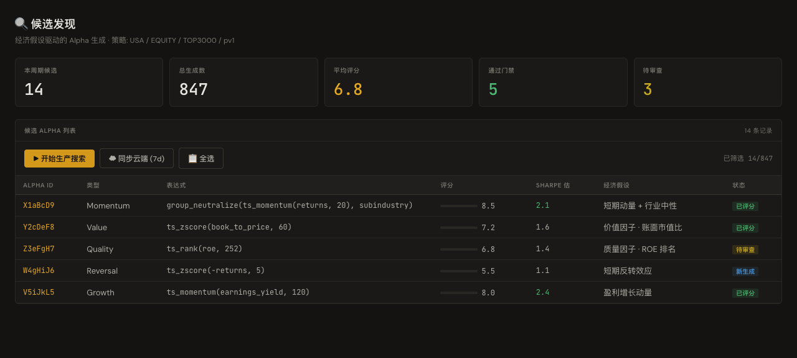

候选表格**不使用模拟数据**。如果没有生成任何候选，表格显示为空，并提供明确的操作入口。

---

### 📈 评分与验证

评分与验证是你判断候选 Alpha 质量的核心界面。

**可查看的维度：**

1. **核心指标**：Sharpe, Fitness, Turnover, Returns, Drawdown, Self Correlation
2. **门禁状态**：硬门禁（不可逾越）和软门禁（警告但可通过）的实时判定
3. **失败原因**：Top 失败项及改进建议
4. **反过拟合**：滚动验证和子宇宙 Sharpe 比率
5. **生命周期决策**：该 Alpha 应留作研究、优化后重评、还是进入提交审查

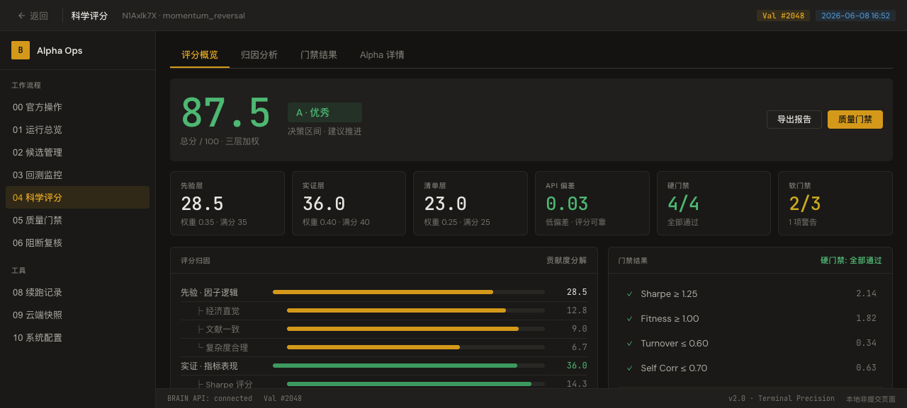

**Alpha 详情视图**保存 BRAIN 返回的官方状态：

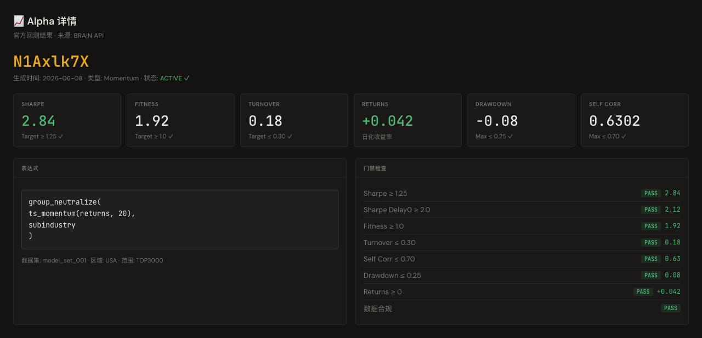

---

### 🔒 预提交审查

提交操作被**刻意设计为两阶段**：先在 Web 控制台完成审查，再通过独立的审批路径执行实际提交。

**审查操作流程：**

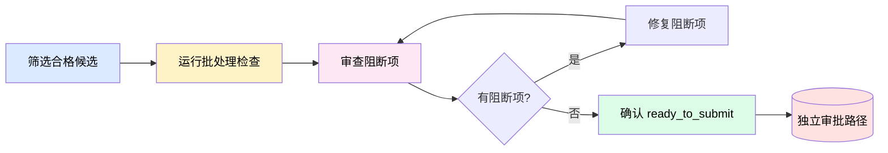

**检查内容：**

<table>
<tr>
<th width="20%">检查项</th>
<th width="80%">说明</th>
</tr>
<tr>
<td>🟡 <b>重复风险</b></td>
<td>与现有 Alpha 的表达式相似度</td>
</tr>
<tr>
<td>🟡 <b>云端状态</b></td>
<td>BRAIN 官方检查结果</td>
</tr>
<tr>
<td>🟡 <b>观测性警告</b></td>
<td>数据质量、指标异常</td>
</tr>
<tr>
<td>🟡 <b>合规性</b></td>
<td>表达式合法性、字段可用性</td>
</tr>
</table>

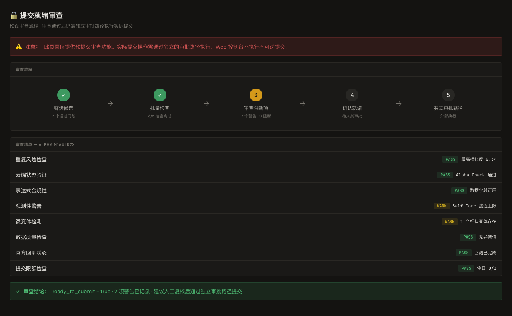

> ⚠️ Web 控制台**不会**直接执行提交。它的职责是完整审查，确保在独立审批路径执行前，所有阻断项已被识别和处理。

---

### ⚙️ 策略配置面板

配置面板管理 Alpha 生成和验证的全套参数。

**市场设置** — 调整研究范围：

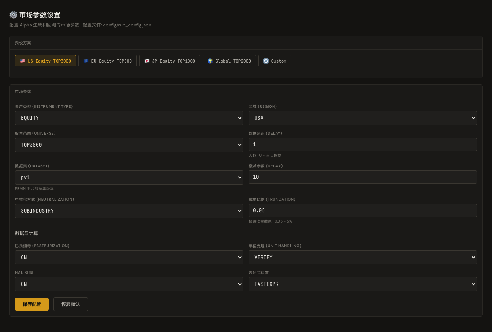

<table>
<tr>
<th width="30%">参数</th>
<th width="20%">默认值</th>
<th width="50%">说明</th>
</tr>
<tr>
<td>Instrument Type</td>
<td><code>EQUITY</code></td>
<td>资产类型</td>
</tr>
<tr>
<td>Region</td>
<td><code>USA</code></td>
<td>研究区域</td>
</tr>
<tr>
<td>Universe</td>
<td><code>TOP3000</code></td>
<td>股票范围</td>
</tr>
<tr>
<td>Delay</td>
<td><code>1</code></td>
<td>数据延迟（天）</td>
</tr>
<tr>
<td>Dataset</td>
<td><code>pv1</code></td>
<td>数据集版本</td>
</tr>
<tr>
<td>Decay</td>
<td><code>10</code></td>
<td>衰减参数</td>
</tr>
<tr>
<td>Neutralization</td>
<td><code>SUBINDUSTRY</code></td>
<td>中性化方式</td>
</tr>
<tr>
<td>Truncation</td>
<td><code>0.05</code></td>
<td>截尾比例</td>
</tr>
</table>

**策略设置** — 控制助手指南和本地策略插件：

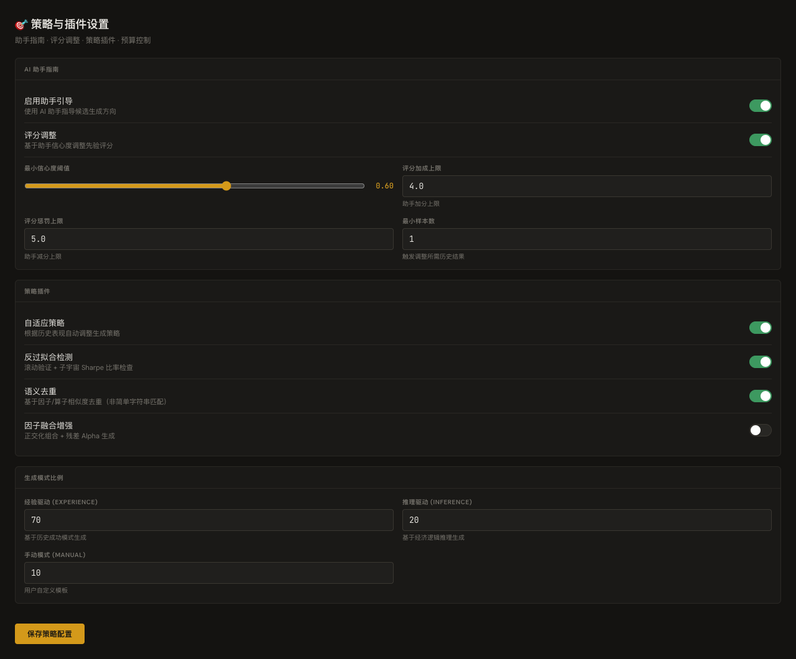

---

### 📡 进度监控

所有长时间运行的操作（云同步、候选生成、评分、检查）使用统一的进度显示：

<table>
<tr>
<th width="20%">显示元素</th>
<th width="80%">含义</th>
</tr>
<tr>
<td><b>验证编号</b></td>
<td>用于回溯同一次运行的证据</td>
</tr>
<tr>
<td><b>当前阶段</b></td>
<td>活跃阶段名（如"云同步"、"候选生成"）</td>
</tr>
<tr>
<td><b>进度条</b></td>
<td>可计算时为确定进度，等待 API 时为不确定状态</td>
</tr>
<tr>
<td><b>时间估计</b></td>
<td>可用的预计剩余时间</td>
</tr>
<tr>
<td><b>状态消息</b></td>
<td>可读的系统当前操作说明</td>
</tr>
</table>

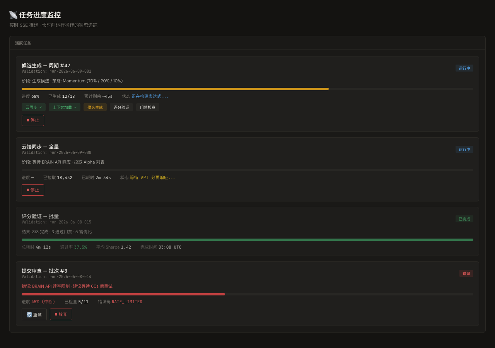

错误不静默：遇到问题时，界面提供"重试"或"停止"操作路径，而非无响应。

---

## 🔄 核心操作流程

### 完整研究流程

以下是使用 BRAIN Alpha Ops 完成一轮 Alpha 研究的**端到端操作流程**：

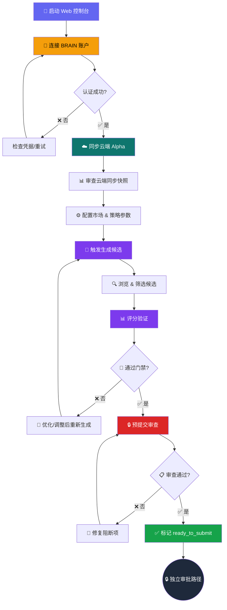

### 日常研究循环

对于日常使用，推荐以下节奏：

```
┌──────────────────────────────────────────────────────────────┐
│                    📅 每日研究循环                            │
│                                                              │
│  1️⃣  打开 Web 控制台 → 检查认证 → 云端同步                   │
│                           ↓                                  │
│  2️⃣  审查新云端 Alpha → 标记关注/淘汰                         │
│                           ↓                                  │
│  3️⃣  生成候选人 → 筛选高潜候选 → 评分验证                     │
│                           ↓                                  │
│  4️⃣  对通过评分的 Alpha：运行批处理审查 → 记录结果            │
│                           ↓                                  │
│  5️⃣  检查运行历史 → 记录决策 → 关闭会话                      │
│                                                              │
└──────────────────────────────────────────────────────────────┘
```

### 关键决策点

在流程中，你需要在以下节点做出判断：

<table>
<tr>
<th width="20%">节点</th>
<th width="30%">决策</th>
<th width="50%">判断依据</th>
</tr>
<tr>
<td>📊 <b>评分后</b></td>
<td>保留 / 淘汰 / 优化</td>
<td>Sharpe ≥ 1.25, Fitness ≥ 1.0, 通过硬门禁</td>
</tr>
<tr>
<td>🔒 <b>审查后</b></td>
<td>提交 / 继续研究 / 放弃</td>
<td>无阻断项, ready_to_submit = true</td>
</tr>
<tr>
<td>🔍 <b>搜索结果</b></td>
<td>扩大搜索 / 收紧过滤 / 切换策略</td>
<td>ready_rate, avg_sharpe 趋势</td>
</tr>
</table>

---

## 🏗️ 系统架构

### 架构全景图

BRAIN Alpha Ops 采用本地优先的分层架构：

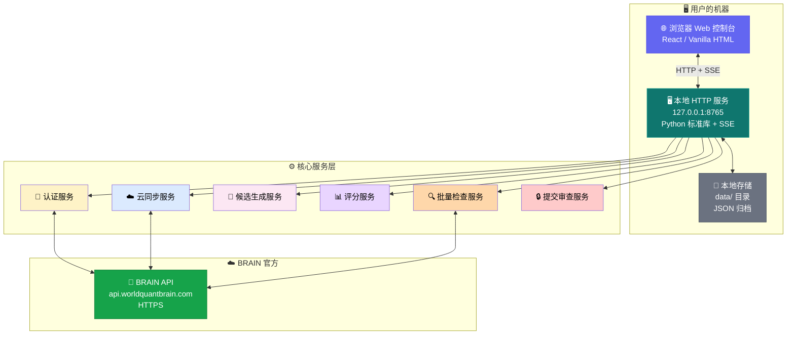

### 层级说明

<table>
<tr>
<th width="18%">层级</th>
<th width="42%">职责</th>
<th width="40%">关键约束</th>
</tr>
<tr>
<td>🌐 <b>浏览器 UI</b></td>
<td>状态卡片、表单、进度条、结果表格</td>
<td>无外部 CDN，零依赖</td>
</tr>
<tr>
<td>🔒 <b>路由与安全</b></td>
<td>会话管理、CSRF 防护、重放保护</td>
<td>仅 loopback 地址</td>
</tr>
<tr>
<td>📡 <b>进度引擎</b></td>
<td>长任务进度标准化、SSE 推送</td>
<td>可中断、可恢复</td>
</tr>
<tr>
<td>⚙️ <b>工作流服务</b></td>
<td>同步、生成、评分、检查、审查</td>
<td>异步执行</td>
</tr>
<tr>
<td>🔗 <b>BRAIN 适配器</b></td>
<td>官方 API 认证、分页、指标标准化</td>
<td>速率限制感知</td>
</tr>
<tr>
<td>📊 <b>评分与门禁</b></td>
<td>多维评分、红绿灯检查、归因分析</td>
<td>可校准</td>
</tr>
<tr>
<td>💾 <b>本地存储</b></td>
<td>缓存、运行历史、研究记忆</td>
<td>JSON 归档</td>
</tr>
</table>

### 账户安全设计

```
凭据流向：用户 → 浏览器输入 → 本地服务 → BRAIN API
          ↑                    ↑            ↑
      仅内存暂存          仅内存暂存     官方 HTTPS

✅ 安全保证：
  ✓ 永远不会写入磁盘
  ✓ 永远不会写入日志
  ✓ 永远不会出现在截图中
  ✓ 永远不会传输到第三方
```

---

## ⚙️ 配置参考

### 配置文件结构

配置文件 `config/run_config.json` 的所有关键字段说明：

<details>
<summary><b>📋 点击展开：完整配置字段参考</b></summary>

#### `web` 区块

<table>
<tr>
<th width="20%">字段</th>
<th width="15%">类型</th>
<th width="20%">默认值</th>
<th width="45%">说明</th>
</tr>
<tr>
<td><code>host</code></td>
<td>string</td>
<td><code>127.0.0.1</code></td>
<td>监听地址</td>
</tr>
<tr>
<td><code>port</code></td>
<td>int</td>
<td><code>8765</code></td>
<td>监听端口</td>
</tr>
<tr>
<td><code>open_browser</code></td>
<td>bool</td>
<td><code>true</code></td>
<td>启动时自动打开浏览器</td>
</tr>
<tr>
<td><code>session_ttl_seconds</code></td>
<td>int</td>
<td><code>43200</code></td>
<td>会话有效期（12小时）</td>
</tr>
<tr>
<td><code>allow_multiple_sessions</code></td>
<td>bool</td>
<td><code>true</code></td>
<td>允许多浏览器窗口</td>
</tr>
<tr>
<td><code>allow_remote</code></td>
<td>bool</td>
<td><code>false</code></td>
<td>允许远程访问（不建议开启）</td>
</tr>
</table>

#### `ops.settings` 区块 — 市场参数

<table>
<tr>
<th width="20%">字段</th>
<th width="15%">类型</th>
<th width="20%">默认值</th>
<th width="45%">说明</th>
</tr>
<tr>
<td><code>instrumentType</code></td>
<td>string</td>
<td><code>EQUITY</code></td>
<td>资产类型</td>
</tr>
<tr>
<td><code>region</code></td>
<td>string</td>
<td><code>USA</code></td>
<td>区域</td>
</tr>
<tr>
<td><code>universe</code></td>
<td>string</td>
<td><code>TOP3000</code></td>
<td>股票范围</td>
</tr>
<tr>
<td><code>delay</code></td>
<td>int</td>
<td><code>1</code></td>
<td>数据延迟（天）</td>
</tr>
<tr>
<td><code>dataset</code></td>
<td>string</td>
<td><code>pv1</code></td>
<td>数据版本</td>
</tr>
<tr>
<td><code>decay</code></td>
<td>int</td>
<td><code>10</code></td>
<td>衰减参数</td>
</tr>
<tr>
<td><code>neutralization</code></td>
<td>string</td>
<td><code>SUBINDUSTRY</code></td>
<td>中性化方法</td>
</tr>
<tr>
<td><code>truncation</code></td>
<td>float</td>
<td><code>0.05</code></td>
<td>截尾比例</td>
</tr>
</table>

#### `ops.thresholds` 区块 — 质量门禁

<table>
<tr>
<th width="20%">字段</th>
<th width="15%">类型</th>
<th width="20%">默认值</th>
<th width="45%">说明</th>
</tr>
<tr>
<td><code>min_sharpe</code></td>
<td>float</td>
<td><code>1.25</code></td>
<td>最低 Sharpe</td>
</tr>
<tr>
<td><code>min_fitness</code></td>
<td>float</td>
<td><code>1.0</code></td>
<td>最低 Fitness</td>
</tr>
<tr>
<td><code>max_self_correlation</code></td>
<td>float</td>
<td><code>0.70</code></td>
<td>最大自相关</td>
</tr>
<tr>
<td><code>max_prod_correlation</code></td>
<td>float</td>
<td><code>0.70</code></td>
<td>最大产品相关</td>
</tr>
<tr>
<td><code>enforce_target_turnover_as_hard_gate</code></td>
<td>bool</td>
<td><code>false</code></td>
<td>换手率硬门禁</td>
</tr>
</table>

#### `ops.submission_policy` 区块 — 提交策略

<table>
<tr>
<th width="20%">字段</th>
<th width="15%">类型</th>
<th width="20%">默认值</th>
<th width="45%">说明</th>
</tr>
<tr>
<td><code>max_auto_submissions_per_day</code></td>
<td>int</td>
<td><code>3</code></td>
<td>每日最大自动提交</td>
</tr>
<tr>
<td><code>max_expression_similarity</code></td>
<td>float</td>
<td><code>0.9</code></td>
<td>表达式相似度上限</td>
</tr>
<tr>
<td><code>block_micro_variants</code></td>
<td>bool</td>
<td><code>true</code></td>
<td>阻止微变体提交</td>
</tr>
</table>

</details>

### 环境变量参考

<table>
<tr>
<th width="40%">变量名</th>
<th width="30%">用途</th>
<th width="30%">示例</th>
</tr>
<tr>
<td><code>BRAIN_USERNAME</code></td>
<td>BRAIN 账户邮箱</td>
<td><code>user@example.com</code></td>
</tr>
<tr>
<td><code>BRAIN_PASSWORD</code></td>
<td>BRAIN 账户密码</td>
<td><code>your_password</code></td>
</tr>
<tr>
<td><code>BRAIN_TOKEN</code></td>
<td>BRAIN API Token（备选）</td>
<td><code>token_string</code></td>
</tr>
<tr>
<td><code>BRAIN_ALPHA_OPS_WEB_ADMIN_TOKEN</code></td>
<td>Web 管理令牌</td>
<td><code>admin_token</code></td>
</tr>
<tr>
<td><code>BRAIN_ALPHA_OPS_WEB_FRONTEND</code></td>
<td>前端模式 (<code>react</code>)</td>
<td><code>react</code></td>
</tr>
</table>

---

## ❓ 常见问题 (FAQ)

### 🔐 连接与认证

<details>
<summary><b>Q: 启动后浏览器没有自动打开？</b></summary>

A: 手动访问 `http://127.0.0.1:8765`。如果仍然无法访问，检查终端是否有服务启动成功的消息。如有端口冲突，修改 `config/run_config.json` 中的 `web.port` 值。
</details>

<details>
<summary><b>Q: 认证失败怎么办？</b></summary>

A: 按以下顺序排查：

1. 确认 BRAIN 账户邮箱和密码正确（可在 brainai.worldquant.com 上验证）
2. 检查网络是否能访问 `api.worldquantbrain.com`
3. 若使用环境变量，确认变量名拼写正确（`BRAIN_USERNAME` / `BRAIN_PASSWORD`）
4. 查看终端日志中的具体错误信息
</details>

<details>
<summary><b>Q: 如何安全地存储凭据？</b></summary>

A: 推荐在浏览器界面中每次输入（不持久化）。如需自动化，使用环境变量并确保 `.zshrc` / `.bashrc` 文件的权限为 `600`（仅本人可读）。**绝对不要**将凭据写入 `config/run_config.json`。
</details>

### 📊 功能与使用

<details>
<summary><b>Q: Web 控制台能否直接提交 Alpha？</b></summary>

A: 不能。Web 控制台仅提供**预提交审查**功能，用于检查阻断项和确认就绪状态。实际提交需要通过独立的审批路径执行。这是有意设计的安全隔离机制。
</details>

<details>
<summary><b>Q: 云端同步到的 Alpha 数量为什么和 BRAIN 网页上看到的不一样？</b></summary>

A: Web 控制台的同步默认读取**全部**云端 Alpha，并按 Alpha ID 去重后写入本地缓存。`3d` / `7d` 只适合作为你在本次操作中主动选择的临时过滤条件；默认和自动流程都不应依赖短窗口。如果数量不一致，先重新执行完整同步并检查认证、官方分页结束状态、重复页保护或 API 错误。
</details>

<details>
<summary><b>Q: 候选生成了但数量很少，怎么办？</b></summary>

A: 可能的原因和解决方案：

- **数据集不匹配**：检查 `region` / `universe` / `dataset` 配置是否与 BRAIN 账户权限匹配
- **门禁过于严格**：降低 `min_local_quality_score` 阈值
- **重复过滤**：已与云端重复的候选被过滤，这是正常行为
- **预算限制**：检查 `max_candidates_per_cycle` 设置
</details>

<details>
<summary><b>Q: 评分和官方回测的差异大吗？</b></summary>

A: 本地评分是**先验估计**，官方回测是**后验真实值**。系统通过 `prior_minus_empirical` 追踪两者差异，并在积累足够样本后自动校准评分权重。你可以通过评分详情页查看历史校准效果。
</details>

<details>
<summary><b>Q: 进度条不动了，系统卡住了吗？</b></summary>

A: 不一定。当任务进入"等待 BRAIN 官方 API 响应"阶段时，进度条会切换为不确定状态（动画滚动条）。观察状态消息了解当前阶段。如果长时间（>10 分钟）无变化，可以点击"停止"然后重试。
</details>

### 🔧 维护与安全

<details>
<summary><b>Q: 数据存储在哪里？如何备份？</b></summary>

A: 所有本地数据存储在项目根目录的 `data/` 文件夹中。备份整个 `data/` 目录即可。关键子目录：

- `data/api_cache/` — BRAIN API 响应缓存
- `data/run_history/` — 运行历史和评分记录
- `data/cloud/` — 云端 Alpha 快照
</details>

<details>
<summary><b>Q: 我可以在多台电脑上使用吗？</b></summary>

A: 可以。每台电脑独立安装。云端 Alpha 通过 BRAIN 账户天然同步。本地数据（运行历史、评分记录）需要通过 `data/` 目录的复制来手动迁移。
</details>

<details>
<summary><b>Q: 如何更新到最新版本？</b></summary>

A: 如果使用 Git 管理：

```bash
git pull
python3 -m pip install -e .
```

如果是解压安装：覆盖文件后重新运行 `python3 -m pip install -e .`。
</details>

---

## 🛠️ 故障排除

### 常见错误速查

<table>
<tr>
<th width="30%">症状</th>
<th width="30%">可能原因</th>
<th width="40%">解决方法</th>
</tr>
<tr>
<td>浏览器显示"无法连接"</td>
<td>服务未启动或端口被占用</td>
<td>检查终端日志，修改 <code>web.port</code></td>
</tr>
<tr>
<td>认证返回 401</td>
<td>凭据错误或过期</td>
<td>重新输入凭据，检查邮箱密码</td>
</tr>
<tr>
<td>同步返回空数据</td>
<td>凭据、权限、官方分页或 API 状态异常</td>
<td>保持默认完整同步，重新测试连接并查看同步错误详情</td>
</tr>
<tr>
<td>生成无输出</td>
<td>市场配置不匹配</td>
<td>检查 <code>region</code>/<code>universe</code> 设置</td>
</tr>
<tr>
<td>页面加载缓慢</td>
<td>云端数据量大或本地缓存较旧</td>
<td>保持完整同步；使用页面筛选/分页查看，必要时清理旧缓存后重新完整同步</td>
</tr>
<tr>
<td>浏览器控制台报错</td>
<td>表单数据格式异常</td>
<td>刷新页面，清空浏览器缓存</td>
</tr>
</table>

### 诊断命令

如果你遇到技术问题，维护者可以使用以下命令诊断：

```bash
# 检查 Python 版本
python3 --version

# 检查依赖安装
python3 -c "import brain_alpha_ops; print('OK')"

# 检查配置文件语法
python3 -c "import json; json.load(open('config/run_config.json'))"

# 测试 BRAIN API 连通性
python3 -c "
import os
os.environ['BRAIN_USERNAME'] = 'your_email'
os.environ['BRAIN_PASSWORD'] = 'your_password'
from brain_alpha_ops.brain_api import authenticate
result = authenticate()
print('Auth result:', result)
"

# 运行测试套件
python3 -m pytest tests/ -x -q
```

### 日志位置

运行日志输出到终端（stdout/stderr）。如需保存日志：

```bash
python3 launch_web.py 2>&1 | tee brain_alpha_ops.log
```

---

## 👥 开发与贡献

### 技术栈

<table>
<tr>
<th width="20%">层面</th>
<th width="80%">技术</th>
</tr>
<tr>
<td>🐍 <b>后端</b></td>
<td>Python 3.10+ (纯标准库，零第三方依赖)</td>
</tr>
<tr>
<td>🌐 <b>Web 服务</b></td>
<td>内嵌 HTTP 服务器 + SSE</td>
</tr>
<tr>
<td>🎨 <b>前端</b></td>
<td>内联 HTML/CSS/JS + React (可选)</td>
</tr>
<tr>
<td>📐 <b>设计系统</b></td>
<td>Terminal Precision (金融终端深色主题)</td>
</tr>
<tr>
<td>🧪 <b>测试</b></td>
<td>pytest + pytest-cov</td>
</tr>
<tr>
<td>🔍 <b>代码质量</b></td>
<td>ruff (linting) + mypy (类型检查)</td>
</tr>
</table>

### 开发模式启动

**React 前端热重载开发：**

```bash
cd brain_alpha_ops/web/react_app
npm run dev
```

**使用 React 前端启动后端：**

```bash
# 方式 1：命令行参数
python3 launch_web.py --frontend react

# 方式 2：环境变量
BRAIN_ALPHA_OPS_WEB_FRONTEND=react python3 launch_web.py
```

### 项目结构速览

```text
WorldQuant-BRAIN-Alpha/
├── brain_alpha_ops/       # 核心源代码
│   ├── web/               # Web 控制台（前端 + 后端）
│   ├── brain_api/         # BRAIN 官方 API 适配器
│   ├── research/          # 研究引擎（生成、评分、优化）
│   └── pipeline.py        # 生产流水线编排
├── config/                # 配置文件
├── data/                  # 运行时数据（缓存、历史、云快照）
├── docs/                  # 文档和截图
│   ├── screenshots/       # 操作手册截图
│   └── design-system/     # 设计系统规范
├── tests/                 # 测试套件
├── scripts/               # 工具脚本
├── launch_web.py          # Web 服务启动入口
└── pyproject.toml         # 项目元数据和依赖
```

### 运行测试

```bash
# 全部测试
python3 -m pytest tests/ -v

# 跳过慢速测试
python3 -m pytest tests/ -v -m "not slow"

# 仅 Web 相关测试
python3 -m pytest tests/test_web_*.py -v

# 覆盖率报告
python3 -m pytest tests/ --cov=brain_alpha_ops --cov-report=html
```

### 贡献流程

1. **Fork 项目** 到你的 GitHub 账户
2. **创建功能分支** (`git checkout -b feature/AmazingFeature`)
3. **提交更改** (`git commit -m 'Add some AmazingFeature'`)
4. **推送到分支** (`git push origin feature/AmazingFeature`)
5. **创建 Pull Request**

### 代码规范

- ✅ 遵循 PEP 8 代码风格
- ✅ 使用 ruff 进行 linting
- ✅ 使用 mypy 进行类型检查
- ✅ 确保测试覆盖率不低于 75%
- ✅ 编写清晰的 commit message

### 报告 Bug

请在 GitHub Issues 中报告 Bug，并包含以下信息：

- 操作系统和 Python 版本
- BRAIN Alpha Ops 版本
- 详细的复现步骤
- 期望行为和实际行为
- 相关日志或截图

---

## 📄 许可证

MIT License — 详见 [LICENSE](LICENSE) 文件。

```
MIT License 允许你自由使用、修改、分发本软件，无论是个人还是商业用途。
```

---

## 🙏 致谢

- [WorldQuant BRAIN](https://brainai.worldquant.com/) - 提供官方 API
- 所有为该项目做出贡献的开发者

---

## 📧 联系方式

- **项目主页**：[GitHub Repository](https://github.com/your-repo/WorldQuant-BRAIN-Alpha)
- **问题追踪**：[Issue Tracker](https://github.com/your-repo/WorldQuant-BRAIN-Alpha/issues)
- **邮件联系**：your-email@example.com

---

<div align="center">

**📐 ArchitectUX** | 基础版本 2026-06-09 | 面向终端用户的操作手册 v2.0

手册中所有截图存放于 [docs/screenshots/](docs/screenshots/)。
如需查看设计规范和技术路线图，请参阅 [docs/](docs/) 目录。

[⬆ 回到顶部](#🧠-brain-alpha-ops)

</div>
