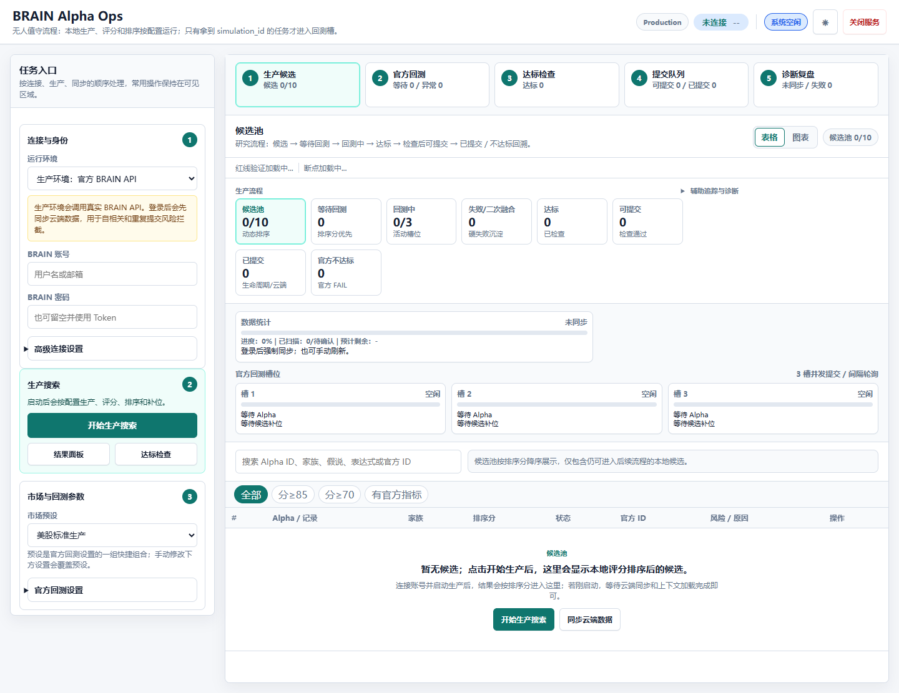
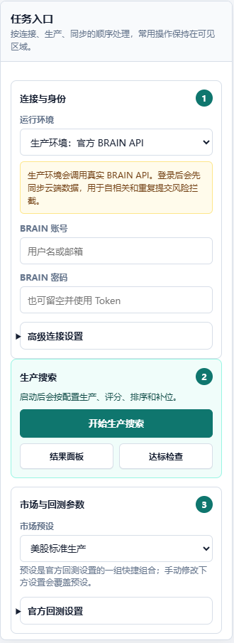
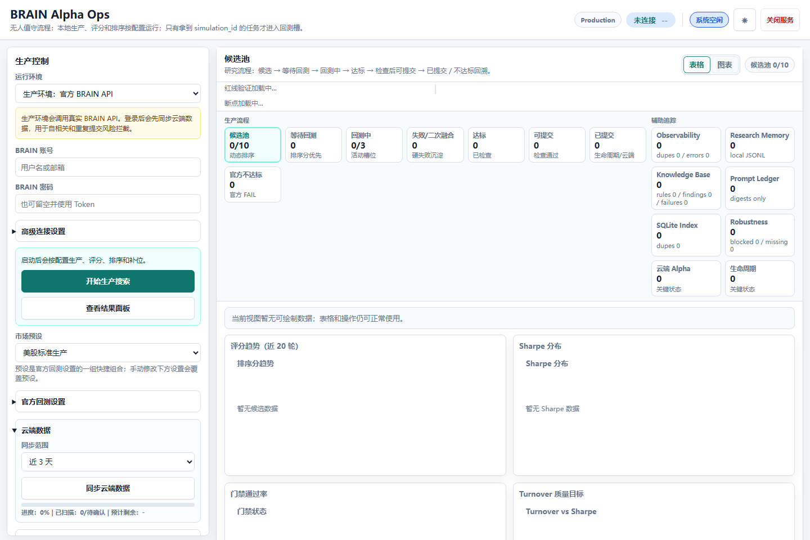
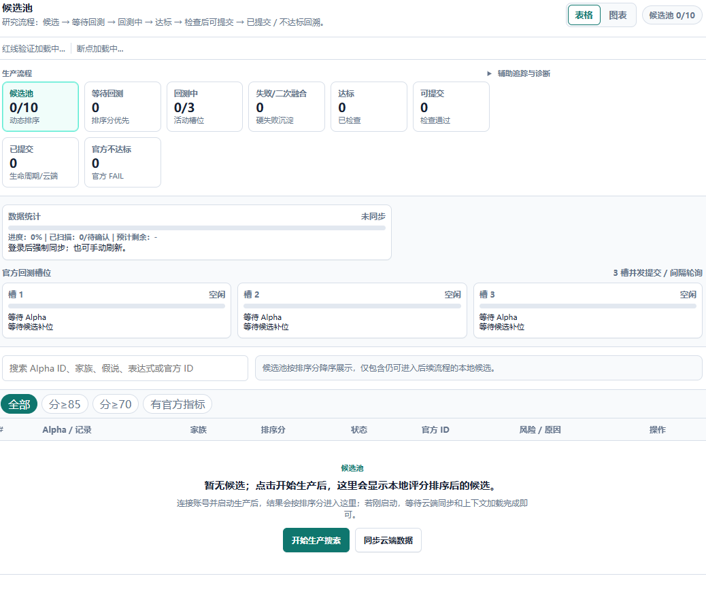

# BRAIN Alpha Ops

欢迎使用 BRAIN Alpha Ops。

这是一个面向 WorldQuant BRAIN 的本地网页工作台。你打开电脑浏览器后，可以在同一个页面里完成账号连接、云端同步、候选生成、结果查看、达标检查和提交前确认。

这份说明以电脑端 Web 控制台为准。第一次使用时，只要按顺序照着点即可。

## 项目简介

BRAIN Alpha Ops 帮你把 Alpha 研究流程放到一个清晰的网页里：

1. 连接你的 BRAIN 账号。
2. 同步账号里已有的 Alpha。
3. 生成新的候选 Alpha。
4. 查看候选状态、分数和风险原因。
5. 对达标候选做提交前检查。
6. 在确认无误后，再谨慎处理提交。

项目默认不会自动提交 Alpha。页面会尽量把“下一步该做什么”和“为什么不能做”直接显示出来，方便你判断。

## 快速入门步骤

### 第 1 步：准备使用环境

你需要：

1. 一台 Windows 电脑。
2. Python 3.10 或更高版本。
3. 一个 WorldQuant BRAIN 账号。
4. PowerShell。

### 第 2 步：安装项目

打开 PowerShell，进入你想保存项目的文件夹，然后运行：

```powershell
git clone https://github.com/qq547820639/WorldQuant-BRAIN-Alpha.git
cd WorldQuant-BRAIN-Alpha

python -m venv venv
.\venv\Scripts\Activate.ps1

pip install -e .
```

以后每次重新使用本项目时，先进入项目文件夹并启用环境：

```powershell
cd WorldQuant-BRAIN-Alpha
.\venv\Scripts\Activate.ps1
```

### 第 3 步：启动电脑端 Web 控制台

在项目文件夹中运行：

```powershell
python launch_web.py
```

然后用电脑浏览器打开：

```text
http://127.0.0.1:8765
```

看到 `BRAIN Alpha Ops` 页面后，就可以开始操作。

## Web 控制台界面总览



请先认识页面上的几个固定位置：

1. **顶部状态栏**：在页面最上方，显示当前环境、连接状态、系统状态和关闭服务按钮。刚打开时通常会看到“未连接”。
2. **左侧操作栏**：页面左侧，从上到下依次是“连接与身份”“生产搜索”“市场与回测参数”“云端数据”等区域。账号填写和主要按钮都在这里。
3. **上方流程卡片**：页面中上方有 5 个步骤卡片，分别是“生产候选”“官方回测”“达标检查”“提交队列”“诊断复盘”。这里用来快速判断流程走到哪一步。
4. **中间结果区**：页面中间显示候选池、回测状态、达标数量、可提交数量和数据表格。
5. **表格 / 图表切换**：结果区右上角可以在“表格”和“图表”之间切换。新手建议先看“表格”。

## 账号设置：在 Web 控制台里完成

不需要在 README 或配置文件里写账号密码。请直接在电脑端 Web 控制台中填写。



### 操作路径

页面左侧操作栏 → **连接与身份**

### 使用账号和密码登录

1. 看左侧操作栏最上方，找到标题为“连接与身份”的卡片。
2. 在“BRAIN 账号”输入框中输入你的用户名或邮箱。
   - 示例：`your@email.com`
3. 在“BRAIN 密码”输入框中输入你的 BRAIN 密码。
   - 输入时页面会隐藏密码，这是正常现象。
4. 确认“运行环境”保持为“生产环境：官方 BRAIN API”。
5. 不需要单独点击“保存账号”。填写后，点击“同步云端数据”或“开始生产搜索”时，页面会使用当前填写的信息连接 BRAIN。

### 使用令牌登录

如果你使用登录令牌：

1. 在左侧“连接与身份”卡片底部点击 **高级连接设置**。
2. 找到“令牌 Token”输入框。
3. 输入你的令牌。
   - 示例：`eyJ...`
4. 如果使用令牌，可以把“BRAIN 密码”留空。
5. 点击“同步云端数据”测试是否能连接。

### 如何判断账号是否连接成功

连接成功后，你会看到这些反馈之一：

1. 顶部状态从“未连接”变成已连接或显示账号相关状态。
2. 点击“同步云端数据”后，左侧“云端数据”区域的进度条开始变化。
3. 页面出现“开始同步云端数据...”之类的提示。
4. 中间结果区开始显示云端 Alpha 数量或同步状态。

如果仍显示“未连接”，通常是账号、密码、令牌或网络有问题。请回到“连接与身份”重新检查输入。

## 第一次使用：推荐操作顺序

### 1. 同步云端数据

点击位置：

左侧操作栏 → **云端数据** → **同步云端数据**

输入示例：

1. “同步范围”选择“近 3 天”。
2. 点击“同步云端数据”。

你会看到：

1. “进度：0%”开始变化。
2. 顶部或页面提示正在同步。
3. 同步完成后，中间结果区会显示云端 Alpha 相关信息。

为什么先做这一步：

同步后，页面更容易判断哪些 Alpha 已经存在、哪些可能重复、哪些需要谨慎处理。

### 2. 生成候选

点击位置：

左侧操作栏 → **生产搜索** → **开始生产搜索**

你会看到：

1. 按钮文字可能变成“停止生产”。
2. 上方“生产候选”卡片数量开始变化。
3. 中间“候选池”出现新的候选。
4. 表格中出现每条 Alpha 的状态、排序分和风险原因。

如果你第一次使用，建议先保持默认设置，不要急着改市场参数。

### 3. 查看候选结果

点击位置：

中间结果区 → 右上角选择 **表格**

重点看这些列：

1. **Alpha / 记录**：候选内容或记录名称。
2. **排序分**：越高通常越值得优先查看。
3. **状态**：候选当前处在哪一步。
4. **官方 ID**：有官方回测记录后会显示。
5. **风险 / 原因**：如果不能继续，通常会写明原因。
6. **操作**：当前候选可执行的动作。

常见状态含义：

| 状态 | 含义 | 你可以做什么 |
|---|---|---|
| 候选池 | 已生成，等待进一步筛选 | 查看分数和风险原因 |
| 等待回测 | 排队等待官方回测 | 等待或继续生成其他候选 |
| 回测中 | 正在等待官方结果 | 不要重复提交，等结果返回 |
| 达标 | 看起来满足进一步检查条件 | 点击“检查” |
| 可提交 | 已通过必要检查 | 谨慎确认后再提交 |
| 不达标 | 没有通过筛选或检查 | 查看原因，通常不建议提交 |

### 4. 切换图表查看趋势



点击位置：

中间结果区右上角 → **图表**

你会看到：

1. 排序分趋势。
2. Sharpe 分布。
3. 门禁通过率。
4. Turnover 质量目标。

如果图表区域显示“暂无数据”，说明当前还没有足够候选结果。先回到“表格”，继续生成或同步数据。

### 5. 做达标检查



点击位置：

入口一：左侧操作栏 → **生产搜索** → **达标检查**

入口二：中间结果区 → 点击上方第 3 张流程卡片 **达标检查**

进入达标检查后，在结果区上方的操作条里找到 **快速 / 全部** 下拉框和 **检查** 按钮。

检查前先选择模式：

| 选项 | 适合什么时候用 |
|---|---|
| 快速 | 检查本次新生成、还没检查过的达标候选 |
| 全部 | 同步云端数据后，重新检查所有达标候选 |

推荐新手选择“快速”。

具体操作：

1. 先看左侧“生产搜索”卡片，确认里面有“达标检查”按钮。
2. 点击“达标检查”，或点击中间上方第 3 张流程卡片“达标检查”。
3. 看结果区上方的操作条。
4. 在下拉框中选择“快速”。
5. 点击旁边的“检查”按钮。
6. 检查过程中，不要重复点击“检查”或“提交”。

你会看到：

1. 检查进度开始变化。
2. 按钮可能暂时不可点，表示检查正在进行。
3. 完成后页面会显示通过数量和失败原因。
4. 通过检查的候选会进入“可提交”相关区域。

### 6. 提交前确认

点击位置：

中间结果区 → 点击上方流程卡片 **提交队列**，或切到 **可提交** 视图 → 勾选要处理的 Alpha → 点击 **提交勾选**

新手建议：

1. 先不要打开“自动提交”。
2. 先查看“风险 / 原因”列。
3. 确认候选已经通过检查。
4. 确认云端数据刚同步过。
5. 确认没有重复或已提交提示。

提交按钮什么时候会出现或可用：

1. 上方“提交队列”卡片里的“可提交”数量大于 0。
2. 当前视图是“达标”或“可提交”。
3. 表格里至少有一条可处理的 Alpha。
4. 你已经勾选了要提交的 Alpha。
5. 没有生产搜索、云端同步、达标检查或提交任务正在运行。
6. 页面没有显示阻断风险。

如果按钮不可点，鼠标放到按钮上或查看页面提示，通常会看到原因，例如“请先选择要提交的 Alpha”“达标检查正在进行”“云端同步正在进行”。

## 常用操作指引

### 查看当前是否有任务在运行

点击位置：

页面顶部状态栏，或左侧“生产搜索”区域。

你会看到：

1. “系统空闲”：当前没有运行中的任务。
2. “生产任务正在运行”：正在生成或处理候选。
3. “云端同步正在进行”：正在读取云端 Alpha。
4. “达标检查正在进行”：正在做提交前检查。
5. “提交处理中”：正在等待提交结果。

当一个任务正在运行时，其他冲突按钮会暂时不可点。这是正常保护。

### 修改市场与回测参数

点击位置：

左侧操作栏 → **市场与回测参数**

推荐做法：

1. 新手先使用默认预设，例如“美股标准生产”。
2. 需要微调时，再展开“官方回测设置”。
3. 改完参数后，再点击“开始生产搜索”。

状态反馈：

如果你手动改了下方设置，页面会以手动设置为准。若不确定，先回到默认预设。

### 查看为什么没有数据

点击位置：

中间结果区 → 候选池表格下方的空状态提示。

常见提示：

1. “暂无数据”：还没开始生成或同步。
2. “点击开始生产搜索”：可以直接点击页面里的按钮开始。
3. “同步云端数据”：可以先读取账号里的已有 Alpha。

### 查看失败原因

点击位置：

中间结果区 → 表格中的 **风险 / 原因** 列。

常见原因：

1. 候选不满足筛选条件。
2. 缺少官方回测结果。
3. 与已有 Alpha 太相似。
4. 云端数据未同步或太旧。
5. 已经提交过。

看到失败原因后，不要急着重复提交。先按原因处理，例如重新同步云端数据、重新检查，或放弃该候选。

## 常见问题排查

### 1. 打不开 Web 控制台

先确认 PowerShell 里还在运行：

```powershell
python launch_web.py
```

然后打开：

```text
http://127.0.0.1:8765
```

如果还是打不开，可能是默认网页地址被占用。打开 [config/run_config.json](config/run_config.json)，把 `web.port` 后面的数字改成 `8766`，重新启动后访问：

```text
http://127.0.0.1:8766
```

### 2. 页面一直显示“未连接”

请按这个顺序检查：

1. 左侧“连接与身份”里的“BRAIN 账号”是否填对。
2. “BRAIN 密码”是否填对。
3. 如果使用令牌，是否展开“高级连接设置”并填写“令牌 Token”。
4. 填完后是否点击过“同步云端数据”来测试连接。
5. 当前网络是否能访问 WorldQuant BRAIN。

### 3. 点击“同步云端数据”失败

常见原因：

1. 账号或密码错误。
2. 登录令牌过期。
3. 网络暂时不可用。
4. 连续操作太频繁，官方临时限制。

处理方法：

1. 回到“连接与身份”重新输入账号信息。
2. 先选“近 3 天”同步范围。
3. 等几分钟后再试。

### 4. 点击“开始生产搜索”后没有候选

可能原因：

1. 账号还没有连接成功。
2. 云端数据还没有同步。
3. 当前筛选太严格。
4. 任务还在启动中。

建议：

1. 先点击“同步云端数据”。
2. 再点击“开始生产搜索”。
3. 在中间“候选池”等待一会儿。
4. 如果仍没有候选，先保持默认市场预设，不要改太多参数。

### 5. “检查”按钮不可点

常见原因：

1. 当前没有达标候选。
2. 生产搜索还在运行。
3. 云端同步还在进行。
4. 已经有达标检查任务在运行。

处理方法：

1. 等当前任务完成。
2. 切换到“达标”视图。
3. 确认达标数量大于 0。
4. 再点击“检查”。

### 6. “提交勾选”按钮不可点

常见原因：

1. 还没有勾选 Alpha。
2. 候选还没有通过检查。
3. 云端同步或达标检查正在进行。
4. 页面判断该候选存在风险。

处理方法：

1. 先看“风险 / 原因”列。
2. 确认候选位于“可提交”区域。
3. 勾选要提交的 Alpha。
4. 再点击“提交勾选”。

### 7. 不知道该选“快速”还是“全部”

选择“快速”：

适合日常使用，优先检查本次新生成、还没检查过的达标候选。

选择“全部”：

适合刚同步过云端数据后，想重新确认所有达标候选。

### 8. 担心误提交

保持默认设置即可。默认不会自动提交。

如果看到“自动提交”开关，新手建议保持关闭。先手动同步、手动检查、手动查看结果，熟悉流程后再决定是否使用。

## 新手推荐路线

第一次完整使用时，建议按这个顺序：

1. 启动 Web 控制台。
2. 在左侧“连接与身份”填写 BRAIN 账号和密码。
3. 点击“同步云端数据”。
4. 点击“开始生产搜索”。
5. 在“候选池”查看结果。
6. 切到“达标”视图。
7. 选择“快速”，点击“检查”。
8. 查看“风险 / 原因”列。
9. 暂时不要打开“自动提交”。

## 安全提醒

- 不要把 BRAIN 账号、密码或登录令牌写进 README、配置文件、日志或提交记录。
- 电脑离开时，关闭浏览器页面或点击右上角“关闭服务”。
- 提交前先同步云端数据，再做达标检查。
- 不确定时，保持“自动提交”关闭。
- 如果怀疑账号信息泄露，请立即修改 BRAIN 密码，或重置登录令牌。
