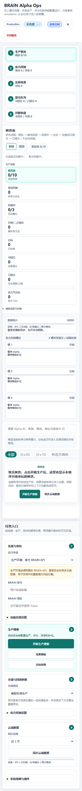

# BRAIN Alpha Ops

欢迎使用 BRAIN Alpha Ops。

它是一个帮助你在本地管理 WorldQuant BRAIN Alpha 研究流程的小工具。你可以把它理解成一个本地工作台：打开网页后，在同一个页面里完成连接账号、生成候选、查看结果、同步云端数据、做提交前检查和排查问题。

不用一开始就理解所有细节。先跟着下面的步骤把 Web 控制台打开，再按页面上的按钮一步步操作即可。

## 项目简介

BRAIN Alpha Ops 主要帮助你做四件事：

1. 生成和整理 Alpha 候选。
2. 在本地先做基础筛选，减少无效尝试。
3. 连接 WorldQuant BRAIN，完成必要的官方检查、回测和云端同步。
4. 用一个清晰的网页控制台查看进度、结果、问题和下一步动作。

项目默认不会自动提交 Alpha。提交相关操作会经过多层确认和检查，尽量避免误提交。

## 快速入门步骤

### 第 1 步：准备账号和环境

你需要准备：

1. 一个 WorldQuant BRAIN 账号。
2. 一台可以运行 Python 的电脑。
3. Windows PowerShell。

如果你只是想先体验页面，可以先把项目启动起来；需要连接 BRAIN 时，再填写账号信息。

### 第 2 步：安装项目

打开 PowerShell，进入你想保存项目的文件夹，然后运行：

```powershell
git clone https://github.com/qq547820639/WorldQuant-BRAIN-Alpha.git
cd WorldQuant-BRAIN-Alpha

python -m venv venv
.\venv\Scripts\Activate.ps1

pip install -e .
```

以后每次重新打开 PowerShell 使用本项目时，先进入项目文件夹并启用环境：

```powershell
cd WorldQuant-BRAIN-Alpha
.\venv\Scripts\Activate.ps1
```

### 第 3 步：设置 BRAIN 登录信息

请不要把账号密码写进文件。推荐在当前 PowerShell 窗口里临时设置：

```powershell
$env:BRAIN_USERNAME = "your@email.com"
$env:BRAIN_PASSWORD = "your_password"
```

如果你使用登录令牌，也可以设置：

```powershell
$env:BRAIN_TOKEN = "your_token"
```

这些信息只在当前 PowerShell 窗口中使用。关闭窗口后，需要重新填写。

### 第 4 步：启动 Web 控制台

在项目文件夹中运行：

```powershell
python launch_web.py
```

然后用浏览器打开：

```text
http://127.0.0.1:8765
```

如果浏览器能看到 `BRAIN Alpha Ops` 页面，就说明已经启动成功。

### 第 5 步：按照页面顺序操作

第一次使用时，建议按这个顺序来：

1. 在左侧填写或确认 BRAIN 账号。
2. 点击“同步云端数据”，先拿到你账号里已有的 Alpha 状态。
3. 点击“开始生产搜索”，生成候选。
4. 在中间结果区查看候选池、等待回测、达标和可提交数量。
5. 对达标的候选点击“检查”。
6. 只有在你确认结果可靠时，再使用提交相关按钮。

## Web 控制台图文操作指引

### 认识主页面


截图位置说明：

1. 左上角是项目名称和当前连接状态。看到“未连接”时，说明还没有成功连接 BRAIN。
2. 左侧栏是主要操作区。这里可以填写账号、启动生产搜索、查看结果面板、做达标检查、同步云端数据。
3. 页面上方的五个步骤卡片展示整体进度：生产候选、官方回测、达标检查、提交队列、诊断复盘。
4. 中间大区域是结果区。候选、回测状态、达标结果和可提交结果都会在这里显示。
5. 中下方的表格是候选列表。生成候选后，可以在这里查看每条 Alpha 的状态、分数、风险原因和操作按钮。

### 第一次打开页面时看哪里



截图位置说明：

1. 手机或窄屏下，页面会先显示顶部状态和步骤卡片。
2. 操作区会移动到下方，继续向下滚动可以看到“连接与身份”“生产搜索”“云端数据”等区域。
3. 绿色高亮按钮通常代表当前最推荐的下一步，例如“开始生产搜索”。
4. 如果页面里显示“暂无候选”，说明还没有运行生产搜索，点击“开始生产搜索”即可开始。

### 查看结果和趋势


截图位置说明：

1. 右上角可以在“表格”和“图表”之间切换。
2. 表格适合逐条查看候选。
3. 图表适合观察整体分布和趋势。
4. 如果图表区域显示暂无数据，通常表示还没有生成候选，或当前视图没有可展示的结果。

### 推荐的日常操作路线

1. 打开 `http://127.0.0.1:8765`。
2. 查看顶部连接状态。
3. 在左侧“连接与身份”里确认账号信息。
4. 点击“同步云端数据”。
5. 点击“开始生产搜索”。
6. 等候选进入中间结果区。
7. 切换“表格”查看候选明细。
8. 点击“检查”确认达标候选是否仍可提交。
9. 只在你确认无误后，再进行提交操作。

## 核心功能说明

### Web 控制台

这是最推荐的入口。你可以在浏览器里完成大多数日常操作，不需要记住很多命令。

你会经常用到这些区域：

- “连接与身份”：确认 BRAIN 账号是否可用。
- “生产搜索”：开始或停止候选生成。
- “市场与回测参数”：选择常用市场设置。
- “云端数据”：同步 BRAIN 上已有的 Alpha。
- “候选池”：查看本地新生成的候选。
- “达标检查”：检查候选是否满足提交前条件。
- “诊断复盘”：查看运行中遇到的问题。

### 生成候选

点击“开始生产搜索”后，项目会开始生成候选 Alpha，并按配置进行排序。生成结果会逐步出现在候选池里。

如果你第一次使用，建议先少量运行，确认流程顺畅后再扩大规模。

### 同步云端数据

“同步云端数据”会读取你 BRAIN 账号里已有的 Alpha 状态，帮助页面判断哪些候选已经存在、哪些可能重复、哪些需要谨慎处理。

第一次使用时建议先同步一次。

### 达标检查

当候选看起来不错时，可以点击“检查”。这个动作会帮助你确认候选是否还满足提交前条件。

页面里有两个常见选择：

- “快速”：优先检查本地新生成、还没检查过的达标候选。
- “全部”：检查同步后所有达标候选。

日常使用通常先选“快速”。当你刚同步过云端数据，并希望全面确认时，再选“全部”。

### 提交保护

项目默认关闭自动提交。即使你打开提交相关功能，系统也会先检查候选状态、重复风险、云端状态和提交条件。

如果页面提示提交被阻止，通常是在保护你避免提交不合适的候选。先查看页面里的风险原因，再决定下一步。

### 诊断复盘

诊断区域会显示运行过程中发现的问题，例如账号未连接、云端数据未同步、候选不足、检查失败或提交条件不满足。

遇到问题时，先看诊断区域，再看常见问题排查。

## 常见问题排查

### 1. 页面打不开

先确认 PowerShell 窗口还在运行：

```powershell
python launch_web.py
```

再打开：

```text
http://127.0.0.1:8765
```

如果还是打不开，可能是默认网页地址被别的程序占用了。可以打开 [config/run_config.json](config/run_config.json)，把 `web.port` 后面的数字改成另一个值，例如 `8766`，然后重新启动。

### 2. 页面显示“未连接”

通常是 BRAIN 登录信息没有设置，或者设置后没有在同一个 PowerShell 窗口启动项目。

重新设置：

```powershell
$env:BRAIN_USERNAME = "your@email.com"
$env:BRAIN_PASSWORD = "your_password"
python launch_web.py
```

然后刷新浏览器页面。

### 3. 点击“同步云端数据”失败

可以按顺序检查：

1. BRAIN 账号和密码是否正确。
2. 当前网络是否可以访问 WorldQuant BRAIN。
3. 是否刚刚连续操作太多，被官方临时限流。

如果是临时限流，等几分钟再试。

### 4. 点击“开始生产搜索”后没有候选

可能原因：

1. 账号还没有连接成功。
2. 官方数据还没有同步完成。
3. 当前筛选条件太严格。
4. 候选生成还在等待中。

建议先点击“同步云端数据”，再重新点击“开始生产搜索”。如果仍然没有结果，可以降低候选筛选要求或减少一次运行的目标数量。

### 5. 为什么有些候选不能提交

不能提交通常不是故障，而是保护机制在生效。常见原因包括：

1. 缺少官方回测结果。
2. 没有通过提交前检查。
3. 与已有 Alpha 太相似。
4. 云端数据太旧，需要重新同步。
5. 本地记录显示已经提交过。

先查看候选行里的“风险 / 原因”，再决定是否重新检查或放弃该候选。

### 6. 页面显示的数据像是旧的

先点击“同步云端数据”。如果仍然觉得不对，关闭当前 PowerShell 窗口，重新打开后执行：

```powershell
cd WorldQuant-BRAIN-Alpha
.\venv\Scripts\Activate.ps1
python launch_web.py
```

然后刷新浏览器页面。

### 7. 我应该点“快速”还是“全部”

日常使用选“快速”。它更适合检查本次新生成、还没检查过的候选。

当你刚同步过云端数据，想重新确认所有达标候选时，选“全部”。

### 8. 我担心误提交怎么办

保持默认设置即可。项目默认不会自动提交。

如果你看到“自动提交”开关，请在完全理解后再开启。新手建议先保持关闭，只手动查看和检查结果。

## 新手推荐路线

第一次完整使用时，可以照着这个小流程走：

1. 启动 Web 控制台。
2. 确认顶部连接状态。
3. 同步云端数据。
4. 开始生产搜索。
5. 查看候选池。
6. 对达标候选做检查。
7. 查看风险原因和诊断信息。
8. 暂时不要自动提交，先熟悉页面反馈。

等你熟悉页面之后，再逐步增加候选数量、调整市场设置，并谨慎使用提交功能。

## 安全提醒

- 不要把 BRAIN 账号、密码或 token 写进 README、配置文件、日志或提交记录。
- 不确定时，保持自动提交关闭。
- 提交前先同步云端数据，再做检查。
- 如果怀疑账号信息泄露，请立即修改 BRAIN 密码，或重置登录令牌。
