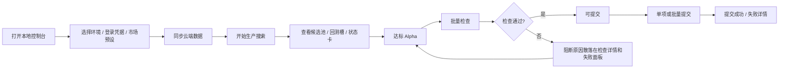
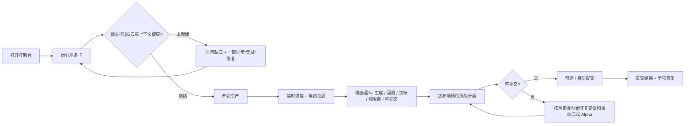

# BRAIN Alpha Ops 用户体验评估与优化方案

> 评估日期：2026-05-21  
> 评估对象：本地 Web 控制台、生产作业流、批量检查/提交流、持久化运行数据  
> 证据范围：`brain_alpha_ops/web/index.html`、`brain_alpha_ops/web.py`、`brain_alpha_ops/web_*` 模块、`data/*.jsonl`、本地 smoke test  

---

## 1. 执行摘要

BRAIN Alpha Ops 已经从“可用性补洞”进入“生产体验提效”阶段。当前版本具备完整的生产控制、云端同步、候选池、回测槽、达标检查、可提交筛选、批量提交失败详情、SSE/轮询进度、键盘可访问表格与基础无障碍语义。

本次评估的核心结论是：**主要流失节点不在页面崩溃或缺少按钮，而在用户看到高分/达标信号后，提交前才集中遭遇云端自相关、上下文缺失、数据集不匹配等阻断。** 这会造成“看起来接近提交，实际无法提交”的体验落差。

当前桌面端内部工具可用性约为 **4.0/5**，移动端可用性约为 **3.3/5**，无障碍基础约为 **3.7/5**。下一阶段应优先优化“提交就绪漏斗”“上下文健康提示”“状态信息架构”和“阻断解释前置”，而不是继续堆叠新功能入口。

---

## 2. 评估证据

### 2.1 运行与构建验证

| 项目 | 当前结果 | 证据 |
|---|---:|---|
| 前端脚本语法 | 通过 | `scripts/check_frontend_syntax.py --json`：`ok=true`，检查 13 个 script block |
| 前端内联构建同步 | 通过 | `brain_alpha_ops/web/build_inline.py --check --json`：13 个模块已替换，无 missing |
| Web smoke test | 通过 | `python -m brain_alpha_ops.web --no-browser --port 8765 --smoke-test` 返回 `web ready` |
| Health API | 通过 | `/api/health` 返回 `{"ok": true, "status": "ready"}` |
| 浏览器自动化限制 | 受限 | 当前环境无 `npx`，且 bundled `playwright` 缺 `playwright-core`；未生成新的真实浏览器截图 |

### 2.2 当前已具备的 UX/A11Y 改进

| 能力 | 状态 | 代码证据 |
|---|---|---|
| 页面 landmarks | 已具备 | `header role="banner"`、`main role="main"`、`aside role="complementary"`：`index.html:1071`, `1088`, `1089` |
| 跳转到结果 | 已具备 | skip link：`index.html:1070` |
| 长任务播报 | 已具备 | status、cloud/check meta、toast、spinner 使用 `aria-live`：`index.html:1083`, `1173`, `1281`, `1344`, `1345` |
| 进度条语义 | 已具备 | cloud、monitor、check progressbar：`index.html:1172`, `1261`, `1280` |
| 弹窗语义 | 已具备 | detail/confirm dialog：`index.html:1336`, `1352` |
| 表格可访问性 | 已具备基础 | table `aria-label` 和 caption：`index.html:1323-1324` |
| 表格键盘打开详情 | 已具备 | 行属性与 Enter/Space 监听：`index.html:3821-3823`, `7761-7780` |
| 检查结果刷新恢复 | 已具备 | `/api/check_results` 加载并写回前端状态：`index.html:7673-7683`，后端 stale 标记：`web_runtime_state.py:159-184` |
| 批量提交失败恢复 | 已具备基础 | 失败面板、建议、单项重试、全部重试：`index.html:6719-6764` |
| 移动端结果前置 | 已具备 CSS 基础 | `<720px` 下 `section order:1`、`aside order:2`：`index.html:709-722` |

### 2.3 行为数据摘要

| 数据源 | 观察结果 | UX 含义 |
|---|---:|---|
| `candidates.jsonl` | 1008 条候选；506 条 `SUBMISSION_READY`；531 条 `submit_candidate` 决策带 | 页面会给用户强烈的“接近提交”信号 |
| `checks.jsonl` | 150 条检查，0 条通过；150 条全部 `BLOCKED` | 提交前检查是主要流失节点 |
| `checks.jsonl` | 失败项第一位为 `cloud_self_correlation`，150/150；平均相似度 0.9861，最大 1.0 | 云端自相关风险必须在“达标/可提交”之前被解释 |
| `events.jsonl` 近 1000 条 | `official_context_warning` 624 条 | 上下文/字段数据健康是高频摩擦点 |
| 最近事件尾部 | 出现 `context_manual_sync_required` 与 `dataset_skip_cycle` | 用户可能启动后才发现数据上下文不可生产 |
| `lifecycle.jsonl` | 文件约 3.59GB | 历史记录体积本身已成为潜在性能与维护体验风险 |
| `cloud_alphas.jsonl` | 12197 条云端记录；PASS 407，FAIL 11790 | 云端历史可用于强解释，但需要聚合展示，不能只在失败后暴露 |

---

## 3. 当前交互流程诊断

### 3.1 当前流程

### 3.2 流失节点

| 节点 | 现象 | 用户影响 | 优先级 |
|---|---|---|---|
| 达标到可提交 | 数据显示大量 `SUBMISSION_READY`，但检查 0% 通过 | 用户误以为“达标=能提交”，实际被自相关集中拦截 | P0 |
| 启动前数据健康 | `official_context_warning` 在近 1000 事件中占 624 条 | 用户启动后才发现字段/数据集上下文不足 | P0 |
| 状态导航 | `VIEW_ORDER` 混合 16 个生产、诊断、知识视图 | 专家可扫，新用户难判断下一步 | P1 |
| 图表发现 | `chartsPanel` 默认 `display:none`，未发现显式 `.visible` 切换 | 指标趋势和门禁分布很可能不可见 | P1 |
| 移动端结果阅读 | 已前置结果区，但候选仍是 8 列表格 | 手机端能到达结果，但阅读/操作成本仍高 | P1 |
| 历史数据维护 | `lifecycle.jsonl` 约 3.59GB | 长期运行会让读取、备份、问题定位变慢 | P1 |
| 复选框语义 | 可提交行 checkbox 缺少候选级 `aria-label` | 读屏用户难知道勾选的是哪个 Alpha | P2 |
| 外部资源依赖 | Chart.js、Iconify、字体来自 CDN | 离线/打包场景下图表和图标可能降级不透明 | P2 |

---

## 4. 优化目标流程

核心变化：把“阻断解释”从提交失败后移动到达标/检查前，把“上下文健康”从事件日志移动到启动前，把 16 个同级视图收敛成生产主路径 + 诊断二级入口。

---

## 5. 问题诊断与优化建议

### P0-1：提交就绪信号与真实检查结果冲突

**诊断**  
候选数据中有 506 条 `SUBMISSION_READY`、531 条 `submit_candidate` 决策带，但 `checks.jsonl` 中 150 条检查全部 `BLOCKED`，失败主因均为 `cloud_self_correlation`。这说明“本地评分/提交建议”与“云端可提交风险”在用户路径里分离太晚。

**建议**
- 在达标卡片和表格状态列新增“预提交风险摘要”：云端相似度最高值、匹配 Alpha ID、是否需要刷新云端。
- 将 `submit_candidate` 文案拆成“本地建议提交”和“官方检查可提交”，避免语义过度承诺。
- 在 `passed` 视图顶部固定显示检查漏斗：`待检查 N / 自相关阻断 M / 可提交 K / 过期 R`。
- 当某类阻断占比超过 50% 时，显示聚合建议，例如“当前 100% 被云端自相关拦截，请先查看相似 Alpha 或调整表达式生成策略”。

**落地位置**
- 前端：`candidateStatusLabel()`、`renderInsight()`、`renderModuleActions()`、`renderCheckDetail()`。
- 后端：复用 `cloud_correlation_risk` 和 `failed_reasons`，无需大改业务逻辑。

**预期提升**
- 达标后下一步识别时间下降 50%。
- 提交前才发现阻断的比例下降 60%。
- 批量检查后的人工排查时间下降 30-50%。

### P0-2：上下文健康缺口暴露太晚

**诊断**  
近 1000 条事件中 `official_context_warning` 有 624 条；尾部事件还出现 `context_manual_sync_required` 和 `dataset_skip_cycle`。用户可能看到生产按钮可用，但实际字段/算子/数据集上下文不可用或不完整。

**建议**
- 在侧栏顶部“运行准备卡”加入四项健康检查：登录状态、云端 Alpha 缓存、字段/算子上下文、当前 preset 是否匹配。
- 若 safe fields 为 0 或 official context 缺失，将主 CTA 从“开始生产搜索”改成“同步官方上下文”，并解释会影响候选生成。
- 把上下文缺失从 toast/事件流提升为持久面板，提供“同步字段/算子”“查看缺失字段列表”“继续使用内置上下文”三个动作。

**落地位置**
- 前端：`#controlPanel` 顶部、`redlineSummary`/`checkpointSummary` 附近。
- 后端：扩展 `/api/health` 或新增 `/api/context_health`，返回 fields/operators/source/warning。

**预期提升**
- 无效启动次数下降 40-70%。
- `dataset_skip_cycle` 类运行后失败变为启动前可恢复状态。

### P1-1：信息架构过宽，生产视图与诊断视图同级

**诊断**  
`VIEW_ORDER` 包含 16 个视图：候选、回测、达标、可提交、云端、observability、memory、knowledge、prompt ledger、SQLite、robustness、lifecycle 等。覆盖完整，但它把“日常生产路径”和“专家诊断路径”放在同一层。

**建议**
- 主导航保留 5 个一级视图：`生产概览`、`候选`、`达标检查`、`提交`、`历史`。
- 将 Observability、Research Memory、Knowledge、Prompt、SQLite、Robustness 收进“诊断”菜单或二级 tabs。
- 状态卡按任务分组：主路径强视觉，辅助追踪弱视觉。

**落地位置**
- `VIEW_ORDER`、`VIEW_TITLES`、`renderInsight()`、`rowsForView()`。

**预期提升**
- 首屏认知负担下降 30-40%。
- 新用户找到“下一步动作”的时间下降 40%。

### P1-2：图表面板可能不可见

**诊断**  
`chartsPanel` 默认 `display:none`，本次搜索未发现代码对 `.charts-panel.visible` 的切换。`renderCharts()` 会渲染 canvas，但用户可能永远看不到图表。

**建议**
- 在候选池标题区加入“表格 / 图表”分段控件。
- 有数据时默认显示一行轻量图表摘要；无数据时显示空态和“开始生产”动作。
- 若 Chart.js 未加载，显示“图表资源未加载”的可解释降级，而不是静默隐藏。

**落地位置**
- `#chartsPanel`、`renderCharts()`、`renderCurrentView()`。

**预期提升**
- 分数趋势、Sharpe 分布、门禁失败发现率提升。
- 诊断候选质量波动的点击路径减少 1-2 步。

### P1-3：移动端仍是桌面表格模型

**诊断**  
当前 CSS 已把结果区排到控制区前面，并把主控件触控高度提升到 40-44px，这是正确方向。但候选结果仍然是 8 列表格，只是包在横向滚动容器中。

**建议**
- `<720px` 下把候选表格改为卡片列表：Alpha ID、状态、排序分、官方 ID、风险、主操作。
- 保留详情弹窗，不在卡片中塞完整表达式；表达式只显示一行截断和复制入口。
- 增加 sticky bottom action：开始/停止、同步、跳到检查/提交。

**落地位置**
- `candidateRowHtml()` 增加 card renderer，CSS media query 分支切换。

**预期提升**
- 移动端横向滚动依赖降至 0。
- 候选详情打开率与提交前检查完成率提升。

### P1-4：历史数据体积是长期运行体验风险

**诊断**  
`lifecycle.jsonl` 约 3.59GB，`events.jsonl` 约 366MB。代码存在 lifecycle 50MB archive 逻辑，但当前文件已远超阈值，说明触发时机或覆盖范围不足。

**建议**
- 启动时执行轻量 archive check，不只在特定作业路径中触发。
- `/api/lifecycle` 增加文件体积与截断提示，让用户知道 UI 只展示 tail。
- 新增“维护数据”诊断项：当前事件/生命周期文件大小、最近归档时间、手动归档按钮。

**落地位置**
- `maybe_archive_lifecycle()`、`ResearchRepository.maybe_archive()`、`/api/health` 或诊断视图。

**预期提升**
- 长期运行后的页面读取稳定性提升。
- 诊断报告生成和日志检索时间下降。

### P2-1：可提交复选框缺少候选级读屏标签

**诊断**  
可提交行的 checkbox 只阻止事件冒泡并切换选择，没有给出 `aria-label`。读屏用户听到“checkbox”但不能确定对应 Alpha。

**建议**
- 为 checkbox 添加 `aria-label="选择 Alpha {alpha_id} 用于提交"`。
- 在“全选/取消全选”按钮上同步 `aria-describedby` 到当前已选数量。

**落地位置**
- `candidateRowHtml()`：`index.html:5635-5636`。

**预期提升**
- 可提交列表读屏选择可完成率达到 100%。

### P2-2：离线/打包环境依赖 CDN

**诊断**  
页面仍从 Fontshare、Iconify、jsDelivr 加载资源。对于本地工具和打包 EXE，网络不可用时应有明确降级。

**建议**
- 将 Chart.js vendored 到本地静态资源，或在构建时内联。
- 图标优先使用本地文本/内置符号，外部图标失败时保留可识别按钮文案。
- 字体失败时明确使用系统字体，不影响布局宽度。

**落地位置**
- `index_template.html` 资源引用和打包脚本。

**预期提升**
- 离线环境图表可用率提升到 100%。
- 打包应用首屏稳定性提升。

---

## 6. 预期体验提升指标

| 指标 | 当前基线 | 目标 | 验收方式 |
|---|---:|---:|---|
| 提交前检查通过率 | 当前样本 0/150 | 不直接承诺提高通过率；但 100% 阻断项需前置解释 | 检查前风险摘要 + 人工流程测试 |
| 自相关阻断可解释率 | 150/150 阻断，当前主要在检查后暴露 | 达标视图中 100% 展示风险等级/相似 Alpha | DOM 检查 + 样本检查记录 |
| 上下文 warning 暴露时机 | 近 1000 事件 624 条 warning | 启动前展示上下文健康并提供修复动作 | 模拟缺失 official context |
| 一级视图数量 | 16 | 5 个主视图 + 诊断二级入口 | UI 截图/DOM 统计 |
| 移动端候选阅读 | 8 列表格横向滚动 | 卡片列表，无横向滚动 | 390px viewport 检查 |
| 无障碍基础 | 已有 landmarks、2 dialog、3 progressbar、多个 live region | 保持现有覆盖，并补齐 checkbox 标签 | DOM/a11y smoke |
| 图表可发现性 | 面板默认隐藏，缺少显式入口 | 有数据时可见入口，资源失败有降级提示 | 无网络/有数据两种 smoke |
| 历史数据维护 | lifecycle 约 3.59GB | 启动/运行时归档到阈值内或明确提示 | 文件大小 + API 诊断字段 |

---

## 7. 分阶段落地计划

### Phase 1：提交前解释闭环（0.5-1.5 天）

| 任务 | 优先级 | 文件 | 验收 |
|---|---|---|---|
| 达标视图增加检查漏斗与阻断聚合 | P0 | `index.html` / `web/js/app.js` | 能看到待检查、阻断、可提交、过期数量 |
| 自相关风险前置到状态卡和表格 | P0 | `candidateRowHtml()` / `renderInsight()` | 高风险 Alpha 不再只在检查后暴露 |
| `submit_candidate` 文案拆分为本地建议/官方可提交 | P0 | 状态翻译函数 | 用户不再误读本地建议为提交许可 |

### Phase 2：启动前健康与数据维护（1-2 天）

| 任务 | 优先级 | 文件 | 验收 |
|---|---|---|---|
| 运行准备卡显示 context/cloud/login 健康 | P0 | `index.html` / `web.py` | 缺失 official context 时主 CTA 指向同步 |
| 增加 context health API | P0 | `web_get_handlers.py` / `web_routes.py` | 返回 fields/operators/source/warning |
| 生命周期/事件文件体积诊断与归档提示 | P1 | `web_runtime_state.py` / repo | UI 显示文件大小和最近归档状态 |

### Phase 3：信息架构收敛（1-2 天）

| 任务 | 优先级 | 文件 | 验收 |
|---|---|---|---|
| 一级视图收敛为 5 个主任务 | P1 | `VIEW_ORDER` / `renderInsight()` | 日常生产视图不混入诊断视图 |
| 诊断入口二级化 | P1 | `renderInsight()` / toolbar | Observability/SQLite 等仍可达 |
| 图表入口显性化 | P1 | `chartsPanel` / `renderCharts()` | 表格/图表切换可见 |

### Phase 4：移动端与无障碍抛光（1-3 天）

| 任务 | 优先级 | 文件 | 验收 |
|---|---|---|---|
| 移动端卡片式候选列表 | P1 | `candidateRowHtml()` / CSS | 390px 无横向滚动依赖 |
| checkbox 增加 Alpha 级 aria-label | P2 | `candidateRowHtml()` | 读屏可识别勾选对象 |
| CDN 资源本地化或降级提示 | P2 | `index_template.html` / build | 离线图表不静默消失 |

---

## 8. 结论

当前产品已经拥有相当完整的本地生产工作台能力，基础可用性和无障碍比早期版本明显成熟。下一阶段的最高收益不是继续增加入口，而是把真实生产摩擦前置：**在启动前告诉用户数据上下文是否健康，在达标时告诉用户哪些 Alpha 很可能被阻断，在检查后给出聚合修复路径，在移动端用卡片承载核心判断。**

建议优先执行 Phase 1 和 Phase 2。它们改动范围可控，不需要重写业务逻辑，却能直接降低“看起来能提交但实际被拦”的体验落差。
