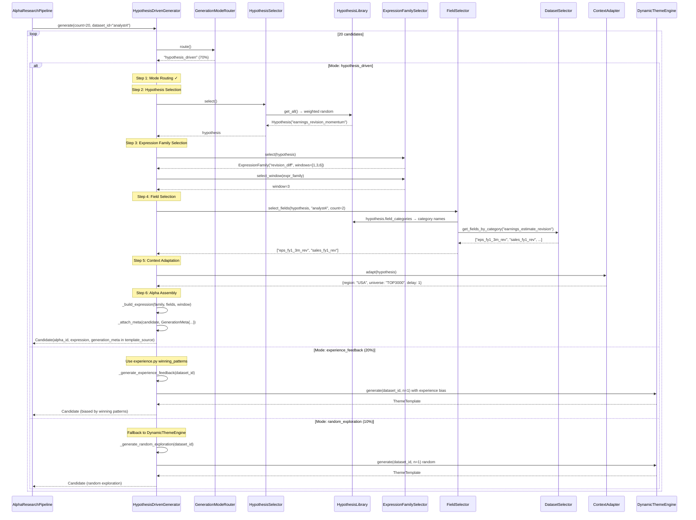
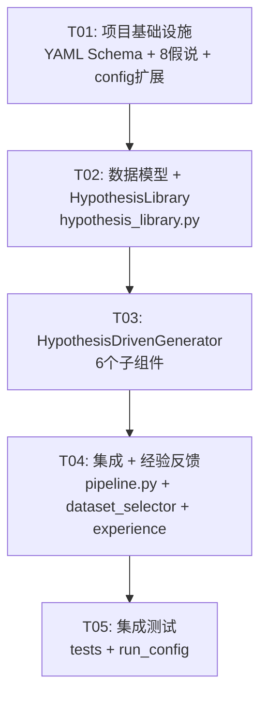

# 系统架构设计：假说驱动 Alpha 创作系统

> **Architect**: Bob | **Date**: 2026-05-14 | **Version**: 1.0.0

---

## 目录

1. [Part A: 系统设计](#part-a-系统设计)
   - [1. Implementation Approach](#1-implementation-approach)
   - [2. File List](#2-file-list)
   - [3. Data Structures and Interfaces](#3-data-structures-and-interfaces)
   - [4. Program Call Flow](#4-program-call-flow)
   - [5. Anything UNCLEAR](#5-anything-unclear)
2. [Part B: 任务分解](#part-b-任务分解)
   - [6. Required Packages](#6-required-packages)
   - [7. Task List](#7-task-list)
   - [8. Shared Knowledge](#8-shared-knowledge)
   - [9. Task Dependency Graph](#9-task-dependency-graph)

---

## Part A: 系统设计

### 1. Implementation Approach

#### 1.1 核心技术挑战

| 挑战 | 分析 | 解决方案 |
|------|------|----------|
| **平滑替换现有 Generator** | Pipeline 在 `_load_official_context()` (pipeline.py:536-724) 中组装 Generator，下游 Scoring/Gate/Diagnostics 强依赖 Candidate 结构 | HypothesisDrivenGenerator 实现与 CandidateGenerator 相同的 `generate(count, dataset_id) → list[Candidate]` 接口，Pipeline 仅需替换实例化那一行 |
| **字段类别到具体字段的映射** | 假说定义使用语义类别（如 `profitability_ratio`），但 DatasetSelector 只按 dataset_id 检索字段 | 在 DatasetSelector 中新增 `get_fields_by_category()` 方法，利用 OfficialField.category 属性做关键词匹配 |
| **经验权重闭环** | experience.py 需要"反向写入"假说权重，但 experience.py 当前只读模式（record + query） | experience.py 新增 `update_hypothesis_weights(library, min_sharpe)` 函数，读取 alpha_features.jsonl 后调用 HypothesisLibrary.update_weights() |
| **生成模式路由的 70/20/10 比例** | 需要在多次 generate() 调用间保持状态，确保比例大致符合配置 | 使用内部计数器和加权随机采样实现，非严格保证每次比例，但长期收敛 |
| **Candidate 兼容性** | 现有 Candidate 没有 `generation_meta` 字段 | **不修改 Candidate 模型**：将 `generation_meta` 序列化为 JSON 存入现有的 `source_tags` 列表和 `template_source` 字段。`source_tags` 追加 `"hypothesis_driven"` 等模式标签，溯源详情写入 `template_source`（该字段当前已存储生成来源标识） |

#### 1.2 框架与库选择

| 库 | 版本 | 用途 | 理由 |
|----|------|------|------|
| `pyyaml` | `>=6.0` | YAML 假说文件解析 | Python 生态标准 YAML 库，人类可读写，支持注释 |
| `jsonschema` | `>=4.19` | YAML Schema 校验 | 可选依赖，用于 CI 中验证假说文件格式，运行时可不安装 |

#### 1.3 架构模式

采用 **Strategy + Pipeline 模式**：

```
GenerationModeRouter (Strategy Pattern)
    ├── HypothesisDrivenStrategy  → HypothesisDrivenGenerator (6-Step Pipeline)
    ├── ExperienceFeedbackStrategy → 复用 experience.py 提炼的 winning_patterns
    └── RandomExplorationStrategy → fallback 到现有 DynamicThemeEngine
```

核心 6-Step Pipeline（HypothesisDrivenGenerator 内部）使用 **Chain of Responsibility** 变体：每个 Step 是独立组件，依次调用，上一步输出作为下一步输入。

#### 1.4 经验权重算法

- 初始权重：所有字段类别/表达式族/窗口权重 = 1.0
- 更新规则（EMA）：`new_weight = 0.8 * old_weight + 0.2 * (winner_count / total_count)`
- 选择概率（Softmax 变体）：`P(i) = weight[i] / sum(weights)` 

---

### 2. File List

#### 2.1 新增文件

| # | 相对路径（项目根目录） | 职责 | 核心接口 |
|---|----------------------|------|----------|
| 1 | `brain_alpha_ops/research/hypothesis_library.py` | Hypothesis 数据模型 + HypothesisLibrary 加载/管理类 | `Hypothesis`, `ExpressionFamily`, `FieldCategoryDef`, `AdaptationConfig`, `FailureMode`, `GenerationMeta` (dataclasses); `HypothesisLibrary`: `__init__()`, `load_all()`, `get_all()`, `get_by_id()`, `get_by_category()`, `update_weights()`, `reload()` |
| 2 | `brain_alpha_ops/research/hypothesis_driven_generator.py` | HypothesisDrivenGenerator 主类 + 6 个子组件 | `HypothesisDrivenGenerator`: `generate(count, dataset_id) → list[Candidate]`; `GenerationModeRouter`: `route() → str`; `HypothesisSelector`: `select() → Hypothesis`; `ExpressionFamilySelector`: `select(hypothesis) → ExpressionFamily`; `FieldSelector`: `select(hypothesis, dataset_id) → list[str]`; `ContextAdapter`: `adapt(hypothesis) → dict` |
| 3 | `brain_alpha_ops/research/hypotheses/_schema.yaml` | JSON Schema 校验定义 | (配置文件，无代码接口) |
| 4 | `brain_alpha_ops/research/hypotheses/earnings_revision.yaml` | 假说 #1: 盈利预测上修动量 | (YAML 数据文件) |
| 5 | `brain_alpha_ops/research/hypotheses/quality_profitability.yaml` | 假说 #2: 质量因子 | (YAML 数据文件) |
| 6 | `brain_alpha_ops/research/hypotheses/value_reversal.yaml` | 假说 #3: 价值反转 | (YAML 数据文件) |
| 7 | `brain_alpha_ops/research/hypotheses/low_volatility.yaml` | 假说 #4: 低波动异常 | (YAML 数据文件) |
| 8 | `brain_alpha_ops/research/hypotheses/liquidity_premium.yaml` | 假说 #5: 流动性溢价 | (YAML 数据文件) |
| 9 | `brain_alpha_ops/research/hypotheses/sentiment_short.yaml` | 假说 #6: 情绪/做空信号 | (YAML 数据文件) |
| 10 | `brain_alpha_ops/research/hypotheses/analyst_behavior.yaml` | 假说 #7: 分析师行为偏差 | (YAML 数据文件) |
| 11 | `brain_alpha_ops/research/hypotheses/microstructure.yaml` | 假说 #8: 微观结构/订单流 | (YAML 数据文件) |

#### 2.2 修改文件

| # | 相对路径 | 修改位置 | 修改内容 | 原因 |
|---|---------|---------|---------|------|
| 1 | `brain_alpha_ops/config.py` | 第 43-67 行（ResearchBudget 类） | 新增 `generation_mode_ratio: str = "70/20/10"` 和 `hypothesis_library_dir: str = "brain_alpha_ops/research/hypotheses"` 字段 | 支持配置三种生成模式比例和假说库路径 |
| 2 | `brain_alpha_ops/research/dataset_selector.py` | 约第 97 行后 | 新增 `get_fields_by_category(category: str) → list[str]` 方法和 `_category_index: dict[str, list[str]]` 属性 | 假说字段选择器需要通过字段类别获取具体字段 |
| 3 | `brain_alpha_ops/research/experience.py` | 约第 223 行后 | 新增 `update_hypothesis_weights(library, min_sharpe, min_sample) → dict` 函数 | P1-2 经验反馈闭环：回测结果反向更新假说权重 |
| 4 | `brain_alpha_ops/research/pipeline.py` | 第 560-600 行（`_load_official_context` 中的 advanced component wiring 区块） | (1) 在 DynamicThemeEngine 初始化后增加 HypothesisLibrary 初始化；(2) 将 `CandidateGenerator(...)` 替换为 `HypothesisDrivenGenerator(loader, mapper, theme_engine, selector, hypothesis_library)` | 集成假说驱动生成器到主 Pipeline |
| 5 | `brain_alpha_ops/research/__init__.py` | 末尾 | 导出新模块的公共 API | 模块对外可见 |

---

### 3. Data Structures and Interfaces

#### 3.1 Class Diagram (Mermaid)

```mermaid
classDiagram
    %% ── Hypothesis Data Models ──
    class FieldCategoryDef {
        +str category
        +str priority
        +list~str~ examples
        +float weight
    }

    class ExpressionFamily {
        +str id
        +str structure
        +str description
        +list~int~ windows
        +list~int~ windows_short
        +list~int~ windows_long
        +float weight
    }

    class FailureMode {
        +str gate
        +str reason
        +str mitigation
    }

    class AdaptationConfig {
        +list~str~ preferred_regions
        +list~str~ preferred_universes
        +list~int~ preferred_delays
        +list~str~ unsuitable_regions
    }

    class Hypothesis {
        +str id
        +str name
        +str category
        +str version
        +Rationale rationale
        +list~FieldCategoryDef~ field_categories
        +list~ExpressionFamily~ expression_families
        +list~FailureMode~ expected_failure_modes
        +AdaptationConfig adaptation
        +ExperienceWeights experience_weights
    }

    class Rationale {
        +str theory
        +list~str~ academic_refs
        +str behavioral_bias
    }

    class ExperienceWeights {
        +float overall
        +dict~str,float~ field_category_weights
        +dict~str,float~ expression_family_weights
        +dict~int,float~ window_weights
    }

    class GenerationMeta {
        +str mode
        +str hypothesis_id
        +str hypothesis_name
        +str expression_family_id
        +str field_category
        +list~str~ selected_fields
        +str region
        +str universe
        +int delay
        +str timestamp
    }

    Hypothesis "1" *-- "1..*" FieldCategoryDef : field_categories
    Hypothesis "1" *-- "2..5" ExpressionFamily : expression_families
    Hypothesis "1" *-- "0..*" FailureMode : expected_failure_modes
    Hypothesis "1" *-- "1" AdaptationConfig : adaptation
    Hypothesis "1" *-- "1" Rationale : rationale
    Hypothesis "1" *-- "1" ExperienceWeights : experience_weights

    %% ── Library ──
    class HypothesisLibrary {
        -Path _directory
        -dict~str,Hypothesis~ _hypotheses
        -dict~str,list~Hypothesis~~ _by_category
        +__init__(directory)
        +load_all() self
        +get_all() list~Hypothesis~
        +get_by_id(hypothesis_id) Hypothesis | None
        +get_by_category(category) list~Hypothesis~
        +get_ids() list~str~
        +update_weights(hypothesis_id, field_cat_weights, expr_fam_weights, window_weights) None
        +reload() self
        +count() int
        -_load_file(path) Hypothesis
        -_validate_weights() None
    }

    HypothesisLibrary "1" -- "*" Hypothesis : manages

    %% ── Generator Components ──
    class GenerationModeRouter {
        -float _hypothesis_ratio
        -float _experience_ratio
        -float _random_ratio
        -int _hypothesis_count
        -int _experience_count
        -int _random_count
        +__init__(ratio_str)
        +route() str
        +reset() None
    }

    class HypothesisSelector {
        -HypothesisLibrary _library
        -set~str~ _recently_used
        +__init__(library)
        +select() Hypothesis
        +exclude_recently_used(max_recency) None
    }

    class ExpressionFamilySelector {
        +__init__()
        +select(hypothesis) ExpressionFamily
        +select_window(expr_family) int
    }

    class FieldSelector {
        -DatasetSelector _selector
        +__init__(selector)
        +select_fields(hypothesis, dataset_id, count) list~str~
        +_resolve_category(category_name, dataset_id) list~str~
    }

    class ContextAdapter {
        +__init__()
        +adapt(hypothesis, available_regions, available_universes) dict
    }

    class HypothesisDrivenGenerator {
        -OfficialDataLoader _loader
        -FieldDatasetMapper _mapper
        -DynamicThemeEngine _theme_engine
        -DatasetSelector _selector
        -HypothesisLibrary _library
        -GenerationModeRouter _router
        -HypothesisSelector _hyp_selector
        -ExpressionFamilySelector _expr_selector
        -FieldSelector _field_selector
        -ContextAdapter _adapter
        +__init__(loader, mapper, theme_engine, selector, library, ratio_str)
        +generate(count, dataset_id) list~Candidate~
        +update_context(fields, operators) None
        +set_dataset(dataset_id) None
        +set_experience_guidance(patterns) None
        -_generate_hypothesis_driven(dataset_id) Candidate
        -_generate_experience_feedback(dataset_id) Candidate
        -_generate_random_exploration(dataset_id) Candidate
        -_build_expression(family, fields, windows) str
        -_attach_meta(candidate, meta) Candidate
    }

    HypothesisDrivenGenerator "1" *-- "1" GenerationModeRouter
    HypothesisDrivenGenerator "1" *-- "1" HypothesisSelector
    HypothesisDrivenGenerator "1" *-- "1" ExpressionFamilySelector
    HypothesisDrivenGenerator "1" *-- "1" FieldSelector
    HypothesisDrivenGenerator "1" *-- "1" ContextAdapter

    HypothesisSelector ..> HypothesisLibrary : queries
    FieldSelector ..> DatasetSelector : queries

    %% ── Existing Modules (unchanged) ──
    class Candidate {
        +str alpha_id
        +str expression
        +str family
        +str hypothesis
        +list~str~ data_fields
        +list~str~ operators
        +list~str~ source_tags
        +str template_source
        +str dataset_id
        +dict local_quality
        +dict validation
        +str lifecycle_status
        +str created_at
    }

    class CandidateGenerator {
        +generate(count, dataset_id) list~Candidate~
        +update_context(fields, operators)
        +set_dataset(dataset_id)
        +set_experience_guidance(patterns)
    }

    class DynamicThemeEngine {
        +generate(dataset_id, n) list~ThemeTemplate~
        +mutate_expression(expr, dataset_id, seed) str
        +build_categories()
    }

    class DatasetSelector {
        +initialize(loader)
        +select(strategy) list~str~
        +get_fields_by_category(category) list~str~
    }

    HypothesisDrivenGenerator ..|> CandidateGenerator : compatible interface
    HypothesisDrivenGenerator ..> DynamicThemeEngine : fallback
    HypothesisDrivenGenerator ..> Candidate : produces
```



---

### 4. Program Call Flow



---

### 5. Anything UNCLEAR

| # | 问题 | 假设 |
|---|------|------|
| 1 | OfficialField.category 是否已有与假说 field_categories 匹配的值？当前 schema 中 category 是自由字符串 | 假说 field_categories 使用关键词匹配（如 `profitability` 匹配 `profitability_ratio`）。DatasetSelector.get_fields_by_category() 做大小写不敏感的 `in` 匹配，并维护一个手动映射文件 `field_category_mapping.json` 作为补充 |
| 2 | GenerationMeta 如何存储而不修改 Candidate 模型？ | 将 GenerationMeta 序列化为 JSON 字符串，存入 `Candidate.template_source`（当前用于存储 "dynamic:momentum" 等）。source_tags 追加模式标签如 "hypothesis_driven" |
| 3 | 经验反馈更新权重的触发频率？ | 在 Pipeline 每轮循环结束时（scoring 完成后），调用 `update_hypothesis_weights()`。初始默认每日更新一次（对应 EMA 平滑） |
| 4 | 假说库的 YAML 文件数量将来可能超过 500 条？ | PRD 提到"假说库总量 < 500 条"，当前 8 条。YAML 加载在初始化时一次性完成，< 500 条性能无忧。如超过，可改为懒加载 |
| 5 | generate() 接口是否完全替代 CandidateGenerator 的 public API？ | 是。HypothesisDrivenGenerator 实现以下方法：`generate(count, dataset_id)`, `update_context(fields, operators)`, `set_dataset(dataset_id)`, `set_experience_guidance(patterns)` |

---

## Part B: 任务分解

### 6. Required Packages

```
- pyyaml@^6.0: YAML 假说文件解析（运行时必需）
- jsonschema@^4.19: JSON Schema 校验（可选，仅 CI 验证假说文件用）
```

`pyyaml` 已在 Python 生态中广泛使用。`jsonschema` 为可选依赖，运行时不需要，仅在 CI 流程中校验假说文件格式。

---

### 7. Task List (ordered by dependency)

#### T01: 项目基础设施与假说数据文件

| 属性 | 值 |
|------|-----|
| **Task ID** | T01 |
| **Task Name** | 项目基础设施：YAML Schema + 8 个假说定义文件 + config 扩展 |
| **Source Files** | `brain_alpha_ops/research/hypotheses/_schema.yaml`, `brain_alpha_ops/research/hypotheses/earnings_revision.yaml`, `brain_alpha_ops/research/hypotheses/quality_profitability.yaml`, `brain_alpha_ops/research/hypotheses/value_reversal.yaml`, `brain_alpha_ops/research/hypotheses/low_volatility.yaml`, `brain_alpha_ops/research/hypotheses/liquidity_premium.yaml`, `brain_alpha_ops/research/hypotheses/sentiment_short.yaml`, `brain_alpha_ops/research/hypotheses/analyst_behavior.yaml`, `brain_alpha_ops/research/hypotheses/microstructure.yaml`, `brain_alpha_ops/config.py` (修改: ResearchBudget 新增 2 字段), `requirements.txt` 或 `pyproject.toml` (新增 pyyaml) |
| **Dependencies** | (无) |
| **Priority** | P0 |

**详细说明**：
1. 创建 `brain_alpha_ops/research/hypotheses/` 目录
2. 编写 `_schema.yaml`：定义假说 YAML 文件的 JSON Schema（id, name, category, version, rationale, field_categories, expression_families, expected_failure_modes, adaptation, experience_weights 的完整结构定义）
3. 按照 PRD 第 220-298 行 8 类假说的设计，为每类编写完整的 YAML 假说文件
4. 修改 `brain_alpha_ops/config.py`：在 `ResearchBudget` dataclass 中新增：
   - `generation_mode_ratio: str = "70/20/10"` — 三种生成模式比例
   - `hypothesis_library_dir: str = "brain_alpha_ops/research/hypotheses"` — 假说库目录路径
5. 在项目依赖中新增 `pyyaml>=6.0`

**验收标准**：
- 9 个 YAML 文件（1 schema + 8 hypotheses）存在且格式正确
- 每个假说文件包含完整的 rationale / field_categories (≥2) / expression_families (2-5) / expected_failure_modes / adaptation
- `ResearchBudget` 包含 `generation_mode_ratio` 和 `hypothesis_library_dir` 两个新字段
- `pyyaml` 可正常 import

---

#### T02: 数据模型与 HypothesisLibrary 核心类

| 属性 | 值 |
|------|-----|
| **Task ID** | T02 |
| **Task Name** | 数据模型定义 + HypothesisLibrary 加载/查询/权重管理 |
| **Source Files** | `brain_alpha_ops/research/hypothesis_library.py` (新建, ~350 行), `brain_alpha_ops/research/__init__.py` (修改: 导出新模块) |
| **Dependencies** | T01（需要假说 YAML 文件来测试加载） |
| **Priority** | P0 |

**详细说明**：
1. 定义所有 dataclass：
   - `Hypothesis` — 假说主对象（含所有子结构）
   - `ExpressionFamily` — 表达式族定义
   - `FieldCategoryDef` — 字段类别定义（含 weight）
   - `AdaptationConfig` — 适配配置
   - `FailureMode` — 预期失败模式
   - `Rationale` — 经济学原理
   - `ExperienceWeights` — 经验权重（含 overall, field_category_weights, expression_family_weights, window_weights）
   - `GenerationMeta` — 溯源信息（mode, hypothesis_id, hypothesis_name, expression_family_id, field_category, selected_fields, region, universe, delay, timestamp）
2. 实现 `HypothesisLibrary` 类：
   - `__init__(directory: str | Path)` — 设置目录
   - `load_all() → HypothesisLibrary` — 扫描目录下所有 `.yaml`，解析并构建索引
   - `get_all() → list[Hypothesis]` — 返回全部假说
   - `get_by_id(hypothesis_id: str) → Hypothesis | None` — 按 ID 精确查找
   - `get_by_category(category: str) → list[Hypothesis]` — 按 category 字段查找
   - `get_ids() → list[str]` — 所有假说 ID 列表
   - `update_weights(hypothesis_id, field_cat_weights, expr_fam_weights, window_weights) → None` — 更新经验权重（EMA 算法: `new = 0.8 * old + 0.2 * update`）
   - `reload() → HypothesisLibrary` — 重新加载
   - `count → int` (property) — 假说总数
   - `_load_file(path) → Hypothesis` — 单个文件加载
   - `_validate_weights() → None` — 确保所有权重值 ≥ 0
3. 在 `brain_alpha_ops/research/__init__.py` 中导出公共类

**验收标准**：
- 从 `brain_alpha_ops.research.hypothesis_library` 可以 import `HypothesisLibrary`, `Hypothesis`, `ExpressionFamily`, `GenerationMeta`
- `HypothesisLibrary("brain_alpha_ops/research/hypotheses").load_all()` 成功加载 8 个假说
- `get_by_id("earnings_revision_momentum")` 返回正确的 Hypothesis 对象
- `update_weights()` 后权重值按 EMA 更新
- `reload()` 重新加载文件恢复原始权重

---

#### T03: HypothesisDrivenGenerator 核心生成器 + 6 个子组件

| 属性 | 值 |
|------|-----|
| **Task ID** | T03 |
| **Task Name** | HypothesisDrivenGenerator 主类 + GenerationModeRouter + HypothesisSelector + ExpressionFamilySelector + FieldSelector + ContextAdapter |
| **Source Files** | `brain_alpha_ops/research/hypothesis_driven_generator.py` (新建, ~450 行) |
| **Dependencies** | T02（需要 HypothesisLibrary 和 dataclasses） |
| **Priority** | P0 |

**详细说明**：
1. 实现 `GenerationModeRouter`（~50 行）：
   - 解析 `"70/20/10"` 比例字符串
   - `route() → str`：加权随机返回 `"hypothesis_driven"` / `"experience_feedback"` / `"random_exploration"`
   - 内部维护计数器用于监控实际比例

2. 实现 `HypothesisSelector`（~40 行）：
   - 基于 `experience_weights.overall` 加权随机选择
   - 维护 `_recently_used` 集合（最近 N 次使用的假说暂时排除）

3. 实现 `ExpressionFamilySelector`（~30 行）：
   - 基于 `expression_family_weights` 加权随机选择表达式族
   - `select_window(expr_family) → int`：从 windows 列表中按 `window_weights` 选择

4. 实现 `FieldSelector`（~80 行）：
   - 依赖 `DatasetSelector.get_fields_by_category()`
   - 调用假说的 `field_categories`，按 priority (P0 > P1) 和 weight 选择字段类别
   - 从 DatasetSelector 获取具体字段名，按 weight 加权随机选取

5. 实现 `ContextAdapter`（~40 行）：
   - 读取 `hypothesis.adaptation`，交叉过滤 DatasetSelector 的可用 dataset 对应的 region/universe
   - 返回 `{"region": str, "universe": str, "delay": int}`

6. 实现 `HypothesisDrivenGenerator`（~200 行）：
   - 实现与 `CandidateGenerator` 兼容的接口：
     - `generate(count, dataset_id) → list[Candidate]`
     - `update_context(fields, operators) → None`
     - `set_dataset(dataset_id) → None`
     - `set_experience_guidance(patterns) → None`
   - 内部三个生成方法：
     - `_generate_hypothesis_driven(dataset_id) → Candidate` — 6-Step 完整流程
     - `_generate_experience_feedback(dataset_id) → Candidate` — 使用 experience patterns 偏置 ThemeEngine
     - `_generate_random_exploration(dataset_id) → Candidate` — 纯随机 fallback 到 ThemeEngine
   - `_build_expression(family, fields, windows) → str` — 将表达式族模板中的占位符替换为实际字段/窗口
   - `_attach_meta(candidate, meta) → Candidate` — 将 GenerationMeta 序列化为 JSON 存入 `template_source`

**验收标准**：
- `GenerationModeRouter(ratio_str="70/20/10").route()` 在 1000 次调用中各模式比例接近 70/20/10（±10%）
- `HypothesisDrivenGenerator.generate(5, "analyst4")` 返回 5 个 Candidate 对象
- 每个 hypothesis_driven 模式生成的 Candidate.template_source 包含可解析的 GenerationMeta JSON
- experience_feedback 模式下正确调用 ThemeEngine 并附加 experience bias
- random_exploration 模式下正确 fallback 到 ThemeEngine
- Candidate 结构完全兼容现有 scoring/diagnostics 模块

---

#### T04: 现有模块集成与经验反馈闭环

| 属性 | 值 |
|------|-----|
| **Task ID** | T04 |
| **Task Name** | Pipeline 集成 + DatasetSelector 扩展 + experience.py 权重回写 |
| **Source Files** | `brain_alpha_ops/research/pipeline.py` (修改: _load_official_context 560-600 行), `brain_alpha_ops/research/dataset_selector.py` (修改: 新增 get_fields_by_category), `brain_alpha_ops/research/experience.py` (修改: 新增 update_hypothesis_weights) |
| **Dependencies** | T03（需要 HypothesisDrivenGenerator 完成） |
| **Priority** | P0 |

**详细说明**：

1. **`dataset_selector.py`** — 新增方法 + 内部索引：
   - 在 `initialize()` 中构建 `self._category_index: dict[str, list[str]]`：遍历所有字段，按 `OfficialField.category` 分组
   - 新增 `get_fields_by_category(category: str) → list[str]`：做大小写不敏感匹配（`category.lower() in field_category.lower()`），返回匹配字段名列表
   - 新增 `get_all_categories() → list[str]`：返回所有已知类别名

2. **`experience.py`** — 新增权重回写函数：
   - 新增 `update_hypothesis_weights(library: HypothesisLibrary, min_sharpe: float = 1.0, min_sample: int = 3) → dict`：
     - 读取 `alpha_features.jsonl`
     - 筛选 winners (pass_fail=PASS, sharpe ≥ min_sharpe)
     - 统计各 hypothesis_id / field / expression_family 的 winner 数量
     - 调用 `library.update_weights()` 更新对应权重
     - 返回更新摘要

3. **`pipeline.py`** — 集成 HypothesisDrivenGenerator：
   - 在 `_load_official_context()` 的第 568 行（DynamicThemeEngine 初始化后）插入：
     ```python
     from brain_alpha_ops.research.hypothesis_library import HypothesisLibrary
     from brain_alpha_ops.research.hypothesis_driven_generator import HypothesisDrivenGenerator
     
     hypothesis_dir = getattr(self.config.budget, 'hypothesis_library_dir', 
                              'brain_alpha_ops/research/hypotheses')
     self._hypothesis_library = HypothesisLibrary(hypothesis_dir).load_all()
     ```
   - 将第 581-586 行 `CandidateGenerator(...)` 替换为：
     ```python
     ratio = getattr(self.config.budget, 'generation_mode_ratio', '70/20/10')
     self.generator = HypothesisDrivenGenerator(
         loader=loader,
         mapper=self._mapper,
         theme_engine=self._theme_engine,
         selector=self._selector,
         library=self._hypothesis_library,
         ratio_str=ratio,
     )
     ```
   - 保持后续 `self.generator.update_context(fields, operators)` 调用不变

**验收标准**：
- `DatasetSelector.get_fields_by_category("profitability")` 返回非空字段列表
- `update_hypothesis_weights(library, min_sharpe=1.0)` 成功更新假说权重，返回摘要字典
- Pipeline 启动后使用 `HypothesisDrivenGenerator` 生成候选
- 现有 `generate(count, dataset_id)` 调用方式不变，Pipeline 其他部分无需修改
- 生成日志中出现 `hypothesis_driven` / `experience_feedback` / `random_exploration` 模式标记

---

#### T05: 集成测试与模式验证

| 属性 | 值 |
|------|-----|
| **Task ID** | T05 |
| **Task Name** | 端到端集成测试 + 静态类型检查 + run_config 兼容性验证 |
| **Source Files** | `tests/test_hypothesis_library.py` (新建), `tests/test_hypothesis_driven_generator.py` (新建), `tests/test_hypothesis_integration.py` (新建), `config/run_config.json` (修改: 新增 generation_mode_ratio 和 hypothesis_library_dir) |
| **Dependencies** | T04（需要完整集成链路） |
| **Priority** | P0 |

**详细说明**：
1. 创建 `tests/test_hypothesis_library.py`：测试 YAML 加载、get_by_id、get_by_category、update_weights、reload
2. 创建 `tests/test_hypothesis_driven_generator.py`：Mock OfficialDataLoader + DatasetSelector，测试三种生成模式各自的输出
3. 创建 `tests/test_hypothesis_integration.py`：模拟 Pipeline 集成流程（加载假说库 → 初始化 Generator → generate → 验证 Candidate 兼容性）
4. 更新 `config/run_config.json`：在 `budget` 下新增 `generation_mode_ratio` 和 `hypothesis_library_dir` 字段
5. 运行 `python -m pytest tests/ -v` 确保所有测试通过

**验收标准**：
- 所有 HypothesisLibrary 单元测试通过（≥ 8 个测试用例）
- 所有 HypothesisDrivenGenerator 单元测试通过（≥ 6 个测试用例）
- 集成测试验证完整 Pipeline 链路无报错
- Candidate 对象可被 `local_quality()` 正常评分
- 现有 `config/run_config.json` 向后兼容（新增字段有默认值）

---

### 8. Shared Knowledge

以下为跨模块的通用约定，Engineer 实现时需遵循：

```
- 所有 Candidate 对象的 source_tags 追加模式标签：
  "hypothesis_driven" / "experience_feedback" / "random_exploration"
  
- GenerationMeta 序列化格式（JSON，存入 template_source）：
  {"gen_mode": "hypothesis_driven", "hypothesis_id": "earnings_revision_momentum",
   "expression_family": "revision_diff", "field_category": "earnings_estimate_revision",
   "selected_fields": ["eps_fy1_3m_rev"], "region": "USA", "universe": "TOP3000",
   "delay": 1, "timestamp": "2026-05-14T12:00:00Z"}
  
- 经验权重更新使用 EMA 平滑（α=0.2）：
  new_weight = 0.8 * old_weight + 0.2 * (winner_ratio)
  
- 所有 YAML 假说文件使用 UTF-8 编码
  
- Hypothesis.category 字段值与 DynamicThemeEngine.TEMPLATE_SKELETONS 的 key 保持兼容：
  earnings_revision → "momentum", quality_profitability → "quality",
  value_reversal → "reversal", low_volatility → "volatility",
  liquidity_premium → "liquidity", sentiment_short → "hybrid",
  analyst_behavior → "cross_sectional", microstructure → "hybrid"
  
- 字段类别匹配规则（DatasetSelector.get_fields_by_category）：
  1. 精确匹配 OfficialField.category（大小写不敏感）
  2. 若精确匹配为空，做子串包含匹配（如 "profit" in "profitability_ratio"）
  3. 若仍为空，查询 field_category_mapping.json 手动映射表
  
- 权重选择使用 Python random.choices(population, weights=..., k=1)
  
- 所有新增 dataclass 使用 @dataclass 装饰器，支持 from_dict / to_dict
```

---

### 9. Task Dependency Graph



**并行化建议**：T01 和 T02 可部分重叠（T01 YAML 文件编写可与 T02 dataclass 定义并行，但 T02 的 HypothesisLibrary.load_all() 测试依赖 T01 完成）。T03 和 T04 的实现者需紧密协作（接口契约已在上文明确定义）。

---

## 附录 A：完整文件清单

### 新建文件（11 个代码/数据文件 + 3 个测试文件）

```
brain_alpha_ops/research/hypothesis_library.py          # 数据模型 + HypothesisLibrary
brain_alpha_ops/research/hypothesis_driven_generator.py  # 主生成器 + 6 子组件
brain_alpha_ops/research/hypotheses/_schema.yaml         # JSON Schema 校验定义
brain_alpha_ops/research/hypotheses/earnings_revision.yaml
brain_alpha_ops/research/hypotheses/quality_profitability.yaml
brain_alpha_ops/research/hypotheses/value_reversal.yaml
brain_alpha_ops/research/hypotheses/low_volatility.yaml
brain_alpha_ops/research/hypotheses/liquidity_premium.yaml
brain_alpha_ops/research/hypotheses/sentiment_short.yaml
brain_alpha_ops/research/hypotheses/analyst_behavior.yaml
brain_alpha_ops/research/hypotheses/microstructure.yaml
tests/test_hypothesis_library.py
tests/test_hypothesis_driven_generator.py
tests/test_hypothesis_integration.py
```

### 修改文件（5 个）

```
brain_alpha_ops/config.py                               # ResearchBudget +2字段
brain_alpha_ops/research/dataset_selector.py             # +get_fields_by_category()
brain_alpha_ops/research/experience.py                   # +update_hypothesis_weights()
brain_alpha_ops/research/pipeline.py                     # 替换Generator集成
brain_alpha_ops/research/__init__.py                     # 导出新模块
config/run_config.json                                   # 新增配置字段
```

---

## 附录 B：关键接口契约速查

| 调用方 | 被调用方 | 方法 | 输入 | 输出 |
|--------|---------|------|------|------|
| Pipeline | HypothesisDrivenGenerator | `generate(count, dataset_id)` | `int, str` | `list[Candidate]` |
| HypothesisDrivenGenerator | HypothesisLibrary | `get_all()` | — | `list[Hypothesis]` |
| HypothesisDrivenGenerator | GenerationModeRouter | `route()` | — | `"hypothesis_driven"` 等 |
| HypothesisDrivenGenerator | HypothesisSelector | `select()` | — | `Hypothesis` |
| HypothesisDrivenGenerator | ExpressionFamilySelector | `select(hypothesis)` | `Hypothesis` | `ExpressionFamily` |
| HypothesisDrivenGenerator | FieldSelector | `select_fields(hypothesis, ds_id, count)` | `Hypothesis, str, int` | `list[str]` |
| HypothesisDrivenGenerator | ContextAdapter | `adapt(hypothesis)` | `Hypothesis` | `dict` |
| HypothesisDrivenGenerator | DynamicThemeEngine | `generate(ds_id, n=1)` | `str, int` | `list[ThemeTemplate]` |
| FieldSelector | DatasetSelector | `get_fields_by_category(cat)` | `str` | `list[str]` |
| experience.py | HypothesisLibrary | `update_weights(...)` | `str, dict, dict, dict` | `None` |
