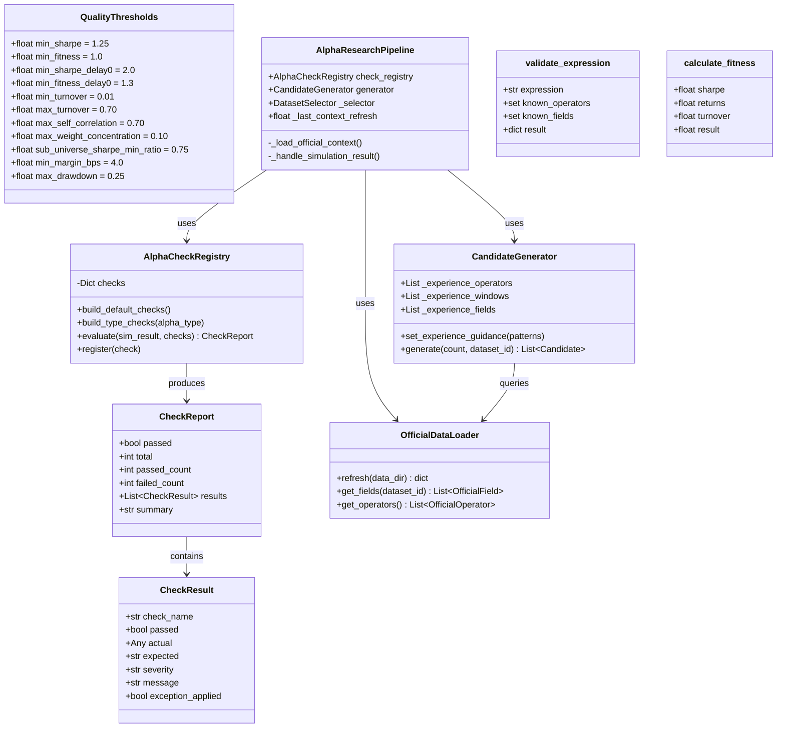
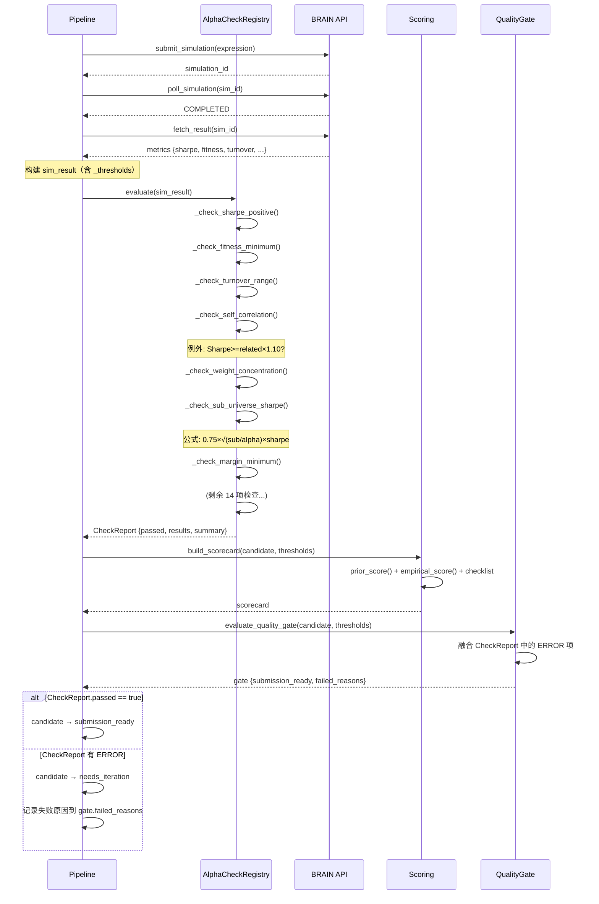
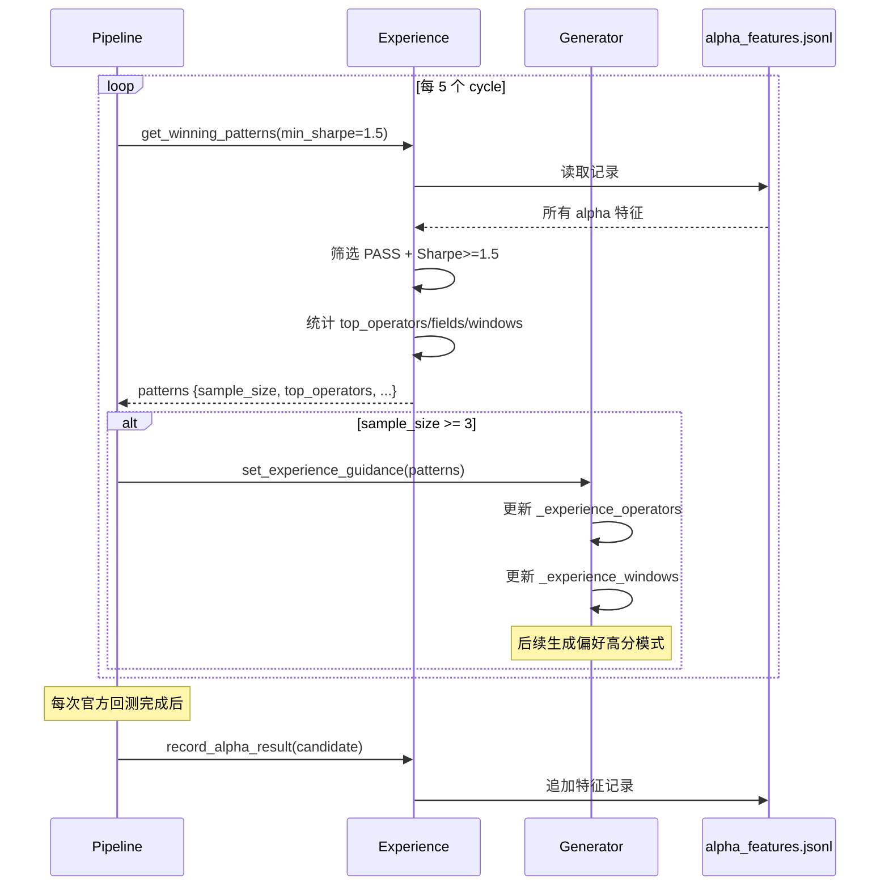

# Brain Alpha OPS — 质量提升架构设计

> **版本**: v1.0 | **日期**: 2026-05-14 | **基于**: PRD v1.0 (`prd_alpha_quality_v2.md`)
> **原则**: Python 标准库 only · 100% BRAIN 官方对齐 · 数据驱动

---

## 1. 实现方案

### P0-1: 官方 Fallback 字段/算子修复

**文件**: `brain_alpha_ops/brain_api/context_defaults.py` 第82-122行

**修改内容**:
1. 删除 3 个不存在的算子: `ts_min`, `ts_max`, `ts_median`
2. 修正 3 个错误名字: `ts_std`→`ts_std_dev`, `ts_argmax`→`ts_arg_max`, `ts_argmin`→`ts_arg_min`
3. 补全缺失的官方算子（从 `data/official_operators.json` 中提取），分类如下:

| 类别 | 需补全的算子 |
|------|-------------|
| Arithmetic | `reverse`, `inverse`, `densify` |
| Logical | `and`, `equal`, `or`, `not_equal`, `not`, `greater`, `greater_equal`, `less_equal`, `is_nan`, `less` |
| Time Series | `ts_scale`, `ts_quantile`, `ts_regression`, `kth_element`, `ts_count_nans`, `ts_covariance`, `ts_delay`, `ts_backfill`, `ts_av_diff`, `hump`, `last_diff_value`, `ts_step`, `days_from_last_change` |
| Cross Sectional | `normalize`, `quantile` |
| Vector | `vec_sum`, `vec_avg` |
| Transformational | `bucket`, `trade_when` |
| Group | `group_scale`, `group_backfill`, `group_mean` |

4. **额外保护**: 在 `data/loader.py` 的 `load_all()` 中，当所有 JSON 都加载失败时，记录清晰的错误日志，但仍允许 fallback（因为 fallback 已修复为完整列表）

---

### P0-2: LOW_SUB_UNIVERSE_SHARPE 公式修复

**文件**: 
- `brain_alpha_ops/research/alpha_checks.py` 第291-303行
- `brain_alpha_ops/research/scoring.py` 第106行

**修改内容**:

```python
# 当前（错误）
threshold = 0.75 * max(sharpe, 0.01)

# 修复后（BRAIN 官方）
import math
sub_size = _metric(sim, "subUniverseSize", "sub_size", default=1000)
alpha_size = _metric(sim, "alphaSize", "alpha_size", default=1000)
size_factor = math.sqrt(sub_size / max(alpha_size, 1))
threshold = 0.75 * size_factor * max(sharpe, 0.01)
```

**降级策略**: 当 API 未返回 sub_size/alpha_size 时，默认两者相等（size_factor=1），公式退化为当前实现，并记录 INFO 日志。

---

### P0-3: Dataset ID 选取链路修复

**文件**: `brain_alpha_ops/research/pipeline.py` 的 `_load_official_context()` 和 main loop

**修改内容**:
1. `_load_official_context()` 中，selector/mapper 初始化后检查 `_selector.available_datasets` 是否为空；若为空则记录 ERROR 事件
2. Main loop 中 dataset 选择前增加守卫：
```python
if not self._selector or not self._selector.available_datasets:
    self._event("dataset_unavailable", "No datasets available; skipping cycle")
    continue
```
3. `DatasetSelector.initialize()` 增加空 dataset 检查（已有防御，增加日志）

---

### P1-1: SELF_CORRELATION 例外规则

**文件**: `brain_alpha_ops/research/alpha_checks.py` 第255-264行

**修改内容**:

```python
def _check_self_correlation(sim: Dict[str, Any]) -> CheckResult:
    val = abs(_metric(sim, "selfCorrelation", "self_correlation", "correlation", default=0.0))
    passed = val < 0.70
    
    # BRAIN 例外规则: 新Alpha.Sharpe ≥ 相关Alpha.Sharpe × 1.10
    exception_applied = False
    if not passed:
        sharpe = _metric(sim, "sharpe", "Sharpe", default=0.0)
        related_sharpe = _metric(sim, "relatedAlphaSharpe", "related_sharpe", default=0.0)
        if related_sharpe > 0 and sharpe >= related_sharpe * 1.10:
            passed = True
            exception_applied = True
    
    return CheckResult(
        check_name="self_correlation",
        passed=passed,
        actual=val,
        expected="< 0.70" if not exception_applied else "< 0.70 OR Sharpe ≥ related × 1.10",
        message=f"SelfCorrelation={val:.4f}" + (" (exception: Sharpe advantage)" if exception_applied else "" if passed else " (>= 0.70)"),
    )
```

**CheckResult 增强**: 增加 `exception_applied: bool = False` 字段。

---

### P1-2: AlphaCheckRegistry 接入 Pipeline

**文件**: `brain_alpha_ops/research/pipeline.py`

**修改内容**:

1. **新增导入**（文件开头）:
```python
from .alpha_checks import AlphaCheckRegistry, CheckReport
```

2. **`__init__` 中注册**:
```python
self.check_registry = AlphaCheckRegistry()
self.check_registry.build_default_checks()
```

3. **在官方回测结果返回后执行检查** — 在 `_poll_due_backtests` 方法中，`fetch_result` 成功后:
```python
# 新增: 执行 AlphaCheckRegistry 全量检查
sim_result = {"_thresholds": self.config.thresholds, **result["metrics"]}
check_report = self.check_registry.evaluate(sim_result)
candidate.official_checks = check_report  # 新增字段

# 合并检查结果到 scorecard
if not check_report.passed:
    for r in check_report.results:
        if not r.passed and r.severity == "ERROR":
            candidate.gate_failures.append(f"CHECK:{r.check_name}:{r.message}")
```

4. **在 `evaluate_quality_gate` 中融合**:
```python
# scoring.py 的 evaluate_quality_gate 函数
if candidate.official_checks and not candidate.official_checks.passed:
    for r in candidate.official_checks.results:
        if not r.passed and r.severity == "ERROR":
            failed.append(f"BRAIN_CHECK:{r.check_name}:{r.message}")
```

---

### P1-3: Fitness 公式补全

**文件**: `brain_alpha_ops/research/scoring.py`

**新增函数**:
```python
def calculate_fitness(sharpe: float, returns: float, turnover: float) -> float:
    """BRAIN 官方 Fitness 公式: Sharpe × √(|Returns| / max(Turnover, 0.125))"""
    import math
    denominator = max(turnover, 0.125)
    ratio = abs(returns) / denominator
    return sharpe * math.sqrt(ratio)
```

**在 `empirical_score()` 中增加交叉验证**:
```python
import math
computed_fitness = calculate_fitness(sharpe, returns, turnover)
api_fitness = fitness  # BRAIN API 返回值
fitness_diff = abs(computed_fitness - api_fitness)
if fitness_diff > 0.05:
    items.append(item("fitness_crosscheck", fitness_diff, "<=", 0.05, False, 0))
```

---

### P1-4: Delay-0 阈值支持

**文件**: `brain_alpha_ops/config.py` 第70-91行

**修改内容**:
```python
@dataclass
class QualityThresholds:
    # Delay-1 (现有)
    min_sharpe: float = 1.25
    min_fitness: float = 1.0
    # Delay-0 (新增)
    min_sharpe_delay0: float = 2.0
    min_fitness_delay0: float = 1.3
    # ... 其余字段不变
```

**在 `alpha_checks.py` 中动态选择阈值**:
```python
def _get_delay_thresholds(sim: Dict[str, Any]) -> tuple[float, float]:
    """根据 delay 参数返回对应的 Sharpe/Fitness 阈值"""
    settings = sim.get("settings", {}) or {}
    delay = int(settings.get("delay", 1))
    if delay == 0:
        return (2.0, 1.3)  # Delay-0
    return (1.25, 1.0)     # Delay-1

# 在 _check_sharpe_positive 中使用
min_sharpe, _ = _get_delay_thresholds(sim)
passed = val >= min_sharpe

# 在 _check_fitness_minimum 中使用
_, min_fitness = _get_delay_thresholds(sim)
passed = val >= min_fitness
```

---

### P1-5: 特殊 Alpha 类型支持

**文件**: `brain_alpha_ops/config.py`, `brain_alpha_ops/research/alpha_checks.py`

**BrainSettings.type 枚举**:
```python
ALPHA_TYPES = ("REGULAR", "POWER_POOL", "ATOM", "PYRAMID")
```

**AlphaCheckRegistry 新增方法**:
```python
def build_type_checks(self, alpha_type: str) -> None:
    """为特定 alpha 类型注册额外检查"""
    if alpha_type == "POWER_POOL":
        self.register(AlphaCheck("powerpool_sharpe", _check_powerpool_sharpe, "ERROR"))
        self.register(AlphaCheck("powerpool_operators", _check_powerpool_operators, "ERROR"))
        self.register(AlphaCheck("powerpool_fields", _check_powerpool_fields, "ERROR"))
        self.register(AlphaCheck("powerpool_self_corr", _check_powerpool_self_corr, "ERROR"))
    elif alpha_type == "ATOM":
        self.register(AlphaCheck("atom_single_dataset", _check_atom_single_dataset, "ERROR"))
    elif alpha_type == "PYRAMID":
        self.register(AlphaCheck("pyramid_count", _check_pyramid_count, "WARNING"))
```

**Power Pool 检查阈值**:
- Sharpe ≥ 1.0
- 唯一算子 ≤ 8
- 唯一数据字段 ≤ 3（分组字段不计）
- 仅 USA / Delay-1
- 自相关 ≤ 0.5

---

### P2-1: 表达式验证增强

**文件**: `brain_alpha_ops/brain_api/official.py` 第230-237行

**修改内容**:
```python
def validate_expression(self, expression: str, settings: dict, 
                        known_operators: set = None, known_fields: set = None) -> dict:
    """增强版: 括号平衡 + 算子存在性 + 字段存在性校验"""
    errors = []
    
    # 括号检查 (现有)
    if expression.count("(") != expression.count(")"):
        errors.append("Unbalanced parentheses")
    
    # 算子存在性检查 (新增)
    if known_operators:
        used_ops = re.findall(r"\b([a-zA-Z_]\w*)\s*\(", expression)
        for op in used_ops:
            if op not in known_operators:
                errors.append(f"Unknown operator: {op}")
    
    # 字段存在性检查 (新增)
    if known_fields:
        used_fields = re.findall(r"\b([a-zA-Z_]\w+)\b", expression)
        for f in used_fields:
            if f.lower() in known_fields and f not in known_operators:
                continue  # valid field
        # 简化: 标记缺少已知字段
        if not any(f.lower() in known_fields for f in used_fields):
            errors.append("No known BRAIN data fields found in expression")
    
    if errors:
        return {"status": "FAIL", "errors": errors}
    return {"status": "PASS", "errors": [], "note": "simulation submission will confirm official compile"}
```

---

### P2-2: 经验学习反馈环闭合

**文件**: `brain_alpha_ops/research/pipeline.py`, `brain_alpha_ops/research/generator.py`

**修改内容**:

1. **pipeline 中每 5 个 cycle 提炼经验**:
```python
# 在 main loop 中，cycle 计数后
if cycle > 0 and cycle % 5 == 0:
    from brain_alpha_ops.research.experience import get_winning_patterns
    patterns = get_winning_patterns(self.config.storage_dir, min_sharpe=1.5)
    if patterns["sample_size"] >= 3:
        self.generator.set_experience_guidance(patterns)
        self._event("experience_feedback", 
            f"Cycle {cycle}: Applied experience from {patterns['sample_size']} winning alphas. "
            f"Top operators: {patterns['top_operators'][:5]}")
```

2. **generator 中增加经验引导**:
```python
# CandidateGenerator 新增方法
def set_experience_guidance(self, patterns: dict) -> None:
    """根据经验模式调整生成偏好"""
    self._experience_operators = patterns.get("top_operators", [])
    self._experience_windows = patterns.get("preferred_windows", [])
    self._experience_fields = [f for combo in patterns.get("field_combinations", []) 
                               for f in combo.get("fields", [])]
```

3. **生成时优先使用经验算子/窗口**（在 `_generate_fallback` 和 `_generate_dynamic` 中使用）。

---

### P2-3: Margin 改为 API 直接返回值

**文件**: `brain_alpha_ops/research/alpha_checks.py` 第319-337行, `brain_alpha_ops/research/scoring.py` 第107-109行

**修改内容**:
```python
# alpha_checks.py
def _check_margin_minimum(sim: Dict[str, Any]) -> CheckResult:
    # 优先使用 API 返回的 margin
    api_margin = _metric(sim, "margin", "Margin", default=None)
    if api_margin is not None and api_margin > 0:
        margin_bps = api_margin
        margin_source = "api"
    else:
        # 降级: 本地推算
        returns = _metric(sim, "returns", "Returns", default=0.0)
        turnover = _metric(sim, "turnover", "Turnover", default=0.01)
        margin_bps = (returns / max(turnover, 0.001)) / 100.0
        margin_source = "estimated"
    # ...
```

---

### P2-4: Drawdown 严重性统一

**文件**: `brain_alpha_ops/research/alpha_checks.py` 第124行 + 第223-240行

**修改**: 注册时和运行时的严重性统一为 `WARNING`（因 BRAIN 官方不硬检查 drawdown）:
```python
# 第124行
self.register(AlphaCheck("drawdown_limit", _check_drawdown_limit, "WARNING"))

# 第238行 — 删除这行覆盖
# severity="INFO",  # 删除 — 与注册级别保持一致
```

---

### P2-5: 字段/算子实时刷新

**文件**: `brain_alpha_ops/data/loader.py`, `brain_alpha_ops/research/pipeline.py`

**修改内容**:

1. `OfficialDataLoader` 新增 `refresh()` 方法:
```python
def refresh(self, data_dir: str = "data") -> dict:
    """Reload JSON files and return diff stats."""
    old_field_count = self.field_count
    old_op_count = self.operator_count
    self._fields.clear()
    self._operators.clear()
    self._datasets.clear()
    self.load_all(data_dir)
    return {
        "fields_delta": self.field_count - old_field_count,
        "operators_delta": self.operator_count - old_op_count,
        "current": {"fields": self.field_count, "operators": self.operator_count},
    }
```

2. Pipeline 增加定时刷新（在 `_should_stop` 检查前）:
```python
# 每 24 小时刷新一次上下文
if time.time() - self._last_context_refresh > 86400:
    refresh_stats = loader.refresh()
    self._event("context_refreshed", str(refresh_stats))
    self._last_context_refresh = time.time()
```

---

## 2. 任务列表

| # | 任务 | 优先级 | 依赖 | 文件 | 预计改动行数 |
|---|------|--------|------|------|------------|
| **T1** | 修复 context_defaults.py fallback 算子 | P0 | — | `brain_api/context_defaults.py` | ~40 |
| **T2** | 增强 loader.py JSON 加载异常处理 | P0 | T1 | `data/loader.py` | ~10 |
| **T3** | 修复 LSS 公式 (alpha_checks.py) | P0 | — | `research/alpha_checks.py:291-303` | ~15 |
| **T4** | 修复 LSS 公式 (scoring.py) | P0 | T3 | `research/scoring.py:106` | ~10 |
| **T5** | 修复 Dataset 链路 | P0 | T2 | `research/pipeline.py` | ~15 |
| **T6** | 实现 SELF_CORRELATION 例外 | P1 | — | `research/alpha_checks.py:255-264` | ~20 |
| **T7** | AlphaCheckRegistry 接入 Pipeline | P1 | T6 | `research/pipeline.py` + `scoring.py` | ~40 |
| **T8** | 实现 calculate_fitness 公式 | P1 | — | `research/scoring.py` | ~20 |
| **T9** | 增加 Delay-0 阈值 | P1 | — | `config.py` + `research/alpha_checks.py` | ~25 |
| **T10** | 支持特殊 Alpha 类型 | P1 | T7 | `config.py` + `research/alpha_checks.py` | ~50 |
| **T11** | 增强 validate_expression | P2 | — | `brain_api/official.py` | ~25 |
| **T12** | 闭合经验学习反馈环 | P2 | T7 | `research/pipeline.py` + `generator.py` | ~35 |
| **T13** | Margin 改为 API 直取 | P2 | — | `research/alpha_checks.py` + `scoring.py` | ~20 |
| **T14** | Drawdown 严重性统一 | P2 | — | `research/alpha_checks.py` | ~5 |
| **T15** | 实现字段实时刷新 | P2 | T2 | `data/loader.py` + `pipeline.py` | ~25 |

**推荐执行顺序**: T1 → T2 → T3 → T4 → T5 (P0 全完成) → T6 → T7 → T8 → T9 → T10 (P1 全完成) → T11 → T12 → T13 → T14 → T15 (P2)

---

## 3. 类图 (Mermaid)



---

## 4. 时序图: AlphaCheckRegistry 集成流程



---

## 5. 时序图: 经验学习反馈环



---

## 6. 依赖包

**无新增依赖**。所有修改仅使用 Python 标准库:
- `math.sqrt` — LSS 公式中开平方（内置）
- `re` — 表达式解析（已使用）
- `json` — JSON 序列化（已使用）

---

## 7. 共享知识

### 7.1 跨文件常量

| 常量 | 值 | 用途 | 定义位置 |
|------|-----|------|---------|
| `LSS_RATIO` | 0.75 | LOW_SUB_UNIVERSE_SHARPE 系数 | `config.py:QualityThresholds` |
| `SC_EXCEPTION_MULTIPLIER` | 1.10 | SELF_CORRELATION 例外倍数 | `alpha_checks.py` |
| `FITNESS_TURNOVER_FLOOR` | 0.125 | Fitness 公式中的 turnover 下限 | `scoring.py:calculate_fitness` |
| `EXPERIENCE_FEEDBACK_INTERVAL` | 5 | 经验反馈间隔（cycles） | `pipeline.py` |
| `CONTEXT_REFRESH_INTERVAL` | 86400 | 上下文刷新间隔（秒） | `pipeline.py` |

### 7.2 数据来源标注约定

所有值标注 `source` 字段:
- `"source": "BRAIN_API"` — 从 BRAIN API 直接获取
- `"source": "BRAIN_official_documentation"` — 从官方文档获取的阈值
- `"source": "local_computation"` — 本地计算
- `"source": "estimated"` — 推算值（如 margin 降级计算）

### 7.3 错误级别约定

| 级别 | 含义 | 行为 |
|------|------|------|
| `ERROR` | BRAIN 提交阻断条件 | gate.passed = False |
| `WARNING` | 质量建议，不阻断提交 | 记录到 scorecard |
| `INFO` | 信息性检查 | 仅日志输出 |

---

## 8. 待明确事项

| # | 问题 | 影响范围 | 建议 |
|---|------|---------|------|
| Q1 | BRAIN API 模拟结果是否返回 `subUniverseSize` 和 `alphaSize`？ | P0-2 LSS公式 | 先以默认值实现，API 返回后自动使用精确值 |
| Q2 | Power Pool 是否使用相同的 `/alphas/{id}/submit` 端点？ | P1-5 | 假设使用相同端点，提交时附带 type 参数 |
| Q3 | `get_winning_patterns` 的反馈权重如何影响生成？ | P2-2 | 用 70% 经验导向 + 30% 随机探索的比例 |
| Q4 | Pyramid alpha 上限是软限制还是硬限制？ | P1-5 | 先实现 WARNING 级别，确认后再升级为 ERROR |
