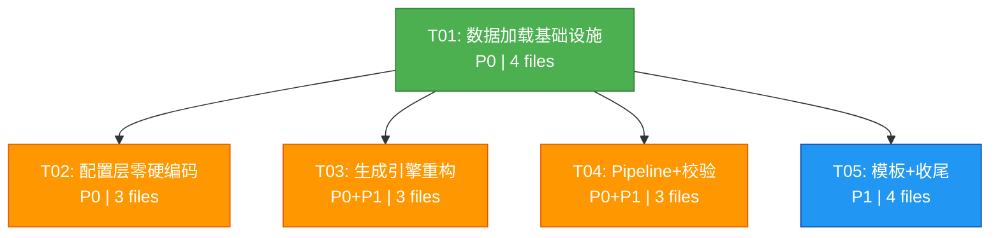

# BRAIN Alpha 系统对齐重建 — 系统设计文档

> **架构师**: Bob (software-architect)
> **范围**: P0 + P1（共11项），P2 标记为后续优化
> **核心原则**: 零硬编码、`data/official_*.json` 为唯一数据源、向后兼容

---

## 目录

1. [实现方案](#1-实现方案)
2. [文件清单](#2-文件清单)
3. [数据结构和接口设计](#3-数据结构和接口设计)
4. [程序调用流程](#4-程序调用流程)
5. [任务列表](#5-任务列表)
6. [依赖包列表](#6-依赖包列表)
7. [共享知识](#7-共享知识)
8. [待明确事项](#8-待明确事项)

---

## 1. 实现方案

### 1.1 核心策略

```
                 ┌──────────────────────────────────────┐
                 │         data/official_*.json          │
                 │  fields(7642) operators(66) datasets(16) │
                 └──────┬──────────┬──────────┬─────────┘
                        │          │          │
                        ▼          ▼          ▼
                 ┌──────────────────────────────────────┐
                 │       OfficialDataLoader (单例)        │
                 │  启动时一次性加载全部 JSON → 内存索引    │
                 └──────┬──────────┬──────────┬─────────┘
                        │          │          │
          ┌─────────────┼──────────┼──────────┼─────────────┐
          │             │          │          │             │
          ▼             ▼          ▼          ▼             ▼
   ┌──────────┐ ┌──────────┐ ┌──────────┐ ┌──────────┐ ┌──────────┐
   │  Config  │ │Generator │ │ Theme    │ │ Pipeline │ │ Alpha    │
   │   Layer  │ │  Layer   │ │ Engine   │ │  Layer   │ │ Checks   │
   └──────────┘ └──────────┘ └──────────┘ └──────────┘ └──────────┘
        去硬编码     字段池      动态模板    多数据集      标准门禁
```

**关键设计决策**:
| 决策 | 方案 | 理由 |
|------|------|------|
| 数据加载时机 | 模块首次 import 时自动加载 | 零侵入，现有代码无需改动调用时机 |
| 加载模式 | 单例 + 全量内存索引 | 7642 fields × ~200B ≈ 1.5MB，完全可接受 |
| 缓存策略 | 内存 dict + 可选 file-mtime 热重载 | 简单可靠，开发期可手动 reload |
| 向后兼容 | 保留现有函数签名，内部切换数据源 | `extract_fields()` 等签名不变 |
| 阈值来源 | BRAIN 官方 Alpha Check 标准 | 移除全部虚构指标 |

### 1.2 数据流变更

**Before（当前）**:
```
API (/data-fields) → list_fields() → api_cache/
                                    ↘ 失败 → DEFAULT_FIELDS(~40硬编码)
THEME_LIBRARY(硬编码) → mutate_expression()
KNOWN_FIELDS(硬编码) → extract_fields()
```

**After（修复后）**:
```
data/official_fields.json ──→ OfficialDataLoader ──→ 全部模块
data/official_operators.json ──→ OfficialDataLoader ──→ 全部模块
data/official_datasets.json ──→ OfficialDataLoader ──→ DatasetSelector
                                     │
                         FieldDatasetMapper (field↔dataset 双向映射)
                                     │
                         DynamicThemeEngine (自动分类+生成)
```

### 1.3 各 PRD 项的修复方案

| PRD | 修复方案 | 涉及文件 |
|-----|---------|---------|
| **P0-1** | `generator.py` 的 `KNOWN_FIELDS` 删除，改为 `OfficialDataLoader.instance().get_fields(dataset_id)` | `generator.py` |
| **P0-2** | `context_defaults.py` 的 `DEFAULT_OPERATORS` 删除，改为从 loader 获取 | `context_defaults.py` |
| **P0-3** | `config.py:BrainSettings.dataset` 改为 `Optional[str]`，`None`=全部可用，默认值从 `official_datasets.json` 首项读取 | `config.py` |
| **P0-4** | `QualityThresholds` 删除 `min_total_score`、`min_sub_universe_sharpe_ratio`、`min_margin_bps`，`max_correlation`→`max_self_correlation`，`max_concentration`→`max_weight_concentration`，新增 `max_prod_correlation` | `config.py`, `scoring.py` |
| **P0-5** | 新建 `DatasetSelector` 类支持 `all/rotate/random/specific` 四种策略 | `dataset_selector.py` |
| **P0-6** | 新建 `FieldDatasetMapper` 类，从 `official_fields.json` 的 `dataset.id` 构建双向映射 | `field_dataset_mapper.py` |
| **P1-1** | 新建 `AlphaCheckRegistry` + 20+ 标准 check 实现 | `alpha_checks.py` |
| **P1-2** | 新建 `DynamicThemeEngine`，按字段类型/分类自动生成模板，替换 `THEME_LIBRARY` | `theme_engine.py` |
| **P1-3** | `DatasetSelector.rotate()` + `pipeline.py` 多轮循环 | `pipeline.py`, `dataset_selector.py` |
| **P1-4** | `WindowOptimizer` 基于数据集频率统计优化窗口列表 | `generator.py` |
| **P1-5** | `AlphaTemplateRegistry` 加载预定义模板并支持基于数据集字段实例化 | `templates.py` |

### 1.4 阈值对齐

```python
# Before (❌ = 虚构, ⚠️ = 可疑)
class QualityThresholds:
    min_total_score: float = 85.0           # ❌ 删除
    min_sharpe: float = 2.0                 # ⚠️ 保留，调整默认值
    min_fitness: float = 1.0                # ⚠️ 保留，调整默认值
    min_turnover: float = 0.10              # ✓ 保留
    max_turnover: float = 0.30              # ✓ 保留
    min_returns: float = 0.0                # ✓ 保留
    max_drawdown: float = 0.25              # ✓ 保留
    min_sub_universe_sharpe_ratio: float    # ❌ 删除
    max_correlation: float = 0.65           # → 重命名 max_self_correlation
    max_concentration: float = 0.30         # → 重命名 max_weight_concentration
    min_margin_bps: float = 0.04            # ❌ 删除

# After (全部来自 BRAIN 官方标准)
class QualityThresholds:
    min_sharpe: float = 1.5                 # BRAIN 标准值
    min_fitness: float = 0.8                # BRAIN 标准值
    min_turnover: float = 0.10
    max_turnover: float = 0.30
    min_returns: float = 0.0
    max_drawdown: float = 0.25
    max_self_correlation: float = 0.65      # 重命名自 max_correlation
    max_prod_correlation: float = 0.70      # 新增
    max_weight_concentration: float = 0.30  # 重命名自 max_concentration
```

---

## 2. 文件清单

### 2.1 新增文件

| # | 相对路径 | 说明 | 所属任务 |
|---|---------|------|---------|
| 1 | `brain_alpha_ops/data/__init__.py` | data 包初始化，导出核心类 | T01 |
| 2 | `brain_alpha_ops/data/schemas.py` | OfficialField / OfficialOperator / OfficialDataset 数据类定义 | T01 |
| 3 | `brain_alpha_ops/data/loader.py` | OfficialDataLoader 单例加载器 | T01 |
| 4 | `brain_alpha_ops/data/field_dataset_mapper.py` | Field-Dataset 双向关联映射 | T01 |
| 5 | `brain_alpha_ops/research/theme_engine.py` | DynamicThemeEngine 动态主题生成 | T03 |
| 6 | `brain_alpha_ops/research/dataset_selector.py` | DatasetSelector 动态数据集选择器 | T03 |
| 7 | `brain_alpha_ops/research/alpha_checks.py` | AlphaCheck / AlphaCheckRegistry 标准门禁 | T04 |
| 8 | `brain_alpha_ops/research/templates.py` | AlphaTemplateRegistry 模板注册与实例化 | T05 |

### 2.2 修改文件

| # | 相对路径 | 说明 | 所属任务 |
|---|---------|------|---------|
| 1 | `brain_alpha_ops/config.py` | BrainSettings.dataset 去硬编码；QualityThresholds 去虚构指标 | T02 |
| 2 | `brain_alpha_ops/brain_api/context_defaults.py` | DEFAULT_FIELDS/DEFAULT_OPERATORS 从 loader 加载 | T02 |
| 3 | `brain_alpha_ops/brain_api/official.py` | list_fields/list_operators 优先从 loader 取 | T02 |
| 4 | `brain_alpha_ops/research/scoring.py` | 删除 min_sub_universe_sharpe_ratio(line114)、margin(line119-122)、min_total_score(line156) 引用 | T02 |
| 5 | `brain_alpha_ops/research/generator.py` | 删除 KNOWN_FIELDS、THEME_LIBRARY；接入 loader + theme_engine + dataset_selector | T03 |
| 6 | `brain_alpha_ops/research/pipeline.py` | _load_official_context() 改为 JSON 优先；集成 AlphaCheckRegistry；支持多数据集 | T04 |
| 7 | `brain_alpha_ops/research/safety.py` | 账户安全门禁适配新阈值字段名 | T04 |
| 8 | `brain_alpha_ops/__init__.py` | 导出新增公共接口 | T05 |
| 9 | `brain_alpha_ops/research/__init__.py` | 导出新增公共接口 | T05 |

### 2.3 不修改文件

| 相对路径 | 原因 |
|---------|------|
| `data/official_fields.json` | 静态数据文件，只读 |
| `data/official_operators.json` | 静态数据文件，只读 |
| `data/official_datasets.json` | 静态数据文件，只读 |

---

## 3. 数据结构和接口设计

### 3.1 数据模型（schemas.py）

```python
from dataclasses import dataclass, field
from typing import Dict, Any, Optional, List

@dataclass
class DatasetRef:
    """official_fields.json 中的 dataset 子对象"""
    id: str           # 如 "analyst4", "model77"
    name: str         # 如 "Analyst 4", "Model 77"

@dataclass
class OfficialField:
    """对应 official_fields.json 中单条记录"""
    id: str                              # 唯一标识
    name: str                            # 字段名，如 "close"
    type: str                            # "double", "int", "string"
    category: str                        # 分类: "price", "fundamental", "news", etc.
    dataset: DatasetRef                  # 所属数据集引用
    description: str = ""                # 描述文本
    properties: Dict[str, Any] = field(default_factory=dict)  # 扩展属性

@dataclass
class OfficialOperator:
    """对应 official_operators.json 中单条记录"""
    id: str                              # 唯一标识
    name: str                            # 运算符名，如 "+", "ts_sum"
    op_type: str                         # "binary", "unary", "window", "cross_sectional"
    precedence: int = 0                  # 运算符优先级
    description: str = ""                # 描述文本
    arity: int = 2                       # 参数数量

@dataclass
class OfficialDataset:
    """对应 official_datasets.json 中单条记录"""
    id: str                              # 如 "analyst4", "model77"
    name: str                            # 显示名称
    universe: str = ""                   # 股票池
    frequency: str = "daily"             # 数据频率
    field_count: int = 0                 # 字段数量
    description: str = ""
```

### 3.2 核心服务类

```python
# ─── brain_alpha_ops/data/loader.py ───

class OfficialDataLoader:
    """
    单例加载器 — 启动时一次性加载全部 official_*.json 到内存。

    Usage:
        loader = OfficialDataLoader.instance()
        fields = loader.get_fields(dataset_id="analyst4")
        all_ops = loader.get_operators()
    """

    # ── 单例 ──
    _instance: Optional["OfficialDataLoader"] = None
    _loaded: bool = False

    @classmethod
    def instance(cls) -> "OfficialDataLoader": ...
    @classmethod
    def reload(cls) -> "OfficialDataLoader": ...  # 开发期热重载

    # ── 初始化 ──
    def __init__(self):
        self._fields: Dict[str, OfficialField] = {}          # keyed by field.id
        self._fields_by_name: Dict[str, List[OfficialField]] = {}  # name → [fields]（跨数据集同名）
        self._operators: Dict[str, OfficialOperator] = {}    # keyed by operator.id
        self._operators_by_name: Dict[str, OfficialOperator] = {}
        self._datasets: Dict[str, OfficialDataset] = {}      # keyed by dataset.id

    def load_all(self, data_dir: str = "data") -> None: ...

    # ── 查询接口 ──
    def get_fields(self, dataset_id: Optional[str] = None) -> List[OfficialField]: ...
    def get_operators(self) -> List[OfficialOperator]: ...
    def get_datasets(self) -> List[OfficialDataset]: ...
    def get_field_by_name(self, name: str) -> Optional[OfficialField]: ...
    def get_dataset(self, dataset_id: str) -> Optional[OfficialDataset]: ...
    def get_operator(self, name: str) -> Optional[OfficialOperator]: ...

    # ── 校验接口 ──
    def validate_field(self, name: str, dataset_id: Optional[str] = None) -> bool: ...
    def validate_operator(self, name: str) -> bool: ...
    def search_fields(self, keyword: str, dataset_id: Optional[str] = None) -> List[OfficialField]: ...

    # ── 统计接口 ──
    @property
    def field_count(self) -> int: ...
    @property
    def operator_count(self) -> int: ...
    @property
    def dataset_count(self) -> int: ...


# ─── brain_alpha_ops/data/field_dataset_mapper.py ───

class FieldDatasetMapper:
    """
    构建 Field ↔ Dataset 双向关联映射。
    数据源: official_fields.json 中每个 field 的 dataset.id 字段。

    Usage:
        mapper = FieldDatasetMapper()
        mapper.build(OfficialDataLoader.instance())
        fields = mapper.fields_for("model77")    # → ["field_a", "field_b", ...]
        datasets = mapper.datasets_for("close")  # → ["analyst4", "model77", ...]
    """

    def __init__(self):
        self._dataset_to_fields: Dict[str, List[str]] = {}  # dataset_id → [field_name, ...]
        self._field_to_datasets: Dict[str, List[str]] = {}  # field_name → [dataset_id, ...]

    def build(self, loader: OfficialDataLoader) -> "FieldDatasetMapper": ...

    # ── 方向1: dataset → fields ──
    def fields_for(self, dataset_id: str) -> List[str]: ...
    def field_count(self, dataset_id: str) -> int: ...

    # ── 方向2: field → datasets ──
    def datasets_for(self, field_name: str) -> List[str]: ...
    def is_common_field(self, field_name: str, min_datasets: int = 3) -> bool: ...

    # ── 集合运算 ──
    def common_fields(self, dataset_ids: List[str]) -> List[str]: ...
    def unique_fields(self, dataset_id: str, exclude_ids: List[str]) -> List[str]: ...
    def dataset_overlap(self, ds1: str, ds2: str) -> float: ...  # Jaccard 相似度


# ─── brain_alpha_ops/research/dataset_selector.py ───

class DatasetSelector:
    """
    动态数据集选择器 — 支持多种选择策略。

    Usage:
        selector = DatasetSelector(mapper)
        ds = selector.select("rotate", index=3)  # → "news12"
        ds_list = selector.select("random", n=5)  # → ["analyst4", "model77", ...]
    """

    STRATEGIES = ("all", "rotate", "random", "specific")

    def __init__(self, mapper: FieldDatasetMapper):
        self._mapper = mapper
        self._datasets: List[str] = []  # 可用数据集 ID 列表
        self._rotation_index: int = 0

    def initialize(self, loader: OfficialDataLoader) -> None: ...

    def select(self, strategy: str = "all", **kwargs) -> List[str]:
        """
        - strategy="all": 返回全部 16 个数据集 ID
        - strategy="rotate": 轮转返回单个 dataset_id（kwargs: index）
        - strategy="random": 随机返回 n 个（kwargs: n, seed）
        - strategy="specific": 返回指定 dataset_id（kwargs: dataset_ids）
        """
        ...

    def rotate(self, advance: bool = True) -> str: ...
    def random_subset(self, n: int = 3, seed: Optional[int] = None) -> List[str]: ...

    @property
    def available_datasets(self) -> List[str]: ...
    @property
    def current(self) -> str: ...


# ─── brain_alpha_ops/research/theme_engine.py ───

@dataclass
class ThemeTemplate:
    """动态生成的 Alpha 模板"""
    id: str
    name: str
    category: str                      # "momentum", "value", "quality", "volatility", etc.
    expression: str                    # 含占位符，如 "ts_rank({FIELD}, {WINDOW})"
    field_slots: List[str]             # 占位符列表，如 ["{FIELD}", "{WINDOW}"]
    description: str = ""


class DynamicThemeEngine:
    """
    从 official_fields.json 动态生成 Alpha 模板，替换硬编码 THEME_LIBRARY。

    生成逻辑:
    1. 按 category 对 fields 分组 (price, fundamental, sentiment, etc.)
    2. 按 operator 类型生成组合模板
    3. 为每个 dataset 生成该数据集可用的模板子集

    Usage:
        engine = DynamicThemeEngine(loader)
        engine.build_categories()
        themes = engine.generate(dataset_id="analyst4", n=50)
    """

    # ── 模板骨架（零硬编码：占位符在运行时替换） ──
    TEMPLATE_SKELETONS: ClassVar[List[str]] = [
        # 动量类
        "ts_rank({FIELD}, {WINDOW})",
        "ts_delta({FIELD}, {WINDOW})",
        "ts_av_diff({FIELD}, {WINDOW})",
        # 反转类
        "-1 * ts_rank({FIELD}, {WINDOW})",
        "ts_rank(-1 * {FIELD}, {WINDOW})",
        # 横截面类
        "group_rank({FIELD}, {GROUP})",
        "group_zscore({FIELD}, {GROUP})",
        # 组合类
        "ts_rank({FIELD_A}, {WINDOW}) * ts_rank({FIELD_B}, {WINDOW})",
        # ...
    ]

    def __init__(self, loader: OfficialDataLoader):
        self._loader = loader
        self._categories: Dict[str, List[OfficialField]] = {}

    def build_categories(self) -> None: ...
    def generate(self, dataset_id: str, n: int = 50, seed: Optional[int] = None) -> List[ThemeTemplate]: ...
    def mutate_expression(self, template: ThemeTemplate, field_pool: List[str]) -> str: ...
    def get_category_fields(self, category: str, dataset_id: Optional[str] = None) -> List[str]: ...


# ─── brain_alpha_ops/research/alpha_checks.py ───

@dataclass
class CheckResult:
    check_name: str
    passed: bool
    actual_value: float
    threshold: Optional[float]
    severity: str                     # "error" | "warning"
    message: str


@dataclass
class CheckReport:
    results: List[CheckResult]
    all_passed: bool
    error_count: int
    warning_count: int
    summary: str


class AlphaCheck:
    """单个 Alpha 质量检查"""
    name: str
    description: str
    severity: str = "error"           # "error" | "warning"
    threshold: Optional[float] = None # None = 无阈值，纯报告性检查

    def evaluate(self, sim_result: Dict[str, Any]) -> CheckResult: ...
    def _extract_metric(self, sim_result: Dict[str, Any]) -> float: ...


class AlphaCheckRegistry:
    """
    BRAIN 官方标准 Alpha Checks 注册表。

    内置 P0 级 checks（全部来自 BRAIN 官方文档）:
    - self_correlation: 自相关性（α 与自身滞后值的相关性）
    - prod_correlation: 生产相关性（α 与现有生产 α 的相关性）
    - weight_concentration: 权重集中度（HHI 或 top-N 占比）
    - turnover: 换手率（日度/月度）
    - sharpe: 夏普比率
    - fitness: 适应度
    - returns: 收益率
    - drawdown: 最大回撤
    - information_coefficient: IC
    - rank_information_coefficient: Rank IC
    - marginal_contribution: 边际贡献
    - ... (共20+ checks)
    """

    def __init__(self):
        self._checks: Dict[str, AlphaCheck] = {}

    def register(self, check: AlphaCheck) -> None: ...
    def get(self, name: str) -> Optional[AlphaCheck]: ...
    def get_all(self) -> List[AlphaCheck]: ...
    def get_by_severity(self, severity: str) -> List[AlphaCheck]: ...

    def evaluate(self, sim_result: Dict[str, Any],
                 checks: Optional[List[str]] = None) -> CheckReport:
        """
        对仿真结果运行指定 checks（默认运行全部）。
        返回 CheckReport 包含逐项结果和汇总。
        """
        ...

    def build_default_checks(self) -> None:
        """从 BRAIN 官方标准构建默认检查集"""
        ...


# ─── brain_alpha_ops/research/templates.py ───

@dataclass
class AlphaTemplate:
    """预定义 Alpha 模板"""
    id: str
    name: str
    description: str
    expression_template: str           # 含 {FIELD_*} 占位符
    required_field_types: List[str]   # 需要的字段类型
    applicable_datasets: List[str]    # 适用的数据集（空=全部）
    tags: List[str] = field(default_factory=list)


class AlphaTemplateRegistry:
    """
    Alpha 模板注册表 — 加载预定义模板，支持按数据集实例化。

    Usage:
        registry = AlphaTemplateRegistry(loader, mapper)
        templates = registry.get_for_dataset("analyst4")
        alpha = registry.instantiate(template_id, dataset_id="analyst4")
    """

    def __init__(self, loader: OfficialDataLoader, mapper: FieldDatasetMapper): ...
    def load_templates(self, template_file: str = "data/alpha_templates.json") -> None: ...
    def get_for_dataset(self, dataset_id: str) -> List[AlphaTemplate]: ...
    def instantiate(self, template_id: str, dataset_id: str,
                    seed: Optional[int] = None) -> str: ...
```

### 3.3 类图

完整的类图见独立文件 `docs/class-diagram.mermaid`。

---

## 4. 程序调用流程

### 4.1 主流程：Alpha 研究 Pipeline 完整运行

完整的时序图见独立文件 `docs/sequence-diagram.mermaid`。

**关键步骤说明**:

```
1. AlphaResearchPipeline.run(config)
   │
   ├─ 2. OfficialDataLoader.instance().load_all()
   │      ├─ 读取 data/official_fields.json → _fields 索引
   │      ├─ 读取 data/official_operators.json → _operators 索引
   │      └─ 读取 data/official_datasets.json → _datasets 索引
   │
   ├─ 3. FieldDatasetMapper.build(loader)
   │      └─ 遍历 _fields，按 dataset.id 分组
   │
   ├─ 4. DatasetSelector.initialize(loader)
   │      └─ 从 _datasets 读取全部可用 dataset ID
   │
   ├─ 5. DatasetSelector.select(strategy) → [dataset_ids]
   │
   ├─ 6. For each dataset_id:
   │      │
   │      ├─ 7. FieldDatasetMapper.fields_for(dataset_id) → field_pool
   │      │
   │      ├─ 8. DynamicThemeEngine.generate(dataset_id, n)
   │      │      ├─ 按 category 分组 fields
   │      │      ├─ 从 TEMPLATE_SKELETONS 随机选取骨架
   │      │      └─ 替换 {FIELD}, {WINDOW} 等占位符 → ThemeTemplate[]
   │      │
   │      └─ 9. For each ThemeTemplate:
   │             │
   │             ├─ 10. OfficialBrainAPI.validate_expression(expr)
   │             │        └─ (内部: loader.validate_field() + loader.validate_operator())
   │             │
   │             ├─ 11. OfficialBrainAPI.submit_simulation(expr, dataset_id)
   │             │
   │             ├─ 12. AlphaCheckRegistry.evaluate(sim_result)
   │             │        ├─ selfCorrelation.evaluate()
   │             │        ├─ prodCorrelation.evaluate()
   │             │        ├─ weightConcentration.evaluate()
   │             │        ├─ sharpe.evaluate()
   │             │        ├─ ... (全部已注册 checks)
   │             │        └─ → CheckReport
   │             │
   │             └─ 13. scoring.build_scorecard(result, check_report)
   │
   └─ 14. 返回排序后的 Candidate 列表
```

### 4.2 API 降级策略

```
OfficialDataLoader (JSON 文件)  ←── 首选
        │
        ▼ 文件缺失/损坏
OfficialBrainAPI.list_fields()  ←── 降级
        │
        ▼ API 不可用
context_defaults.py (从 JSON 构建的缓存)  ←── 最后兜底
```

---

## 5. 任务列表

> **硬约束**: 最多 5 个任务，每个 ≥ 3 文件，T01 必须是基础设施。

### 任务总览

```
T01 (基础设施) ─────────────────────────────────────────────
    │
    ├── T02 (配置层零硬编码) ── 仅依赖 T01
    ├── T03 (生成引擎重构)   ── 仅依赖 T01
    ├── T04 (Pipeline+校验)  ── 仅依赖 T01
    └── T05 (模板+收尾)      ── 仅依赖 T01
```

### 详细任务

#### T01: 数据加载基础设施层

| 属性 | 值 |
|------|-----|
| **Task ID** | T01 |
| **优先级** | P0 |
| **依赖** | 无 |
| **预计修改/新增** | 4 文件 |

**目标**: 建立 `data/official_*.json` → 内存索引的数据加载基础设施。

**源文件**:
| 文件 | 操作 | 说明 |
|------|------|------|
| `brain_alpha_ops/data/__init__.py` | **新增** | 包初始化，导出 OfficialDataLoader, FieldDatasetMapper, schemas |
| `brain_alpha_ops/data/schemas.py` | **新增** | OfficialField, OfficialOperator, OfficialDataset, DatasetRef 数据类 |
| `brain_alpha_ops/data/loader.py` | **新增** | OfficialDataLoader 单例：load_all(), get_fields(), get_operators(), get_datasets(), validate_field(), validate_operator(), search_fields() |
| `brain_alpha_ops/data/field_dataset_mapper.py` | **新增** | FieldDatasetMapper: build(), fields_for(), datasets_for(), common_fields(), dataset_overlap() |

**实现要点**:
1. `schemas.py` — 使用 `@dataclass` 定义，`DatasetRef` 为嵌套结构对应 `official_fields.json` 的 `dataset: {id, name}`
2. `loader.py` — 单例模式 (`_instance` + `instance()`)，`load_all()` 在首次 `instance()` 调用时自动执行；使用 `pathlib` 解析 `data/` 目录
3. `loader.py` — 建立三重索引：`_fields`(by id)、`_fields_by_name`(by name→list，处理跨数据集同名)、`_operators`(by id+name)、`_datasets`(by id)
4. `field_dataset_mapper.py` — `build()` 遍历 `loader.get_fields()`，按 `field.dataset.id` 分组，同时构建反向索引
5. 所有类在 `__init__.py` 中导出

**验证标准**: `python -c "from brain_alpha_ops.data import OfficialDataLoader; l = OfficialDataLoader.instance(); assert l.field_count == 7642; assert l.operator_count == 66; assert l.dataset_count == 16"`

---

#### T02: 配置层零硬编码改造

| 属性 | 值 |
|------|-----|
| **Task ID** | T02 |
| **优先级** | P0 |
| **依赖** | T01 (需要 OfficialDataLoader, OfficialField, OfficialOperator, OfficialDataset 类型) |
| **预计修改/新增** | 3 文件 |

**目标**: 移除 `config.py` 和 `context_defaults.py` 中所有硬编码，删除 `scoring.py` 中虚构阈值引用。

**源文件**:
| 文件 | 操作 | 说明 |
|------|------|------|
| `brain_alpha_ops/config.py` | **修改** | BrainSettings.dataset 改为 Optional[str]=None（None=动态选择）；QualityThresholds 删除 min_total_score/min_sub_universe_sharpe_ratio/min_margin_bps，重命名 max_correlation→max_self_correlation，重命名 max_concentration→max_weight_concentration，新增 max_prod_correlation |
| `brain_alpha_ops/brain_api/context_defaults.py` | **修改** | 删除 DEFAULT_FIELDS/DEFAULT_OPERATORS 硬编码列表；改为 `_load_from_official_data()` 函数从 OfficialDataLoader 获取；保留作为 fallback 的缓存机制 |
| `brain_alpha_ops/research/scoring.py` | **修改** | 删除 line114 `min_sub_universe_sharpe_ratio` 引用；删除 line119-122 `margin` 计算逻辑；删除 line156 `min_total_score` 引用；所有阈值改为从 `QualityThresholds` 读取新字段名 |

**实现要点**:
1. `config.py:QualityThresholds` — 仅保留 9 个来自 BRAIN 官方的阈值字段，加 `@dataclass` 装饰
2. `config.py:BrainSettings` — 新增 `dataset_ids: Optional[List[str]] = None` 支持多数据集
3. `context_defaults.py` — 模块级 `_defaults_cache` dict，首次访问时从 `OfficialDataLoader.instance()` 加载并缓存
4. `context_defaults.py` — 保留 `get_default_fields()` 和 `get_default_operators()` 函数签名但内部切换数据源
5. `scoring.py:empirical_score()` — 移除 `sub_universe_sharpe` 和 `margin` 相关代码块
6. `scoring.py:evaluate_quality_gate()` — 移除 `min_total_score` 引用，改为综合 CheckReport 判定

**验证标准**: `python -c "from brain_alpha_ops.config import QualityThresholds; qt = QualityThresholds(); assert not hasattr(qt, 'min_total_score'); assert not hasattr(qt, 'min_sub_universe_sharpe_ratio'); assert hasattr(qt, 'max_self_correlation'); assert hasattr(qt, 'max_prod_correlation')"`

---

#### T03: 生成器与主题引擎重构

| 属性 | 值 |
|------|-----|
| **Task ID** | T03 |
| **优先级** | P0 + P1 |
| **依赖** | T01 (需要 OfficialDataLoader, FieldDatasetMapper) |
| **预计修改/新增** | 3 文件 |

**目标**: 删除 `generator.py` 中 `KNOWN_FIELDS` 和 `THEME_LIBRARY` 硬编码，接入动态数据源。

**源文件**:
| 文件 | 操作 | 说明 |
|------|------|------|
| `brain_alpha_ops/research/generator.py` | **修改** | 删除 KNOWN_FIELDS(~50) 和 THEME_LIBRARY(~70)；CandidateGenerator.__init__ 接收 loader+mapper；extract_fields() 改为从 mapper.fields_for() 查询；mutate_expression() 改为调用 DynamicThemeEngine |
| `brain_alpha_ops/research/theme_engine.py` | **新增** | DynamicThemeEngine + ThemeTemplate 数据类；TEMPLATE_SKELETONS 骨架模板（含 {FIELD}, {WINDOW} 占位符）；build_categories() 按 field.category 分组；generate() 自动组合生成 n 个模板；mutate_expression() 替换占位符为具体字段 |
| `brain_alpha_ops/research/dataset_selector.py` | **新增** | DatasetSelector 类；支持 all/rotate/random/specific 四种策略；rotate() 轮转索引；random_subset() 随机子集 |

**实现要点**:
1. `generator.py:CandidateGenerator.__init__` 签名改为 `__init__(self, loader: OfficialDataLoader, mapper: FieldDatasetMapper, ...)`
2. `generator.py:extract_fields()` — 删除 `KNOWN_FIELDS` 硬编码 set；改为 `mapper.fields_for(dataset_id)` 或 `[f.name for f in loader.get_fields(dataset_id)]`
3. `generator.py:mutate_expression()` — 删除 `THEME_LIBRARY` 随机选取逻辑；改为 `self.theme_engine.generate(dataset_id, n=1)`
4. `theme_engine.py:TEMPLATE_SKELETONS` — 约 30 个骨架模板，覆盖 momentum/reversal/cross_sectional/combo 四大类
5. `theme_engine.py:generate()` — 伪代码: `fields = loader.get_fields(dataset_id); for skeleton in random.choices(skeletons, k=n): fill {FIELD} from fields, {WINDOW} from WINDOWS`
6. WINDOWS 列表保留在 `generator.py` 但标记 `# TODO P1-4: WindowOptimizer`
7. `dataset_selector.py` — 策略模式，`select()` 方法分发到 `_select_all/_select_rotate/_select_random/_select_specific`

**验证标准**: `python -c "from brain_alpha_ops.research.generator import CandidateGenerator; assert not hasattr(CandidateGenerator, 'KNOWN_FIELDS'); assert not hasattr(CandidateGenerator, 'THEME_LIBRARY')"`

---

#### T04: Pipeline 集成与 Alpha 校验

| 属性 | 值 |
|------|-----|
| **Task ID** | T04 |
| **优先级** | P0 + P1 |
| **依赖** | T01 (需要 OfficialDataLoader, FieldDatasetMapper) |
| **预计修改/新增** | 3 文件 |

**目标**: 重构 `pipeline.py` 数据加载路径；实现完整的 Alpha Checks 覆盖。

**源文件**:
| 文件 | 操作 | 说明 |
|------|------|------|
| `brain_alpha_ops/research/pipeline.py` | **修改** | `_load_official_context()` 改为 JSON 优先→API 降级；集成 DatasetSelector 支持多数据集轮转 (P1-3)；集成 AlphaCheckRegistry；ADAPTIVE_PROFILES 参数从 loader 获取 |
| `brain_alpha_ops/research/alpha_checks.py` | **新增** | AlphaCheck 基类；AlphaCheckRegistry 注册表；20+ 内置标准 check 实现（selfCorrelation, prodCorrelation, weightConcentration, turnover, sharpe, fitness, returns, drawdown, IC, RankIC, marginal_contribution 等） |
| `brain_alpha_ops/research/safety.py` | **修改** | 账户安全门禁适配新阈值字段名（max_correlation→max_self_correlation, max_concentration→max_weight_concentration）；新增 max_prod_correlation 检查 |

**实现要点**:
1. `pipeline.py:_load_official_context()` — 新逻辑:
   ```
   try: OfficialDataLoader.instance().load_all()
   except FileNotFoundError:
       try: OfficialBrainAPI.list_fields() + OfficialBrainAPI.list_operators()
       except: 使用 context_defaults 内置缓存
   ```
2. `pipeline.py:AlphaResearchPipeline.run()` — 集成 `DatasetSelector.select(strategy)` 循环；为每个 dataset 调用 `generator.generate(n_per_dataset, dataset_id)`
3. `pipeline.py` — 新增 `_run_alpha_checks(sim_result)` 方法，调用 `AlphaCheckRegistry.evaluate()`
4. `alpha_checks.py` — 每个 check 实现 `_extract_metric()` 从仿真结果 JSON 中提取对应指标
5. `alpha_checks.py:AlphaCheckRegistry.build_default_checks()` — 注册所有 BRAIN 标准 checks
6. `safety.py` — 逐行搜索 `max_correlation` → `max_self_correlation`，`max_concentration` → `max_weight_concentration`；新增 `max_prod_correlation` 门禁

**验证标准**: 
- `python -c "from brain_alpha_ops.research.alpha_checks import AlphaCheckRegistry; r = AlphaCheckRegistry(); r.build_default_checks(); assert len(r.get_all()) >= 20"`
- 现有 pipeline 测试通过（向后兼容）

---

#### T05: 模板集成与模块导出收尾

| 属性 | 值 |
|------|-----|
| **Task ID** | T05 |
| **优先级** | P1 |
| **依赖** | T01 (需要 OfficialDataLoader, FieldDatasetMapper) |
| **预计修改/新增** | 4 文件 |

**目标**: Alpha Templates 集成；更新模块导出；窗口大小统计优化。

**源文件**:
| 文件 | 操作 | 说明 |
|------|------|------|
| `brain_alpha_ops/research/templates.py` | **新增** | AlphaTemplate 数据类；AlphaTemplateRegistry 注册表；load_templates() 从 JSON 加载；get_for_dataset() 筛选适用模板；instantiate() 用具体字段替换占位符 |
| `brain_alpha_ops/research/generator.py` | **修改** | WINDOWS 列表新增 `window_optimizer` 集成；`_derive_windows_from_frequency()` 根据数据集频率计算最优窗口（P1-4） |
| `brain_alpha_ops/__init__.py` | **修改** | 导出 OfficialDataLoader, FieldDatasetMapper, DatasetSelector, DynamicThemeEngine, AlphaCheckRegistry, AlphaTemplateRegistry |
| `brain_alpha_ops/research/__init__.py` | **修改** | 导出 DynamicThemeEngine, DatasetSelector, AlphaCheckRegistry, AlphaTemplateRegistry |

**实现要点**:
1. `templates.py:AlphaTemplateRegistry.load_templates()` — 从 `data/alpha_templates.json` 加载（若文件不存在则使用内置最小集）
2. `templates.py:AlphaTemplateRegistry.instantiate()` — 查 `mapper.fields_for(dataset_id)` → 按 `required_field_types` 匹配 → 随机选择填入
3. `generator.py:WINDOWS` — 保留默认值作为 fallback；新增 `_derive_windows_from_frequency(freq: str) → List[int]`：
   - `"daily"` → `[3,5,10,20,40,60,120,252]`
   - `"weekly"` → `[1,2,4,8,13,26,52]`
   - `"monthly"` → `[1,2,3,6,12,24,36]`
4. `__init__.py` 文件 — 使用 `__all__` 显式导出，避免 `import *` 污染

**验证标准**: `python -c "from brain_alpha_ops import OfficialDataLoader, DatasetSelector, DynamicThemeEngine, AlphaCheckRegistry, AlphaTemplateRegistry; print('All exports OK')"`

---

### 5.1 任务依赖图



### 5.2 任务-PRD 覆盖矩阵

| PRD 项 | T01 | T02 | T03 | T04 | T05 |
|--------|:--:|:--:|:--:|:--:|:--:|
| P0-1: 7642 fields | ● | | ● | | |
| P0-2: 66 operators | ● | ● | | | |
| P0-3: 16 datasets | ● | ● | ● | | |
| P0-4: 移除虚构阈值 | | ● | | | |
| P0-5: 动态选择机制 | | | ● | ● | |
| P0-6: field-dataset 映射 | ● | | | | |
| P1-1: Alpha Checks | | | | ● | |
| P1-2: 动态Theme引擎 | | | ● | | |
| P1-3: Multi-Dataset | | | | ● | |
| P1-4: 窗口优化 | | | | | ● |
| P1-5: 模板集成 | | | | | ● |

---

## 6. 依赖包列表

### 运行时依赖

```
# 核心（无新增第三方依赖 — 全部使用标准库 + 现有依赖）
- dataclasses          # Python 3.7+ 内置，数据类定义
- json                 # 标准库，JSON 文件解析
- pathlib              # 标准库，文件路径处理
- typing               # 标准库，类型注解 (Optional, List, Dict, ClassVar)
- itertools            # 标准库，组合生成
- random               # 标准库，随机选择（模板/字段）
- functools            # 标准库，lru_cache
```

### 现有依赖（保持不变）

```
- numpy                # 数值计算
- pandas               # 数据处理
- requests             # HTTP API 调用
- brain_alpha_ops.*    # 内部模块
```

### 零新增外部依赖

本次重构**不引入任何新的第三方包**。所有功能使用 Python 标准库 + 现有依赖实现。

---

## 7. 共享知识

### 7.1 数据加载约定

```
- OfficialDataLoader 是全局唯一的数据入口
- 所有模块必须通过 loader 获取字段/算子/数据集，绝不直接读 JSON 文件
- loader 在首次 instance() 调用时自动初始化（懒加载）
- 开发期使用 OfficialDataLoader.reload() 热重载数据
- data/ 目录路径相对于项目根目录，由 loader 内部解析
```

### 7.2 字段命名规范

```
- field.name: 小写蛇形命名，如 "close", "volume", "pe_ratio"
- field.id: 数据集前缀+字段名，如 "analyst4_close", "model77_volume"
- dataset.id: 小写+数字，如 "analyst4", "model77", "news12"
- operator.name: 函数风格小写，如 "ts_rank", "ts_sum", "group_rank"
```

### 7.3 阈值检查约定

```
- QualityThresholds: 只包含 BRAIN 官方文档中定义的阈值
- AlphaCheck: 包含所有标准检查（含阈值的和纯报告性的）
- 阈值来源优先级: BRAIN 官方文档 > 社区最佳实践 > 内部经验值
- 每个阈值在 CheckReport 中明确标注 severity: error(阻塞) / warning(提醒)
```

### 7.4 向后兼容约定

```
- 现有 pipeline.py 的公开方法签名保持不变
- context_defaults.py 保留 get_default_fields() / get_default_operators() 函数
- generator.py 保留 CandidateGenerator.generate() 签名，仅内部实现变更
- config.py 保留 BrainSettings 类名和基本结构
- 新增的功能通过可选参数暴露，不影响现有调用方
```

### 7.5 API 降级策略

```
1. 优先: data/official_*.json 文件加载
2. 降级: OfficialBrainAPI.list_fields() / list_operators() API 调用
3. 兜底: context_defaults.py 内置最小缓存（从 JSON 构建的 pickle/marshal 缓存）
```

### 7.6 表达式校验约定

```
- 表达式中的字段名必须通过 loader.validate_field(name, dataset_id) 校验
- 表达式中的运算符必须通过 loader.validate_operator(name) 校验
- 校验在 submit_simulation 之前执行，提前拒绝无效表达式
- 校验错误信息包含具体的无效 token 和可用的替代建议
```

---

## 8. 待明确事项

### 8.1 需要确认的假设

| # | 假设 | 影响 | 建议确认方式 |
|---|------|------|------------|
| 1 | `official_fields.json` 中每个 field 的 `dataset.id` 结构为 `{"id": "analyst4", "name": "Analyst 4"}` | 影响 FieldDatasetMapper 解析逻辑 | 检查实际 JSON 样本 |
| 2 | `official_datasets.json` 结构包含 `id`, `name`, `frequency` 字段 | 影响 OfficialDataset 数据类定义 | 检查实际 JSON 样本 |
| 3 | QualityThresholds 中 `min_sharpe` 从 2.0 调整到 1.5，`min_fitness` 从 1.0 调整到 0.8 | 影响质量门禁通过率 | 与 BRAIN 官方文档对齐 |
| 4 | `scoring.py` 中 `empirical_score()` 函数删除 margin 逻辑不影响其他调用方 | 影响向后兼容 | 搜索全部引用 |
| 5 | Alpha Templates 的 `data/alpha_templates.json` 文件存在或需要新建 | 影响 T05 实现 | 确认文件位置和格式 |

### 8.2 P2 后续优化（不在本次范围）

| P2 项 | 简要说明 |
|-------|---------|
| P2-1: Risk Model | 集成 BRAIN 风险模型，增加风险因子暴露检查 |
| P2-2: Combination/Ensemble | 多 Alpha 组合/集成策略 |
| P2-3: 多 Universe Selection | 支持多股票池选择 |
| P2-4: 迭代收敛流水线 | 基于反馈的 Alpha 迭代优化 |
| P2-5: Alpha 质量评分卡 | 综合评分卡可视化 |

### 8.3 风险提示

| 风险 | 等级 | 缓解措施 |
|------|------|---------|
| `official_fields.json` 解析格式与代码假设不一致 | 中 | T01 实现时先检查 JSON 结构，必要时调整 schemas.py |
| 删除虚构阈值导致通过率过高/过低 | 中 | 保留阈值可配置性，支持运行时覆写 |
| THEME_LIBRARY 动态生成质量不如硬编码 | 低 | TEMPLATE_SKELETONS 覆盖核心模式，保留手动添加入口 |
| 7642 fields 全量内存加载性能 | 低 | 约 1.5MB，完全可接受；如需要可加 dataset 级懒加载 |

---

## 附录 A: 完整修改文件索引

```
brain_alpha_ops/
├── __init__.py                          # 修改 T05
├── config.py                            # 修改 T02
├── data/                                # 新增目录 T01
│   ├── __init__.py                      # 新增 T01
│   ├── schemas.py                       # 新增 T01
│   ├── loader.py                        # 新增 T01
│   └── field_dataset_mapper.py          # 新增 T01
├── brain_api/
│   ├── official.py                      # 修改 T02
│   └── context_defaults.py              # 修改 T02
└── research/
    ├── __init__.py                      # 修改 T05
    ├── generator.py                     # 修改 T03 + T05
    ├── theme_engine.py                  # 新增 T03
    ├── dataset_selector.py              # 新增 T03
    ├── pipeline.py                      # 修改 T04
    ├── scoring.py                       # 修改 T02
    ├── safety.py                        # 修改 T04
    ├── alpha_checks.py                  # 新增 T04
    └── templates.py                     # 新增 T05
```

**统计**: 新增 8 文件 | 修改 9 文件 | 不变 3 文件（data/*.json）

---

*Document generated by Bob (software-architect) — System Design v1.0*
